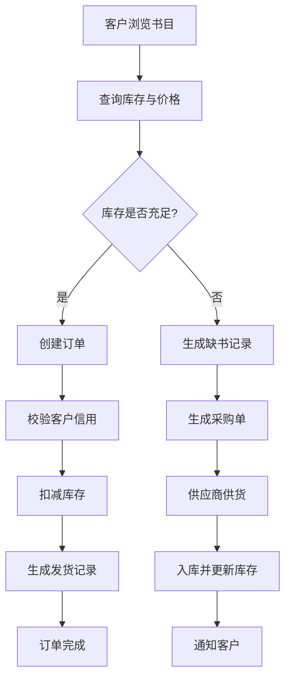
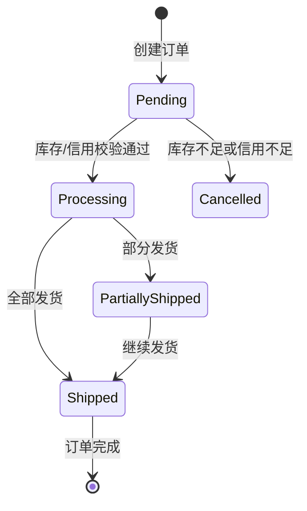
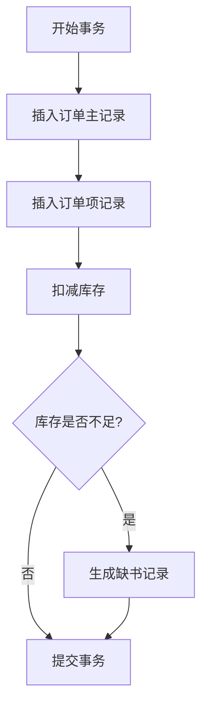
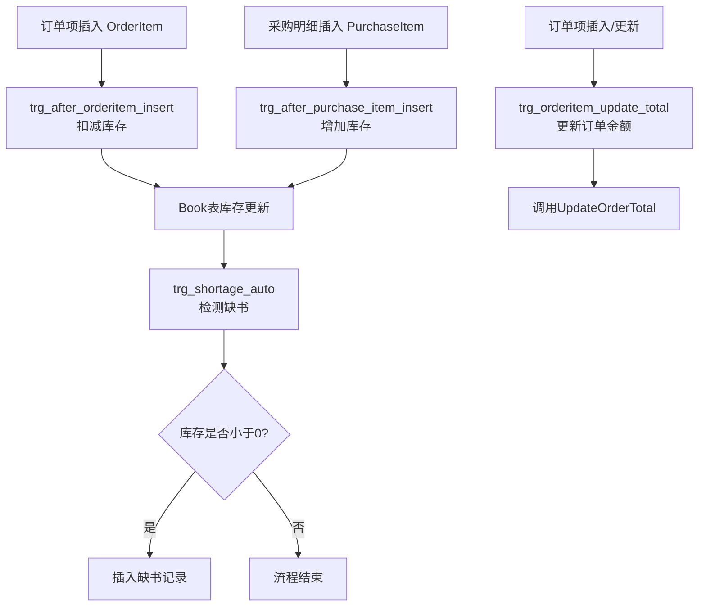
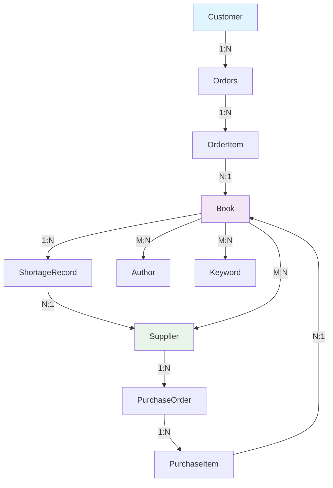

# **网上书店管理系统数据库设计说明书**

| U202317346 | U202317352 |
| :--------: | :--------: |
|   郝玉龙   |   梅凯文   |
| 软件2306班 | 软件2306班 |


## **1. 引言**

### **1.1 编写目的**

本设计说明书旨在为《网上书店管理系统》的数据库设计与实现提供完整、系统、规范的指导文档。文档结合需求分析、概念设计与逻辑设计三个阶段的核心成果，旨在：

- **明确系统数据模型**：定义系统中所有实体、属性与关系，建立清晰的概念模型与逻辑模型。
- **指导数据库实施**：提供详细的表结构、约束、索引、视图、存储过程与触发器设计，确保数据库能正确支持业务功能。
- **保障数据质量与安全**：通过完整性约束、事务控制、权限设计与备份策略，确保数据的一致性、安全性与可恢复性。
- **为开发与维护提供依据**：作为后续数据库开发、测试、部署与维护的基准文档，便于团队协作与系统迭代。

本文档面向系统分析师、数据库设计师、开发工程师、测试人员及后期维护人员使用。

### **1.2 项目背景**

随着互联网购物的普及，传统书店业务逐渐向线上迁移，形成了线上线下融合的运营模式。为满足小型网上书店的日常业务与线上服务需求，本项目旨在构建一个支持**书目管理、库存管理、采购管理、客户管理、订单处理、发货管理、供应商管理及网上查询浏览**的综合数据库系统。

系统采用 **C/S + B/S 混合架构**：
- **后台管理端（C/S）**：供书店内部人员使用，处理日常业务，如库存维护、采购管理、信用调整等。
- **前台用户端（B/S）**：供客户通过浏览器访问，实现书目查询、在线下单、订单跟踪等功能。

数据库采用 **MySQL 8.0+**，存储引擎为 **InnoDB**，以支持事务处理、外键约束与行级锁，确保系统在高并发环境下的数据一致性与可靠性。

### **1.3 系统概述**

网上书店管理系统核心业务流如下所示：



系统主要功能模块包括：
- **书目与库存管理**：维护书目信息、作者、关键字、库存量与位置。
- **客户与信用管理**：管理客户账户、信用等级、透支额度与折扣政策。
- **订单与发货管理**：处理客户下单、库存校验、信用审核、分批发货。
- **缺书与采购管理**：实现缺书登记、采购单生成、到货入库。
- **供应商管理**：维护供应商信息及其供货关系。
- **网上查询浏览**：支持客户与管理员的多维度查询。

### **1.4 设计原则与约束**

为确保数据库设计的规范性、可维护性与性能，本设计遵循以下原则：

| 原则类别       | 具体说明                                                     |
| -------------- | ------------------------------------------------------------ |
| **规范化设计** | 表结构遵循第三范式（3NF），减少数据冗余，确保更新一致性。    |
| **完整性约束** | 通过主键、外键、CHECK约束、触发器实现实体、参照与用户定义的完整性。 |
| **安全性设计** | 采用密码哈希存储、视图权限隔离、最小权限原则保护敏感数据。   |
| **性能优化**   | 为高频查询字段建立索引，使用全文索引支持模糊查询，合理设计事务与锁机制。 |
| **可扩展性**   | 表结构与字段设计预留扩展空间，支持未来业务增长与功能扩展。   |
| **可维护性**   | 提供清晰的注释、数据字典、备份与恢复策略，便于后期维护与问题排查。 |

**主要技术约束：**
- 数据库：MySQL 8.0+
- 字符集：utf8mb4
- 存储引擎：InnoDB
- 最大并发用户数：预计100人同时在线
- 数据量预估：书目1万条，订单年增量约5万条

### **1.5 术语与缩写**

| 术语/缩写    | 全称/说明                                                |
| ------------ | -------------------------------------------------------- |
| **E-R 模型** | 实体-关系模型，用于描述系统中实体、属性及其关系。        |
| **PK**       | 主键，唯一标识表中每一条记录。                           |
| **FK**       | 外键，建立表与表之间的关联关系。                         |
| **3NF**      | 第三范式，确保表中每一列都与主键直接相关，消除传递依赖。 |
| **DFD**      | 数据流图，描述系统中数据的流动、处理与存储。             |
| **C/S**      | 客户端/服务器架构。                                      |
| **B/S**      | 浏览器/服务器架构。                                      |
| **InnoDB**   | MySQL支持事务的存储引擎。                                |
| **UTF8MB4**  | 支持四字节字符的UTF-8编码，适用于存储表情符号与生僻字。  |

---

### **1.6 设计团队分工**

为确保数据库设计文档的系统性、专业性和完整性，本设计由两位作者协同完成，各自承担不同的核心职责，具体分工如下：

#### 郝玉龙

**主要职责：**

- **整体架构设计**：负责数据库整体架构设计、实体关系模型（E-R图）构建
- **核心表结构设计**：主导设计`Book`、`Customer`、`Orders`、`OrderItem`等核心业务表
- **数据完整性设计**：设计主键、外键、CHECK约束等完整性约束机制
- **事务与并发控制**：设计事务边界、隔离级别、锁机制等并发控制方案
- **性能优化策略**：制定索引策略、查询优化方案、执行计划分析
- **安全体系设计**：设计用户角色、权限矩阵、密码安全机制

#### **梅凯文**

**主要职责：**

- **视图设计实现**：设计并实现所有业务视图，包括`v_book_detail`、`v_customer_orders`等
- **存储过程开发**：编写`CreateOrder`、`ReceivePurchase`等核心存储过程
- **触发器设计与实现**：设计`trg_after_orderitem_insert`等业务触发器
- **初始化数据设计**：设计测试数据、示例数据及初始化脚本
- **查询优化示例**：编写高频查询示例、统计查询脚本
- **文档格式整理**：负责文档结构优化、图表整合、格式规范

## **协同工作方式**

两位作者采用以下协同工作模式：
1. **迭代设计**：郝玉龙完成基础架构设计后，梅凯文负责具体实现与验证
2. **交叉评审**：每周进行设计交叉评审，确保设计一致性和完整性
3. **文档同步**：使用版本控制系统管理设计文档，保持实时同步
4. **测试驱动**：梅凯文编写测试用例，郝玉龙验证设计可行性

---

# **2. 需求分析综述**

## **2.1 用户角色与权限分析**

系统涉及四类主要用户角色，其职责与权限定义如下：

| 角色           | 职责描述                                                     | 关键数据权限                                                 |
| -------------- | ------------------------------------------------------------ | ------------------------------------------------------------ |
| **系统管理员** | 负责数据库整体维护、用户权限分配、系统监控与备份恢复。       | 全表访问权限（DDL、DML）、用户管理、权限配置。               |
| **书店管理员** | 管理书目信息、库存更新、客户信用调整、订单发货处理。         | 访问`Book`、`Customer`、`Orders`、`Shipment`、`ShortageRecord`等业务表。 |
| **采购管理员** | 处理缺书记录、生成采购单、管理供应商信息、执行入库操作。     | 访问`ShortageRecord`、`PurchaseOrder`、`Supplier`、`BookSupplier`等表。 |
| **网上客户**   | 注册登录、浏览查询书目、下订单、查询订单状态、登记缺书请求。 | 仅能访问自身客户信息、订单记录、发货记录及公开书目信息（通过视图）。 |

**权限控制策略：**
- 通过数据库用户角色（Role）实现权限分组。
- 敏感操作（如信用调整、库存修改）仅限后台管理员执行。
- 客户端查询通过视图（View）实现数据隔离与安全性。

## **2.2 功能需求总结**

### **2.2.1 书目与库存管理**
- **功能描述**：管理书目基本信息、作者、关键字、库存量、存放位置及供应商关系。
- **核心属性**：
  - 书号（支持丛书结构）
  - 书名、出版社、单价
  - 作者（1~4人，有序）
  - 关键字（最多10个）
  - 目录、封面（可选）
  - 库存量、库存位置
  - 供应商列表（多对多）
- **业务规则**：
  - 新书录入时自动初始化库存为0。
  - 库存量随订单发货自动扣减，随采购入库自动增加。
  - 库存量低于设定阈值时自动触发缺书记录。

### **2.2.2 客户与信用管理**
- **功能描述**：管理客户账户信息、信用等级、透支额度与折扣政策。
- **信用等级规则**（与需求文档一致）：

| 信用等级 | 折扣 | 透支额度   | 说明                     |
| -------- | ---- | ---------- | ------------------------ |
| 1        | 10%  | 不允许透支 | 基础客户                 |
| 2        | 15%  | 不允许透支 | 良好客户                 |
| 3        | 15%  | 有限额透支 | 优质客户，可先发货后付款 |
| 4        | 20%  | 有限额透支 | VIP客户，额度更高        |
| 5        | 25%  | 无限额透支 | 企业级客户               |

- **业务规则**：
  - 客户可自行修改基本信息（除余额、信用等级外）。
  - 信用等级可由管理员手动调整，或根据消费累计自动提升（可选）。
  - 下单时系统校验信用额度与账户余额。

### **2.2.3 订单与发货管理**
- **功能描述**：处理客户下单、库存校验、信用审核、发货记录生成。
- **订单状态机**：



- **业务规则**：
  - 支持一个订单包含多本书（订单明细）。
  - 库存不足时可接受订单，并自动生成缺书记录。
  - 发货前校验客户信用与账户余额。
  - 支持分批发货（部分发货状态）。

### **2.2.4 缺书与采购管理**
- **功能描述**：实现缺书登记、采购单生成、到货入库。
- **缺书记录来源**：
  1. **人工登记**：管理员手动录入缺书信息。
  2. **自动触发**：库存低于阈值时系统自动生成。
  3. **客户触发**：客户下单时库存不足或主动登记缺书。
- **采购流程**：
  ```
  缺书记录 → 生成采购单 → 发送供应商 → 到货入库 → 更新库存 
  ```

### **2.2.5 供应商管理**
- **功能描述**：维护供应商基本信息及其与书目的供应关系。
- **核心属性**：供应商编号、名称、地址、联系方式、供应书目及价格。
- **业务规则**：一本书可由多个供应商供应，每个供应商可供应多本书。

### **2.2.6 网上查询浏览**
- **客户查询功能**：
  - 按书名、作者、关键字进行模糊查询。
  - 查看书目详情（含作者、关键字、库存）。
  - 查询个人订单历史与发货状态。
- **管理员查询功能**：
  - 库存统计与预警查询。
  - 缺书记录与采购进度查询。
  - 客户信用与消费统计。

## **2.3 数据流分析（DFD）**

### **2.3.1 外部实体说明**
| 实体          | 说明                                                 |
| ------------- | ---------------------------------------------------- |
| **Customer**  | 客户，执行查询、下单、登记缺书等操作。               |
| **Admin**     | 书店管理员，负责书目维护、库存管理、发货等后台操作。 |
| **Purchaser** | 采购人员，处理缺书记录、生成采购单、执行入库。       |
| **Supplier**  | 供应商，提供书目信息与供货服务。                     |

### **2.3.2 核心处理过程（P1–P5）**
| 过程编号 | 名称           | 功能描述                                                     |
| -------- | -------------- | ------------------------------------------------------------ |
| **P1**   | 书目查询与展示 | 响应客户查询，从D1读取书目信息并返回结果；支持管理员维护书目数据。 |
| **P2**   | 订单处理       | 处理客户下单，校验库存与信用，生成订单记录与缺书记录，触发出库。 |
| **P3**   | 库存管理       | 执行出库与入库操作，实时更新库存数据（D1）。                 |
| **P4**   | 缺书与采购管理 | 处理缺书记录来源，生成采购单，接收供应商发货通知，触发入库流程。 |
| **P5**   | 客户管理       | 处理客户注册、登录、信息维护、信用与余额更新。               |

### **2.3.3 数据存储（D1–D5）**
| 存储编号 | 名称           | 存储内容                                           |
| -------- | -------------- | -------------------------------------------------- |
| **D1**   | 书目与库存数据 | 书目基本信息、作者、关键字、库存量、供应商关系等。 |
| **D2**   | 客户数据       | 客户账户、联系方式、余额、信用等级、透支额度等。   |
| **D3**   | 订单与订单明细 | 订单主表、订单明细、发货状态、金额等。             |
| **D4**   | 缺书记录       | 缺书来源、数量、推荐供应商、登记日期、处理状态等。 |
| **D5**   | 采购单数据     | 采购单主表、采购明细、供应商、状态、创建日期等。   |

### **2.3.4 数据流动特点**
- **客户行为驱动多流程**：查询（P1）→ 下单（P2）→ 可能触发缺书（P4）→ 查询订单（D3）。
- **库存为核心枢纽**：订单处理（P2）与采购入库（P4）均通过库存管理（P3）更新D1。
- **采购流程闭环**：缺书记录（D4）→ 采购单（D5）→ 入库（P3）→ 更新库存（D1）。
- **信用贯穿订单生命周期**：下单前校验（P2）、发货前复核、信用等级动态调整（P5）。？

---

# **3. 概念结构设计**

## **3.1 实体识别与定义**

根据需求分析与业务对象识别，系统共定义 **11个核心实体** 与 **5个联系实体**，完整列表如下：

| 实体名称（英文）   | 实体名称（中文） | 类型     | 说明                                                         |
| ------------------ | ---------------- | -------- | ------------------------------------------------------------ |
| **Book**           | 书目             | 核心实体 | 存储书籍的基本信息，如书名、价格、库存等。                   |
| **Author**         | 作者             | 独立实体 | 存储作者信息，与书目为多对多关系。                           |
| **Keyword**        | 关键字           | 独立实体 | 存储关键字文本，与书目为多对多关系。                         |
| **Supplier**       | 供应商           | 核心实体 | 存储供应商基本信息及联系方式。                               |
| **Customer**       | 客户             | 核心实体 | 存储客户账户、信用等级、余额等信息。                         |
| **Orders**         | 订单             | 核心实体 | 记录客户下单信息，包括订单状态、收货地址等。                 |
| **OrderItem**      | 订单明细         | 联系实体 | 实现订单与书目之间的多对多关系，记录每本书的购买数量与金额。 |
| **Shipment**       | 发货记录         | 核心实体 | 记录每批发货的详细信息，支持部分发货。                       |
| **ShortageRecord** | 缺书记录         | 核心实体 | 记录缺书信息，包括来源（人工/自动/客户）、数量、推荐供应商等。 |
| **PurchaseOrder**  | 采购单           | 核心实体 | 记录采购单基本信息，如供应商、创建日期、状态等。             |
| **PurchaseItem**   | 采购明细         | 联系实体 | 实现采购单与书目之间的多对多关系，记录采购数量。             |
| **BookAuthor**     | 书目作者联系     | 联系实体 | 实现书目与作者的多对多关系，并记录作者顺序。                 |
| **BookKeyword**    | 书目关键字联系   | 联系实体 | 实现书目与关键字的多对多关系。                               |
| **BookSupplier**   | 书目供应商联系   | 联系实体 | 实现书目与供应商的多对多关系，记录供应价格。                 |

## **3.2 实体属性说明**

### **3.2.1 Book（书目）**
| 属性名        | 数据类型      | 约束     | 说明             |
| ------------- | ------------- | -------- | ---------------- |
| BookID        | INT           | PK       | 书目唯一标识     |
| Title         | VARCHAR(200)  | NOT NULL | 书名             |
| Publisher     | VARCHAR(100)  |          | 出版社           |
| Price         | DECIMAL(10,2) | NOT NULL | 售价，大于等于0  |
| StockQuantity | INT           | NOT NULL | 当前库存量       |
| Catalog       | TEXT          |          | 内容目录（可选） |
| CoverImage    | LONGBLOB      |          | 封面图片（可选） |
| SeriesID      | INT           |          | 丛书编号（可选） |
| Location      | VARCHAR(100)  |          | 库存位置描述     |
| CreatedAt     | DATETIME      |          | 创建时间         |
| UpdatedAt     | DATETIME      |          | 最后更新时间     |

### **3.2.2 Author（作者）**
| 属性名    | 数据类型     | 约束     | 说明         |
| --------- | ------------ | -------- | ------------ |
| AuthorID  | INT          | PK       | 作者唯一标识 |
| Name      | VARCHAR(100) | NOT NULL | 作者姓名     |
| CreatedAt | DATETIME     |          | 创建时间     |

### **3.2.3 BookAuthor（书目作者联系）**
| 属性名      | 数据类型 | 约束     | 说明                          |
| ----------- | -------- | -------- | ----------------------------- |
| BookID      | INT      | FK, PK   | 关联书目                      |
| AuthorID    | INT      | FK, PK   | 关联作者                      |
| AuthorOrder | TINYINT  | NOT NULL | 作者顺序（1~4），复合主键之一 |

### **3.2.4 Keyword（关键字）**
| 属性名    | 数据类型    | 约束     | 说明           |
| --------- | ----------- | -------- | -------------- |
| KeywordID | INT         | PK       | 关键字唯一标识 |
| Word      | VARCHAR(50) | NOT NULL | 关键字文本     |
| CreatedAt | DATETIME    |          | 创建时间       |

### **3.2.5 BookKeyword（书目关键字联系）**
| 属性名    | 数据类型 | 约束   | 说明       |
| --------- | -------- | ------ | ---------- |
| BookID    | INT      | FK, PK | 关联书目   |
| KeywordID | INT      | FK, PK | 关联关键字 |

### **3.2.6 Supplier（供应商）**
| 属性名       | 数据类型     | 约束     | 说明           |
| ------------ | ------------ | -------- | -------------- |
| SupplierID   | INT          | PK       | 供应商唯一标识 |
| Name         | VARCHAR(200) | NOT NULL | 供应商名称     |
| Address      | VARCHAR(300) |          | 地址           |
| Phone        | VARCHAR(50)  |          | 联系电话       |
| ContactEmail | VARCHAR(100) |          | 联系邮箱       |
| CreatedAt    | DATETIME     |          | 创建时间       |

### **3.2.7 BookSupplier（书目供应商联系）**
| 属性名      | 数据类型      | 约束   | 说明       |
| ----------- | ------------- | ------ | ---------- |
| BookID      | INT           | FK, PK | 关联书目   |
| SupplierID  | INT           | FK, PK | 关联供应商 |
| SupplyPrice | DECIMAL(10,2) |        | 供应价格   |

### **3.2.8 Customer（客户）**
| 属性名       | 数据类型      | 约束      | 说明                                  |
| ------------ | ------------- | --------- | ------------------------------------- |
| CustomerID   | INT           | PK        | 客户唯一标识                          |
| Email        | VARCHAR(150)  | UNIQUE    | 登录邮箱                              |
| PasswordHash | VARCHAR(255)  | NOT NULL  | 密码哈希值                            |
| Name         | VARCHAR(200)  |           | 客户姓名                              |
| Address      | VARCHAR(300)  |           | 收货地址                              |
| Balance      | DECIMAL(12,2) | DEFAULT 0 | 账户余额                              |
| CreditLevel  | TINYINT       | DEFAULT 1 | 信用等级（1~5）                       |
| MonthlyLimit | DECIMAL(12,2) | DEFAULT 0 | 月度透支额度（仅信用等级3、4、5有效） |
| CreatedAt    | DATETIME      |           | 注册时间                              |
| LastLogin    | DATETIME      |           | 最后登录时间                          |

### **3.2.9 Orders（订单）**
| 属性名          | 数据类型      | 约束              | 说明                                                         |
| --------------- | ------------- | ----------------- | ------------------------------------------------------------ |
| OrderID         | INT           | PK                | 订单唯一标识                                                 |
| CustomerID      | INT           | FK                | 关联客户                                                     |
| OrderDate       | DATETIME      |                   | 下单时间                                                     |
| ShippingAddress | VARCHAR(300)  |                   | 收货地址                                                     |
| TotalAmount     | DECIMAL(12,2) | DEFAULT 0         | 订单总金额                                                   |
| Status          | VARCHAR(50)   | DEFAULT 'Pending' | 订单状态：Pending/Processing/PartiallyShipped/Shipped/Cancelled |

### **3.2.10 OrderItem（订单明细）**
| 属性名    | 数据类型      | 约束      | 说明                         |
| --------- | ------------- | --------- | ---------------------------- |
| OrderID   | INT           | FK, PK    | 关联订单                     |
| BookID    | INT           | FK, PK    | 关联书目                     |
| Quantity  | INT           | NOT NULL  | 购买数量                     |
| UnitPrice | DECIMAL(10,2) | NOT NULL  | 单价（下单时价格快照）       |
| Amount    | DECIMAL(12,2) | GENERATED | 计算列：Quantity * UnitPrice |

### **3.2.11 Shipment（发货记录）**
| 属性名     | 数据类型     | 约束     | 说明             |
| ---------- | ------------ | -------- | ---------------- |
| ShipmentID | INT          | PK       | 发货记录唯一标识 |
| OrderID    | INT          | FK       | 关联订单         |
| BookID     | INT          | FK       | 关联书目         |
| Quantity   | INT          | NOT NULL | 发货数量         |
| ShipDate   | DATETIME     |          | 发货时间         |
| Carrier    | VARCHAR(100) |          | 承运商           |
| TrackingNo | VARCHAR(100) |          | 物流单号         |

### **3.2.12 ShortageRecord（缺书记录）**
| 属性名     | 数据类型    | 约束      | 说明                             |
| ---------- | ----------- | --------- | -------------------------------- |
| ShortageID | INT         | PK        | 缺书记录唯一标识                 |
| BookID     | INT         | FK        | 关联书目                         |
| SupplierID | INT         | FK        | 推荐供应商（可选）               |
| CustomerID | INT         | FK        | 关联客户（若为客户触发）         |
| Quantity   | INT         | NOT NULL  | 缺书数量                         |
| Date       | DATETIME    |           | 登记日期                         |
| SourceType | VARCHAR(50) |           | 来源：Manual/Auto/Customer       |
| Processed  | TINYINT     | DEFAULT 0 | 是否已处理（0=未处理，1=已处理） |

### **3.2.13 PurchaseOrder（采购单）**
| 属性名     | 数据类型    | 约束              | 说明                  |
| ---------- | ----------- | ----------------- | --------------------- |
| POID       | INT         | PK                | 采购单唯一标识        |
| SupplierID | INT         | FK                | 关联供应商            |
| CreateDate | DATETIME    |                   | 创建日期              |
| Status     | VARCHAR(50) | DEFAULT 'Created' | 状态：Created/Arrived |

### **3.2.14 PurchaseItem（采购明细）**
| 属性名   | 数据类型 | 约束     | 说明       |
| -------- | -------- | -------- | ---------- |
| POID     | INT      | FK, PK   | 关联采购单 |
| BookID   | INT      | FK, PK   | 关联书目   |
| Quantity | INT      | NOT NULL | 采购数量   |

## **3.3 实体间关系分析**

系统实体间关系汇总如下表所示，涵盖了所有一对多、多对多及联系实体的语义说明：

| 关系                             | 类型   | 实体A         | 实体B          | 基数 | 说明                                                         |
| -------------------------------- | ------ | ------------- | -------------- | ---- | ------------------------------------------------------------ |
| **Book – Author**                | 多对多 | Book          | Author         | M:N  | 一本书可有多个作者，一个作者可著多本书；通过BookAuthor联系实体实现。 |
| **Book – Keyword**               | 多对多 | Book          | Keyword        | M:N  | 一本书可有多个关键字，一个关键字可对应多本书；通过BookKeyword实现。 |
| **Book – Supplier**              | 多对多 | Book          | Supplier       | M:N  | 一本书可由多个供应商供应，一个供应商可供应多本书；通过BookSupplier实现。 |
| **Customer – Orders**            | 一对多 | Customer      | Orders         | 1:N  | 一个客户可拥有多个订单。                                     |
| **Orders – OrderItem**           | 一对多 | Orders        | OrderItem      | 1:N  | 一个订单可包含多个订单项（多种书）。                         |
| **Book – OrderItem**             | 一对多 | Book          | OrderItem      | 1:N  | 一本书可出现在多个订单项中。                                 |
| **OrderItem – Shipment**         | 一对多 | OrderItem     | Shipment       | 1:N  | 一个订单项可对应多批发货（支持分批发货）。                   |
| **Book – ShortageRecord**        | 一对多 | Book          | ShortageRecord | 1:N  | 一本书可产生多个缺书记录。                                   |
| **Supplier – ShortageRecord**    | 一对多 | Supplier      | ShortageRecord | 1:N  | 一个供应商可被推荐为多个缺书记录的供货方。                   |
| **Customer – ShortageRecord**    | 一对多 | Customer      | ShortageRecord | 1:N  | 一个客户可触发多个缺书记录（若来源为客户）。                 |
| **Supplier – PurchaseOrder**     | 一对多 | Supplier      | PurchaseOrder  | 1:N  | 一个供应商可对应多个采购单。                                 |
| **PurchaseOrder – PurchaseItem** | 一对多 | PurchaseOrder | PurchaseItem   | 1:N  | 一个采购单可包含多个采购明细（多种书）。                     |
| **Book – PurchaseItem**          | 一对多 | Book          | PurchaseItem   | 1:N  | 一本书可出现在多个采购明细中。                               |

## **3.4 全局E-R图**

系统全局E-R图如下所示，以可视化形式展示了所有实体、属性及其之间的关系：


**图例说明：**
- 矩形表示实体
- 菱形表示关系
- 椭圆形表示属性
- 连线上的数字表示基数（1、N、M）
- 虚线框表示弱实体或联系实体

**主要关系路径示例：**
1. **客户下单路径**：`Customer → Orders → OrderItem → Book`
2. **缺书采购路径**：`ShortageRecord → PurchaseOrder → PurchaseItem → Book`
3. **书目关联路径**：`Book ←→ Author / Keyword / Supplier`

---

# **4. 逻辑结构设计**

## **4.1 数据库环境说明**

| 项目           | 说明                                                         |
| -------------- | ------------------------------------------------------------ |
| **数据库系统** | MySQL 8.0+                                                   |
| **字符集**     | utf8mb4                                                      |
| **排序规则**   | utf8mb4_general_ci                                           |
| **存储引擎**   | InnoDB（支持事务、外键、行级锁）                             |
| **命名规范**   | 表名采用PascalCase，字段名采用camelCase，外键以`FK_`为前缀，索引以`IDX_`为前缀 |
| **主键策略**   | 自增整数（INT AUTO_INCREMENT），联系表采用复合主键           |

## **4.2 关系模式设计**

基于概念模型，将实体与联系转换为以下关系模式（表结构）：

| 表名（英文）     | 表名（中文）     | 说明                                     |
| ---------------- | ---------------- | ---------------------------------------- |
| `Book`           | 书目表           | 存储书目核心信息                         |
| `Author`         | 作者表           | 存储作者信息                             |
| `BookAuthor`     | 书目作者联系表   | 实现书目与作者的多对多关系，含作者顺序   |
| `Keyword`        | 关键字表         | 存储关键字文本                           |
| `BookKeyword`    | 书目关键字联系表 | 实现书目与关键字的多对多关系             |
| `Supplier`       | 供应商表         | 存储供应商信息                           |
| `BookSupplier`   | 书目供应商联系表 | 实现书目与供应商的多对多关系，含供应价格 |
| `Customer`       | 客户表           | 存储客户账户、信用、余额等信息           |
| `Orders`         | 订单表           | 存储订单主信息                           |
| `OrderItem`      | 订单明细表       | 存储订单项信息，连接订单与书目           |
| `Shipment`       | 发货记录表       | 存储发货明细，支持分批发货               |
| `ShortageRecord` | 缺书记录表       | 存储缺书登记信息                         |
| `PurchaseOrder`  | 采购单表         | 存储采购单主信息                         |
| `PurchaseItem`   | 采购明细表       | 存储采购项信息，连接采购单与书目         |

## **4.3 表结构详细设计**

### **4.3.1 Book（书目表）**

```sql
CREATE TABLE Book (
  BookID INT PRIMARY KEY AUTO_INCREMENT COMMENT '书目ID',
  Title VARCHAR(200) NOT NULL COMMENT '书名',
  Publisher VARCHAR(100) COMMENT '出版社',
  Price DECIMAL(10,2) NOT NULL CHECK (Price >= 0) COMMENT '售价',
  StockQuantity INT NOT NULL DEFAULT 0 COMMENT '库存量',
  Catalog TEXT COMMENT '内容目录',
  CoverImage LONGBLOB COMMENT '封面图片',
  SeriesID INT COMMENT '丛书编号',
  Location VARCHAR(100) COMMENT '库存位置',
  CreatedAt DATETIME DEFAULT CURRENT_TIMESTAMP COMMENT '创建时间',
  UpdatedAt DATETIME DEFAULT CURRENT_TIMESTAMP ON UPDATE CURRENT_TIMESTAMP COMMENT '最后更新时间',
  FULLTEXT INDEX fx_book_title (Title) COMMENT '全文索引-书名'
) ENGINE=InnoDB COMMENT='书目信息表';
```

### **4.3.2 Author（作者表）**

```sql
CREATE TABLE Author (
  AuthorID INT PRIMARY KEY AUTO_INCREMENT COMMENT '作者ID',
  Name VARCHAR(100) NOT NULL COMMENT '作者姓名',
  CreatedAt DATETIME DEFAULT CURRENT_TIMESTAMP COMMENT '创建时间'
) ENGINE=InnoDB COMMENT='作者信息表';
```

### **4.3.3 BookAuthor（书目作者联系表）**

```sql
CREATE TABLE BookAuthor (
  BookID INT NOT NULL COMMENT '书目ID',
  AuthorID INT NOT NULL COMMENT '作者ID',
  AuthorOrder TINYINT NOT NULL CHECK (AuthorOrder BETWEEN 1 AND 4) COMMENT '作者顺序（1-4）',
  PRIMARY KEY (BookID, AuthorID),
  FOREIGN KEY (BookID) REFERENCES Book(BookID) ON DELETE CASCADE ON UPDATE CASCADE,
  FOREIGN KEY (AuthorID) REFERENCES Author(AuthorID) ON DELETE RESTRICT ON UPDATE CASCADE,
  INDEX idx_bookauthor_bookid (BookID)
) ENGINE=InnoDB COMMENT='书目作者关联表';
```

### **4.3.4 Keyword（关键字表）**

```sql
CREATE TABLE Keyword (
  KeywordID INT PRIMARY KEY AUTO_INCREMENT COMMENT '关键字ID',
  Word VARCHAR(50) NOT NULL COMMENT '关键字文本',
  UNIQUE INDEX ux_keyword_word (Word),
  FULLTEXT INDEX fx_keyword_word (Word)
) ENGINE=InnoDB COMMENT='关键字表';
```

### **4.3.5 BookKeyword（书目关键字联系表）**

```sql
CREATE TABLE BookKeyword (
  BookID INT NOT NULL COMMENT '书目ID',
  KeywordID INT NOT NULL COMMENT '关键字ID',
  PRIMARY KEY (BookID, KeywordID),
  FOREIGN KEY (BookID) REFERENCES Book(BookID) ON DELETE CASCADE,
  FOREIGN KEY (KeywordID) REFERENCES Keyword(KeywordID) ON DELETE CASCADE
) ENGINE=InnoDB COMMENT='书目关键字关联表';
```

### **4.3.6 Supplier（供应商表）**

```sql
CREATE TABLE Supplier (
  SupplierID INT PRIMARY KEY AUTO_INCREMENT COMMENT '供应商ID',
  Name VARCHAR(200) NOT NULL COMMENT '供应商名称',
  Address VARCHAR(300) COMMENT '地址',
  Phone VARCHAR(50) COMMENT '电话',
  ContactEmail VARCHAR(100) COMMENT '联系邮箱',
  CreatedAt DATETIME DEFAULT CURRENT_TIMESTAMP COMMENT '创建时间'
) ENGINE=InnoDB COMMENT='供应商信息表';
```

### **4.3.7 BookSupplier（书目供应商联系表）**

```sql
CREATE TABLE BookSupplier (
  BookID INT NOT NULL COMMENT '书目ID',
  SupplierID INT NOT NULL COMMENT '供应商ID',
  SupplyPrice DECIMAL(10,2) COMMENT '供应价格',
  PRIMARY KEY (BookID, SupplierID),
  FOREIGN KEY (BookID) REFERENCES Book(BookID) ON DELETE CASCADE,
  FOREIGN KEY (SupplierID) REFERENCES Supplier(SupplierID) ON DELETE CASCADE
) ENGINE=InnoDB COMMENT='书目供应商关联表';
```

### **4.3.8 Customer（客户表）**

```sql
CREATE TABLE Customer (
  CustomerID INT PRIMARY KEY AUTO_INCREMENT COMMENT '客户ID',
  Email VARCHAR(150) UNIQUE NOT NULL COMMENT '登录邮箱',
  PasswordHash VARCHAR(255) NOT NULL COMMENT '密码哈希值',
  Name VARCHAR(200) COMMENT '客户姓名',
  Address VARCHAR(300) COMMENT '收货地址',
  Balance DECIMAL(12,2) DEFAULT 0 COMMENT '账户余额',
  CreditLevel TINYINT DEFAULT 1 CHECK (CreditLevel BETWEEN 1 AND 5) COMMENT '信用等级（1-5）',
  MonthlyLimit DECIMAL(12,2) DEFAULT 0 COMMENT '月度透支额度',
  CreatedAt DATETIME DEFAULT CURRENT_TIMESTAMP COMMENT '注册时间',
  LastLogin DATETIME COMMENT '最后登录时间',
  INDEX idx_customer_email (Email)
) ENGINE=InnoDB COMMENT='客户信息表';
```

### **4.3.9 Orders（订单表）**

```sql
CREATE TABLE Orders (
  OrderID INT PRIMARY KEY AUTO_INCREMENT COMMENT '订单ID',
  CustomerID INT NOT NULL COMMENT '客户ID',
  OrderDate DATETIME DEFAULT CURRENT_TIMESTAMP COMMENT '下单时间',
  ShippingAddress VARCHAR(300) COMMENT '收货地址',
  TotalAmount DECIMAL(12,2) DEFAULT 0 COMMENT '订单总金额',
  Status VARCHAR(50) DEFAULT 'Pending' 
    CHECK (Status IN ('Pending', 'Processing', 'PartiallyShipped', 'Shipped', 'Cancelled')) 
    COMMENT '订单状态',
  FOREIGN KEY (CustomerID) REFERENCES Customer(CustomerID) ON DELETE RESTRICT,
  INDEX idx_orders_customer (CustomerID)
) ENGINE=InnoDB COMMENT='订单表';
```

### **4.3.10 OrderItem（订单明细表）**

```sql
CREATE TABLE OrderItem (
  OrderID INT NOT NULL COMMENT '订单ID',
  BookID INT NOT NULL COMMENT '书目ID',
  Quantity INT NOT NULL CHECK (Quantity > 0) COMMENT '购买数量',
  UnitPrice DECIMAL(10,2) NOT NULL COMMENT '单价',
  Amount DECIMAL(12,2) AS (Quantity * UnitPrice) STORED COMMENT '金额',
  PRIMARY KEY (OrderID, BookID),
  FOREIGN KEY (OrderID) REFERENCES Orders(OrderID) ON DELETE CASCADE,
  FOREIGN KEY (BookID) REFERENCES Book(BookID) ON DELETE RESTRICT,
  INDEX idx_orderitem_bookid (BookID)
) ENGINE=InnoDB COMMENT='订单明细表';
```

### **4.3.11 Shipment（发货记录表）**

```sql
CREATE TABLE Shipment (
  ShipmentID INT PRIMARY KEY AUTO_INCREMENT COMMENT '发货记录ID',
  OrderID INT NOT NULL COMMENT '订单ID',
  BookID INT NOT NULL COMMENT '书目ID',
  Quantity INT NOT NULL COMMENT '发货数量',
  ShipDate DATETIME DEFAULT CURRENT_TIMESTAMP COMMENT '发货时间',
  Carrier VARCHAR(100) COMMENT '承运商',
  TrackingNo VARCHAR(100) COMMENT '物流单号',
  FOREIGN KEY (OrderID) REFERENCES Orders(OrderID) ON DELETE CASCADE,
  FOREIGN KEY (BookID) REFERENCES Book(BookID) ON DELETE RESTRICT,
  INDEX idx_shipment_order (OrderID)
) ENGINE=InnoDB COMMENT='发货记录表';
```

### **4.3.12 ShortageRecord（缺书记录表）**

```sql
CREATE TABLE ShortageRecord (
  ShortageID INT PRIMARY KEY AUTO_INCREMENT COMMENT '缺书记录ID',
  BookID INT NOT NULL COMMENT '书目ID',
  SupplierID INT COMMENT '推荐供应商ID',
  CustomerID INT COMMENT '客户ID（若为客户触发）',
  Quantity INT NOT NULL COMMENT '缺书数量',
  Date DATETIME DEFAULT CURRENT_TIMESTAMP COMMENT '登记日期',
  SourceType VARCHAR(50) 
    CHECK (SourceType IN ('Manual', 'Auto', 'Customer')) 
    COMMENT '来源类型',
  Processed TINYINT DEFAULT 0 COMMENT '是否已处理（0=未处理，1=已处理）',
  FOREIGN KEY (BookID) REFERENCES Book(BookID) ON DELETE CASCADE,
  FOREIGN KEY (SupplierID) REFERENCES Supplier(SupplierID) ON DELETE SET NULL,
  FOREIGN KEY (CustomerID) REFERENCES Customer(CustomerID) ON DELETE SET NULL,
  INDEX idx_shortage_book (BookID)
) ENGINE=InnoDB COMMENT='缺书记录表';
```

### **4.3.13 PurchaseOrder（采购单表）**

```sql
CREATE TABLE PurchaseOrder (
  POID INT PRIMARY KEY AUTO_INCREMENT COMMENT '采购单ID',
  SupplierID INT NOT NULL COMMENT '供应商ID',
  CreateDate DATETIME DEFAULT CURRENT_TIMESTAMP COMMENT '创建日期',
  Status VARCHAR(50) DEFAULT 'Created' 
    CHECK (Status IN ('Created', 'Arrived')) 
    COMMENT '采购单状态',
  FOREIGN KEY (SupplierID) REFERENCES Supplier(SupplierID) ON DELETE RESTRICT
) ENGINE=InnoDB COMMENT='采购单表';
```

### **4.3.14 PurchaseItem（采购明细表）**

```sql
CREATE TABLE PurchaseItem (
  POID INT NOT NULL COMMENT '采购单ID',
  BookID INT NOT NULL COMMENT '书目ID',
  Quantity INT NOT NULL COMMENT '采购数量',
  PRIMARY KEY (POID, BookID),
  FOREIGN KEY (POID) REFERENCES PurchaseOrder(POID) ON DELETE CASCADE,
  FOREIGN KEY (BookID) REFERENCES Book(BookID) ON DELETE RESTRICT
) ENGINE=InnoDB COMMENT='采购明细表';
```

## **4.4 数据字典（摘要）**

为便于查阅，以下为关键表字段的数据字典摘要：

| 表名      | 字段名      | 数据类型      | 是否为空 | 默认值         | 说明            |
| --------- | ----------- | ------------- | -------- | -------------- | --------------- |
| Book      | BookID      | INT           | NO       | AUTO_INCREMENT | 书目唯一标识    |
| Book      | Title       | VARCHAR(200)  | NO       | -              | 书名            |
| Book      | Price       | DECIMAL(10,2) | NO       | -              | 售价            |
| Customer  | CreditLevel | TINYINT       | NO       | 1              | 信用等级（1-5） |
| Orders    | Status      | VARCHAR(50)   | NO       | 'Pending'      | 订单状态        |
| OrderItem | Amount      | DECIMAL(12,2) | NO       | GENERATED      | 计算金额        |

> **完整数据字典**（含所有表的所有字段）见附录。

---

# **5. 视图设计**

## **5.1 视图设计原则**

视图设计遵循以下原则，以确保系统的安全性、性能与可维护性：

| 原则           | 说明                                                         |
| -------------- | ------------------------------------------------------------ |
| **安全性隔离** | 通过视图隐藏敏感字段（如密码、余额、成本价等），实现数据访问控制。 |
| **查询简化**   | 封装复杂的多表连接逻辑，为常用查询提供简洁的接口。           |
| **逻辑一致性** | 将业务规则固化在视图中，确保不同查询结果的一致性。           |
| **性能优化**   | 视图基于索引良好的表设计，避免全表扫描，支持高效查询。       |
| **可维护性**   | 视图命名规范、注释完整，便于后续维护与扩展。                 |

## **5.2 视图列表与说明**

系统共设计 **6个核心业务视图**，覆盖书目展示、客户信息、订单历史、发货跟踪等关键业务场景：

| 视图名称               | 中文说明         | 主要使用者   | 核心功能                                   |
| ---------------------- | ---------------- | ------------ | ------------------------------------------ |
| `v_book_basic_info`    | 书目基础信息视图 | 客户、管理员 | 提供书目公开信息，隐藏敏感字段             |
| `v_book_detail`        | 书目详情视图     | 客户、管理员 | 展示书目完整信息（含作者、关键字聚合）     |
| `v_customer_info`      | 客户基础信息视图 | 管理员       | 查看客户列表及信用等级，隐藏密码等敏感信息 |
| `v_customer_orders`    | 客户历史订单视图 | 客户、管理员 | 查询客户订单历史及状态                     |
| `v_order_items_detail` | 订单明细视图     | 客户、管理员 | 展示订单项详情（含书名、单价、金额）       |
| `v_shipment_detail`    | 发货明细视图     | 客户、管理员 | 查询发货记录详情（含物流信息）             |

## **5.3 视图定义与使用场景**

### **5.3.1 v_book_basic_info（书目基础信息视图）**

**设计目的**：为客户端书目列表页面提供简洁、安全的书目信息，隐藏目录、封面等大字段及内部管理字段。

```sql
CREATE VIEW v_book_basic_info AS
SELECT 
    BookID,
    Title,
    Publisher,
    Price,
    StockQuantity,
    Location,
    CreatedAt
FROM Book
WHERE StockQuantity >= 0;  -- 仅显示可售书目
```

**使用场景**：
- 客户浏览书目列表
- 管理员快速查看库存情况
- 前端分页展示与搜索

### **5.3.2 v_book_detail（书目详情视图）**

**设计目的**：提供书目完整信息，包括聚合的作者列表、关键字列表，支持详情页展示与复杂查询。

```sql
CREATE VIEW v_book_detail AS
SELECT 
    b.BookID,
    b.Title,
    b.Publisher,
    b.Price,
    b.StockQuantity,
    b.Catalog,
    b.Location,
    b.CreatedAt,
    -- 聚合作者（按顺序）
    GROUP_CONCAT(DISTINCT a.Name ORDER BY ba.AuthorOrder SEPARATOR ', ') AS Authors,
    -- 聚合关键字
    GROUP_CONCAT(DISTINCT k.Word SEPARATOR ', ') AS Keywords,
    -- 聚合供应商
    GROUP_CONCAT(DISTINCT s.Name SEPARATOR ', ') AS Suppliers
FROM Book b
LEFT JOIN BookAuthor ba ON b.BookID = ba.BookID
LEFT JOIN Author a ON ba.AuthorID = a.AuthorID
LEFT JOIN BookKeyword bk ON b.BookID = bk.BookID
LEFT JOIN Keyword k ON bk.KeywordID = k.KeywordID
LEFT JOIN BookSupplier bs ON b.BookID = bs.BookID
LEFT JOIN Supplier s ON bs.SupplierID = s.SupplierID
GROUP BY b.BookID;
```

**使用场景**：
- 书目详情页面展示
- 管理员维护书目信息
- 多条件联合查询（如按作者+关键字）

### **5.3.3 v_customer_info（客户基础信息视图）**

**设计目的**：为管理员提供客户信息概览，隐藏密码哈希、最后登录时间等敏感字段。

```sql
CREATE VIEW v_customer_info AS
SELECT 
    CustomerID,
    Email,
    Name,
    Address,
    Balance,
    CreditLevel,
    MonthlyLimit,
    CreatedAt
FROM Customer;
```

**使用场景**：
- 管理员查看客户列表
- 信用等级管理界面
- 客户信息统计报表

### **5.3.4 v_customer_orders（客户历史订单视图）**

**设计目的**：提供客户订单历史查询，支持按状态、时间范围筛选。

```sql
CREATE VIEW v_customer_orders AS
SELECT
    o.OrderID,
    o.CustomerID,
    c.Name AS CustomerName,
    o.OrderDate,
    o.Status,
    o.TotalAmount,
    o.ShippingAddress
FROM Orders o
JOIN Customer c ON o.CustomerID = c.CustomerID;
```

**使用场景**：
- 客户查看自己的订单历史
- 管理员跟踪订单状态
- 订单统计与审计

### **5.3.5 v_order_items_detail（订单明细视图）**

**设计目的**：展示订单中每项商品的详细信息，方便客户与管理员核对订单内容。

```sql
CREATE VIEW v_order_items_detail AS
SELECT
    oi.OrderID,
    oi.BookID,
    b.Title,
    b.Publisher,
    oi.Quantity,
    oi.UnitPrice,
    oi.Amount,
    o.OrderDate,
    o.Status AS OrderStatus
FROM OrderItem oi
JOIN Book b ON oi.BookID = b.BookID
JOIN Orders o ON oi.OrderID = o.OrderID;
```

**使用场景**：
- 订单详情页面展示
- 发货前核对订单项
- 销售统计与商品分析

### **5.3.6 v_shipment_detail（发货明细视图）**

**设计目的**：提供发货记录详情，包括物流信息，支持订单跟踪与物流管理。

```sql
CREATE VIEW v_shipment_detail AS
SELECT
    s.ShipmentID,
    s.OrderID,
    s.BookID,
    b.Title,
    s.Quantity AS ShippedQuantity,
    s.ShipDate,
    s.Carrier,
    s.TrackingNo,
    o.ShippingAddress,
    c.Name AS CustomerName
FROM Shipment s
JOIN Book b ON s.BookID = b.BookID
JOIN Orders o ON s.OrderID = o.OrderID
JOIN Customer c ON o.CustomerID = c.CustomerID;
```

**使用场景**：
- 客户查询物流信息
- 管理员跟踪发货进度
- 物流公司对账与管理

## **5.4 视图权限配置建议**

为保障数据安全，建议通过数据库权限机制对视图访问进行控制：

| 视图名称               | 允许访问的角色                 | 权限说明                   |
| ---------------------- | ------------------------------ | -------------------------- |
| `v_book_basic_info`    | 客户角色、管理员角色           | 所有用户可读               |
| `v_book_detail`        | 客户角色、管理员角色           | 所有用户可读               |
| `v_customer_info`      | 管理员角色                     | 仅管理员可读，隐藏敏感字段 |
| `v_customer_orders`    | 客户角色（仅自己）、管理员角色 | 客户仅能查看自己的订单     |
| `v_order_items_detail` | 客户角色（仅自己）、管理员角色 | 同上                       |
| `v_shipment_detail`    | 客户角色（仅自己）、管理员角色 | 同上                       |

**权限实现示例**：
```sql
-- 为客户角色授权访问自己的订单视图（需结合应用程序层过滤）
GRANT SELECT ON v_customer_orders TO 'customer_role';
GRANT SELECT ON v_order_items_detail TO 'customer_role';
GRANT SELECT ON v_shipment_detail TO 'customer_role';
```

---

# **6. 存储过程设计**

## **6.1 存储过程设计原则**

存储过程设计遵循以下原则，以确保业务逻辑的一致性、事务安全性与系统性能：

| 原则           | 说明                                                         |
| -------------- | ------------------------------------------------------------ |
| **事务完整性** | 核心业务操作（如下单、采购入库）必须封装在事务中，确保数据一致性。 |
| **参数验证**   | 输入参数需进行有效性校验（如非空、范围、存在性检查）。       |
| **错误处理**   | 使用错误处理机制（如`DECLARE ... HANDLER`）记录异常并回滚事务。 |
| **性能优化**   | 避免在过程中进行大量循环操作，尽量使用集合操作。             |
| **可重用性**   | 将通用业务逻辑封装为过程，供多个模块调用。                   |
| **安全性**     | 使用最小权限原则，仅授予执行权限，避免直接表访问。           |

## **6.2 核心存储过程说明**

系统共设计 **3个核心存储过程**，覆盖下单、采购入库、订单金额更新等关键业务场景：

| 存储过程名称       | 功能说明             | 事务性 | 关键业务规则                               |
| ------------------ | -------------------- | ------ | ------------------------------------------ |
| `CreateOrder`      | 处理客户下单流程     | 是     | 库存校验、信用校验、缺书记录生成、库存扣减 |
| `ReceivePurchase`  | 处理采购到货入库流程 | 是     | 库存增加、采购单状态更新、缺书记录标记     |
| `UpdateOrderTotal` | 更新订单总金额       | 否     | 基于订单项金额重新计算订单总额             |

## **6.3 存储过程详细设计**

### **6.3.1 CreateOrder（创建订单）**

**功能描述**：处理客户下单全流程，包括订单创建、库存扣减、信用校验、缺书记录生成，所有操作在一个事务中完成。

**输入参数**：
- `pCustomerID`：客户ID
- `pShippingAddress`：收货地址
- 订单项数据：通过临时表`temp_order_item`传递（结构：`BookID, Quantity`）

**业务逻辑流程图**：


**存储过程代码**：
```sql
DELIMITER $$

CREATE PROCEDURE CreateOrder(
    IN pCustomerID INT,
    IN pShippingAddress VARCHAR(300)
)
BEGIN
    DECLARE vOrderID INT;
    DECLARE vCreditLevel TINYINT;
    DECLARE vBalance DECIMAL(12,2);
    DECLARE vTotalAmount DECIMAL(12,2);
    DECLARE EXIT HANDLER FOR SQLEXCEPTION
    BEGIN
        ROLLBACK;
        RESIGNAL;
    END;

    -- 开始事务
    START TRANSACTION;

    -- 校验客户信用与余额
    SELECT CreditLevel, Balance INTO vCreditLevel, vBalance
    FROM Customer WHERE CustomerID = pCustomerID FOR UPDATE;

    -- 计算订单总金额（基于临时表）
    SELECT SUM(b.Price * t.Quantity) INTO vTotalAmount
    FROM temp_order_item t
    JOIN Book b ON t.BookID = b.BookID;

    -- 信用校验：信用等级<3需检查余额
    IF vCreditLevel < 3 AND vBalance < vTotalAmount THEN
        SIGNAL SQLSTATE '45000' 
        SET MESSAGE_TEXT = '余额不足，请充值或提升信用等级';
    END IF;

    -- 插入订单主记录
    INSERT INTO Orders(CustomerID, ShippingAddress, TotalAmount) 
    VALUES(pCustomerID, pShippingAddress, vTotalAmount);
    
    SET vOrderID = LAST_INSERT_ID();

    -- 插入订单项记录
    INSERT INTO OrderItem(OrderID, BookID, Quantity, UnitPrice)
    SELECT 
        vOrderID,
        t.BookID,
        t.Quantity,
        b.Price
    FROM temp_order_item t
    JOIN Book b ON t.BookID = b.BookID;

    -- 扣减库存（行级锁确保并发安全）
    UPDATE Book b
    JOIN temp_order_item t ON b.BookID = t.BookID
    SET b.StockQuantity = b.StockQuantity - t.Quantity
    WHERE b.BookID = t.BookID;

    -- 自动生成缺书记录（库存为负时）
    INSERT INTO ShortageRecord(BookID, Quantity, Date, SourceType)
    SELECT 
        b.BookID,
        ABS(b.StockQuantity),
        NOW(),
        'Order'
    FROM Book b
    WHERE b.StockQuantity < 0;

    -- 更新客户余额（信用等级<3时扣款）
    IF vCreditLevel < 3 THEN
        UPDATE Customer 
        SET Balance = Balance - vTotalAmount
        WHERE CustomerID = pCustomerID;
    END IF;

    COMMIT;
END$$

DELIMITER ;
```

### **6.3.2 ReceivePurchase（采购到货入库）**

**功能描述**：处理采购单到货入库流程，更新库存、采购单状态，并标记相关缺书记录为已处理。

**输入参数**：
- `pPOID`：采购单ID

**业务逻辑**：
1. 更新相关书目的库存数量
2. 更新采购单状态为"已到货"
3. 标记相关缺书记录为已处理

**存储过程代码**：
```sql
DELIMITER $$

CREATE PROCEDURE ReceivePurchase(
    IN pPOID INT
)
BEGIN
    DECLARE EXIT HANDLER FOR SQLEXCEPTION
    BEGIN
        ROLLBACK;
        RESIGNAL;
    END;

    START TRANSACTION;

    -- 更新库存
    UPDATE Book b
    JOIN PurchaseItem pi ON b.BookID = pi.BookID
    SET b.StockQuantity = b.StockQuantity + pi.Quantity
    WHERE pi.POID = pPOID;

    -- 更新采购单状态
    UPDATE PurchaseOrder
    SET Status = 'Arrived'
    WHERE POID = pPOID;

    -- 标记相关缺书记录为已处理
    UPDATE ShortageRecord sr
    JOIN PurchaseItem pi ON sr.BookID = pi.BookID
    SET sr.Processed = 1
    WHERE pi.POID = pPOID 
      AND sr.Processed = 0 
      AND sr.SourceType IN ('Auto', 'Order');

    COMMIT;
END$$

DELIMITER ;
```

### **6.3.3 UpdateOrderTotal（更新订单总金额）**

**功能描述**：根据订单项重新计算订单总金额，用于订单项变更后的金额同步。

**输入参数**：
- `pOrderID`：订单ID

**使用场景**：
- 订单项数量或单价变更后
- 订单退款或部分取消后
- 定期批量更新订单金额

**存储过程代码**：
```sql
DELIMITER $$

CREATE PROCEDURE UpdateOrderTotal(
    IN pOrderID INT
)
BEGIN
    UPDATE Orders
    SET TotalAmount = (
        SELECT COALESCE(SUM(Amount), 0)
        FROM OrderItem
        WHERE OrderID = pOrderID
    )
    WHERE OrderID = pOrderID;
END$$

DELIMITER ;
```

## **6.4 存储过程调用示例**

### **6.4.1 下单流程调用示例**
```sql
-- 1. 准备临时订单项数据
CREATE TEMPORARY TABLE temp_order_item (
    BookID INT,
    Quantity INT
);

INSERT INTO temp_order_item VALUES 
(101, 2),  -- 购买书ID=101，数量2本
(205, 1);  -- 购买书ID=205，数量1本

-- 2. 调用存储过程下单
CALL CreateOrder(1001, '北京市海淀区中关村大街1号');

-- 3. 清理临时表
DROP TEMPORARY TABLE temp_order_item;
```

### **6.4.2 采购入库调用示例**
```sql
-- 采购单ID=5001到货入库
CALL ReceivePurchase(5001);
```

### **6.4.3 更新订单金额调用示例**
```sql
-- 更新订单ID=3001的总金额
CALL UpdateOrderTotal(3001);
```

## **6.5 存储过程权限管理**

为保障系统安全，存储过程应仅对应用程序角色开放执行权限：

```sql
-- 创建应用程序角色
CREATE ROLE app_role;

-- 授予存储过程执行权限
GRANT EXECUTE ON PROCEDURE CreateOrder TO app_role;
GRANT EXECUTE ON PROCEDURE ReceivePurchase TO app_role;
GRANT EXECUTE ON PROCEDURE UpdateOrderTotal TO app_role;

-- 不授予直接表操作权限
REVOKE ALL PRIVILEGES ON Book, Orders, Customer FROM app_role;
```

## **6.6 性能与并发考虑**

| 存储过程           | 并发控制策略                          | 性能优化建议                            |
| ------------------ | ------------------------------------- | --------------------------------------- |
| `CreateOrder`      | 使用`SELECT ... FOR UPDATE`锁客户记录 | 临时表预先加载订单项，减少事务内计算    |
| `ReceivePurchase`  | 行级锁自动管理（InnoDB）              | 采购单明细表建立`(POID, BookID)`索引    |
| `UpdateOrderTotal` | 无特殊锁机制                          | 订单项表`(OrderID, BookID)`索引优化查询 |

---

# **7. 触发器设计**

## **7.1 触发器设计原则**

触发器设计遵循以下原则，以确保数据一致性、业务规则自动执行与系统性能平衡：

| 原则               | 说明                                                         |
| ------------------ | ------------------------------------------------------------ |
| **数据一致性**     | 触发器用于自动维护数据间的逻辑一致性（如库存同步、金额计算）。 |
| **业务规则自动化** | 将固定的业务规则（如缺书自动登记）固化在触发器中，减少应用层代码。 |
| **简洁高效**       | 触发器逻辑应简单直接，避免复杂计算或循环，防止性能下降。     |
| **避免递归触发**   | 设计时需注意触发链，防止无限递归或循环触发。                 |
| **错误处理**       | 触发器中的异常应妥善处理，避免影响主操作。                   |
| **可维护性**       | 触发器应有清晰的命名和注释，便于后续维护。                   |

## **7.2 触发器列表与说明**

系统共设计 **4个核心业务触发器**，覆盖库存自动更新、缺书记录自动生成、订单金额同步等关键业务场景：

| 触发器名称                       | 触发时机                         | 目标表         | 功能说明                         |
| -------------------------------- | -------------------------------- | -------------- | -------------------------------- |
| `trg_after_orderitem_insert`     | AFTER INSERT ON OrderItem        | Book           | 订单项插入后自动扣减库存         |
| `trg_after_purchase_item_insert` | AFTER INSERT ON PurchaseItem     | Book           | 采购明细插入后自动增加库存       |
| `trg_shortage_auto`              | AFTER UPDATE ON Book             | ShortageRecord | 库存更新后自动检测并生成缺书记录 |
| `trg_orderitem_update_total`     | AFTER INSERT/UPDATE ON OrderItem | Orders         | 订单项变更后自动更新订单总金额   |

## **7.3 触发器详细设计**

### **7.3.1 trg_after_orderitem_insert（订单项插入后扣减库存）**

**设计目的**：当订单明细插入时，自动扣减对应书目的库存数量，确保库存实时准确。

**触发逻辑**：
- 每插入一条`OrderItem`记录，对应`Book.StockQuantity`减少`NEW.Quantity`
- 仅处理`INSERT`操作，`UPDATE`和`DELETE`由其他机制处理

```sql
DELIMITER $$

CREATE TRIGGER trg_after_orderitem_insert
AFTER INSERT ON OrderItem
FOR EACH ROW
BEGIN
    UPDATE Book
    SET StockQuantity = StockQuantity - NEW.Quantity,
        UpdatedAt = NOW()
    WHERE BookID = NEW.BookID;
END$$

DELIMITER ;
```

### **7.3.2 trg_after_purchase_item_insert（采购明细插入后增加库存）**

**设计目的**：当采购明细插入时，自动增加对应书目的库存数量，支持采购入库的库存同步。

**触发逻辑**：
- 每插入一条`PurchaseItem`记录，对应`Book.StockQuantity`增加`NEW.Quantity`
- 仅用于采购入库场景，避免手动更新库存

```sql
DELIMITER $$

CREATE TRIGGER trg_after_purchase_item_insert
AFTER INSERT ON PurchaseItem
FOR EACH ROW
BEGIN
    UPDATE Book
    SET StockQuantity = StockQuantity + NEW.Quantity,
        UpdatedAt = NOW()
    WHERE BookID = NEW.BookID;
END$$

DELIMITER ;
```

### **7.3.3 trg_shortage_auto（库存更新后自动生成缺书记录）**

**设计目的**：当书目库存更新后，自动检测是否低于零（缺货），并生成缺书记录。

**业务规则**：
- 仅当`NEW.StockQuantity < 0`时触发
- 缺书记录数量为`ABS(NEW.StockQuantity)`（库存负数的绝对值）
- 来源类型标记为'Auto'（系统自动生成）

```sql
DELIMITER $$

CREATE TRIGGER trg_shortage_auto
AFTER UPDATE ON Book
FOR EACH ROW
BEGIN
    IF NEW.StockQuantity < 0 THEN
        INSERT INTO ShortageRecord (
            BookID, 
            Quantity, 
            Date, 
            SourceType, 
            Processed
        ) VALUES (
            NEW.BookID,
            ABS(NEW.StockQuantity),
            NOW(),
            'Auto',
            0
        );
    END IF;
END$$

DELIMITER ;
```

### **7.3.4 trg_orderitem_update_total（订单项变更后更新订单总金额）**

**设计目的**：当订单项发生插入或更新时，自动重新计算并更新对应订单的总金额。

**触发逻辑**：
- 监听`OrderItem`表的`INSERT`和`UPDATE`操作
- 调用存储过程`UpdateOrderTotal`更新订单金额
- 避免在触发器中直接编写复杂计算逻辑

```sql
DELIMITER $$

CREATE TRIGGER trg_orderitem_update_total
AFTER INSERT ON OrderItem
FOR EACH ROW
BEGIN
    CALL UpdateOrderTotal(NEW.OrderID);
END$$

DELIMITER ;

-- 同样为UPDATE操作创建触发器
DELIMITER $$

CREATE TRIGGER trg_orderitem_update_total_update
AFTER UPDATE ON OrderItem
FOR EACH ROW
BEGIN
    CALL UpdateOrderTotal(NEW.OrderID);
END$$

DELIMITER ;
```

## **7.4 触发器执行流程与依赖关系**

系统触发器的执行流程与依赖关系如下图所示：



## **7.5 触发器性能与并发考虑**

| 触发器名称                       | 性能影响           | 并发处理策略           | 索引依赖                 |
| -------------------------------- | ------------------ | ---------------------- | ------------------------ |
| `trg_after_orderitem_insert`     | 低（单行更新）     | InnoDB行级锁，避免死锁 | `Book(BookID)`主键索引   |
| `trg_after_purchase_item_insert` | 低（单行更新）     | 同上                   | `Book(BookID)`主键索引   |
| `trg_shortage_auto`              | 中（可能触发插入） | 短事务，快速提交       | `Book(BookID)`主键索引   |
| `trg_orderitem_update_total`     | 中（调用存储过程） | 存储过程内使用事务控制 | `OrderItem(OrderID)`索引 |

**性能优化建议**：
1. **避免触发器循环**：不在触发器中执行全表扫描或复杂连接
2. **索引支持**：确保触发器操作的表有合适索引
3. **批量操作处理**：对于批量插入/更新，考虑使用存储过程代替触发器

## **7.6 触发器与存储过程的协同**

系统中触发器与存储过程存在以下协同关系：

| 场景             | 触发器作用     | 存储过程作用                 | 协同效果                       |
| ---------------- | -------------- | ---------------------------- | ------------------------------ |
| **下单流程**     | 自动扣减库存   | 处理订单创建、信用校验       | 确保库存实时同步，业务逻辑完整 |
| **采购入库**     | 自动增加库存   | 更新采购单状态、标记缺书记录 | 库存与状态同步更新             |
| **订单金额更新** | 监听订单项变更 | 重新计算订单总金额           | 金额实时同步，数据一致         |

## **7.7 触发器维护与监控**

### **7.7.1 查看触发器定义**
```sql
-- 查看所有触发器
SHOW TRIGGERS FROM OnlineBookStore;

-- 查看特定触发器定义
SHOW CREATE TRIGGER trg_after_orderitem_insert;
```

### **7.7.2 触发器状态监控**
建议定期监控触发器执行情况：
- 通过慢查询日志检查触发器性能
- 监控`Book`表更新频率，评估触发器负载
- 定期检查`ShortageRecord`表，确认自动触发是否正常

### **7.7.3 异常处理**
触发器中应避免复杂的错误处理，但可记录异常：
```sql
-- 示例：带错误记录的触发器（扩展）
CREATE TRIGGER trg_after_orderitem_insert_safe
AFTER INSERT ON OrderItem
FOR EACH ROW
BEGIN
    DECLARE CONTINUE HANDLER FOR SQLEXCEPTION
    BEGIN
        -- 记录错误日志（需创建错误日志表）
        INSERT INTO trigger_error_log 
        VALUES (NOW(), 'trg_after_orderitem_insert', '库存扣减失败');
    END;
    
    UPDATE Book
    SET StockQuantity = StockQuantity - NEW.Quantity
    WHERE BookID = NEW.BookID;
END;
```

## **7.8 触发器禁用与启用**

在某些维护场景下可能需要临时禁用触发器：

```sql
-- 临时禁用触发器
DROP TRIGGER IF EXISTS trg_after_orderitem_insert;

-- 重新启用（重新创建）
-- 需保存触发器定义脚本，维护时重新执行
```

---

# **8. 索引与性能优化设计**

## **8.1 索引设计原则**

索引设计遵循以下原则，在提升查询性能的同时平衡写入开销：

| 原则                 | 说明                                                    |
| -------------------- | ------------------------------------------------------- |
| **高频查询优先**     | 为频繁执行的查询条件（WHERE、JOIN、ORDER BY）建立索引。 |
| **选择性优先**       | 优先为高选择性字段（唯一值多）建立索引。                |
| **复合索引最左匹配** | 复合索引遵循最左前缀原则，按查询频率排序字段。          |
| **避免过度索引**     | 每个索引增加写入开销，仅为必要的查询建立索引。          |
| **全文索引专用**     | 文本模糊查询使用全文索引，避免LIKE '%text%'全表扫描。   |
| **定期评估优化**     | 根据查询执行计划定期评估索引效果，调整优化。            |

## **8.2 索引策略与设计**

系统索引分为四类：**主键索引**、**唯一索引**、**普通索引**、**全文索引**。具体设计如下：

### **8.2.1 主键索引（Primary Key）**
所有表均设计自增INT主键，InnoDB默认以主键构建聚簇索引。

### **8.2.2 唯一索引（Unique Index）**
| 表名         | 字段名               | 索引名            | 说明                |
| ------------ | -------------------- | ----------------- | ------------------- |
| Customer     | Email                | ux_customer_email | 客户邮箱唯一        |
| Keyword      | Word                 | ux_keyword_word   | 关键字文本唯一      |
| BookSupplier | (BookID, SupplierID) | 复合主键          | 书目-供应商关系唯一 |

### **8.2.3 普通索引（B-Tree Index）**
| 表名           | 字段名     | 索引名                  | 查询场景           |
| -------------- | ---------- | ----------------------- | ------------------ |
| Orders         | CustomerID | idx_orders_customer     | 查询客户订单历史   |
| OrderItem      | OrderID    | idx_orderitem_orderid   | 查询订单明细       |
| OrderItem      | BookID     | idx_orderitem_bookid    | 查询某书的销售情况 |
| Shipment       | OrderID    | idx_shipment_order      | 查询订单发货记录   |
| ShortageRecord | BookID     | idx_shortage_book       | 查询某书缺书记录   |
| BookAuthor     | BookID     | idx_bookauthor_bookid   | 查询书目作者关系   |
| PurchaseItem   | BookID     | idx_purchaseitem_bookid | 查询某书采购历史   |

### **8.2.4 全文索引（Fulltext Index）**
| 表名    | 字段名 | 索引名          | 查询场景         |
| ------- | ------ | --------------- | ---------------- |
| Book    | Title  | ft_book_title   | 按书名模糊搜索   |
| Keyword | Word   | ft_keyword_word | 按关键字模糊搜索 |

## **8.3 复合索引设计**

针对多条件查询场景，设计以下复合索引：

| 表名           | 复合索引字段            | 索引名                      | 覆盖查询场景               |
| -------------- | ----------------------- | --------------------------- | -------------------------- |
| Orders         | (CustomerID, OrderDate) | idx_orders_customer_date    | 查询客户某时间段的订单     |
| OrderItem      | (OrderID, BookID)       | 主键已覆盖                  | 订单项详情查询（天然覆盖） |
| ShortageRecord | (BookID, Processed)     | idx_shortage_book_processed | 查询某书未处理的缺书记录   |
| BookAuthor     | (BookID, AuthorOrder)   | 主键已覆盖                  | 按作者顺序查询（天然覆盖） |

## **8.4 索引创建SQL示例**

```sql
-- 唯一索引
CREATE UNIQUE INDEX ux_customer_email ON Customer(Email);
CREATE UNIQUE INDEX ux_keyword_word ON Keyword(Word);

-- 普通索引
CREATE INDEX idx_orders_customer ON Orders(CustomerID);
CREATE INDEX idx_orderitem_bookid ON OrderItem(BookID);
CREATE INDEX idx_shipment_order ON Shipment(OrderID);
CREATE INDEX idx_shortage_book ON ShortageRecord(BookID);
CREATE INDEX idx_bookauthor_bookid ON BookAuthor(BookID);
CREATE INDEX idx_purchaseitem_bookid ON PurchaseItem(BookID);

-- 复合索引
CREATE INDEX idx_orders_customer_date ON Orders(CustomerID, OrderDate DESC);
CREATE INDEX idx_shortage_book_processed ON ShortageRecord(BookID, Processed);

-- 全文索引
CREATE FULLTEXT INDEX ft_book_title ON Book(Title);
CREATE FULLTEXT INDEX ft_keyword_word ON Keyword(Word);
```

## **8.5 查询性能优化**

### **8.5.1 高频查询优化示例**

**场景1：客户查询历史订单（分页）**
```sql
-- 优化前（使用OFFSET）
SELECT * FROM Orders 
WHERE CustomerID = 1001 
ORDER BY OrderDate DESC 
LIMIT 10 OFFSET 20; -- 性能随OFFSET增大而下降

-- 优化后（使用游标分页）
SELECT * FROM Orders 
WHERE CustomerID = 1001 
  AND OrderID < 上一次最小ID  -- 客户端记录最后一条ID
ORDER BY OrderDate DESC 
LIMIT 10;
```

**场景2：书目模糊搜索**
```sql
-- 优化前（LIKE全表扫描）
SELECT * FROM Book 
WHERE Title LIKE '%数据库%';

-- 优化后（全文索引）
SELECT * FROM Book 
WHERE MATCH(Title) AGAINST('数据库' IN NATURAL LANGUAGE MODE);
```

### **8.5.2 JOIN查询优化**
```sql
-- 查询订单详情（使用索引覆盖）
EXPLAIN 
SELECT o.OrderID, o.OrderDate, oi.BookID, oi.Quantity
FROM Orders o
JOIN OrderItem oi ON o.OrderID = oi.OrderID  -- idx_orderitem_orderid
WHERE o.CustomerID = 1001                    -- idx_orders_customer
ORDER BY o.OrderDate DESC 
LIMIT 10;
```

## **8.6 执行计划分析**

使用`EXPLAIN`分析关键查询的执行计划：

### **8.6.1 订单历史查询分析**
```sql
EXPLAIN 
SELECT * FROM Orders 
WHERE CustomerID = 1001 
  AND Status = 'Shipped'
ORDER BY OrderDate DESC;
```

**预期优化结果**：
- `type`: ref (索引扫描)
- `key`: idx_orders_customer (使用客户ID索引)
- `Extra`: Using where; Using filesort (需优化)

**优化建议**：
```sql
-- 添加复合索引
CREATE INDEX idx_orders_customer_status_date 
ON Orders(CustomerID, Status, OrderDate DESC);
```

### **8.6.2 书目详情查询分析**
```sql
EXPLAIN 
SELECT b.*, GROUP_CONCAT(a.Name) 
FROM Book b
LEFT JOIN BookAuthor ba ON b.BookID = ba.BookID
LEFT JOIN Author a ON ba.AuthorID = a.AuthorID
WHERE b.BookID = 5001
GROUP BY b.BookID;
```

**预期优化结果**：
- `type`: const (主键查询)
- `key`: PRIMARY
- `Extra`: Using temporary (临时表聚合)

## **8.7 索引维护策略**

### **8.7.1 定期重建索引**
```sql
-- 优化表（重建索引）
OPTIMIZE TABLE Book, Orders, Customer;

-- 分析表统计信息
ANALYZE TABLE Book, Orders, Customer;
```

### **8.7.2 监控索引使用情况**
```sql
-- 查看索引使用统计
SELECT 
    object_schema AS `数据库`,
    object_name AS `表名`,
    index_name AS `索引名`,
    count_read AS `读取次数`,
    count_fetch AS `获取次数`
FROM performance_schema.table_io_waits_summary_by_index_usage
WHERE object_schema = 'OnlineBookStore'
ORDER BY count_read DESC;
```

### **8.7.3 识别未使用索引**
```sql
-- 查找可能未使用的索引
SELECT 
    t.TABLE_NAME AS `表名`,
    s.INDEX_NAME AS `索引名`,
    s.COLUMN_NAME AS `字段名`
FROM INFORMATION_SCHEMA.STATISTICS s
JOIN INFORMATION_SCHEMA.TABLES t 
    ON s.TABLE_SCHEMA = t.TABLE_SCHEMA 
    AND s.TABLE_NAME = t.TABLE_NAME
WHERE s.TABLE_SCHEMA = 'OnlineBookStore'
    AND s.INDEX_NAME != 'PRIMARY'
    AND s.NON_UNIQUE = 1
    AND t.TABLE_ROWS > 1000
ORDER BY t.TABLE_NAME, s.INDEX_NAME;
```

## **8.8 性能监控与调优建议**

### **8.8.1 关键性能指标**
| 指标         | 监控阈值        | 说明                 |
| ------------ | --------------- | -------------------- |
| 查询响应时间 | < 100ms（简单） | 关键页面查询响应时间 |
| 索引命中率   | > 95%           | 查询中索引使用比例   |
| 慢查询数量   | < 5个/天        | 执行时间>2秒的查询   |
| 连接数峰值   | < 最大连接数80% | 避免连接池耗尽       |

### **8.8.2 慢查询日志配置**
```sql
-- 启用慢查询日志
SET GLOBAL slow_query_log = 'ON';
SET GLOBAL long_query_time = 2; -- 2秒以上视为慢查询
SET GLOBAL slow_query_log_file = '/var/log/mysql/slow.log';

-- 定期分析慢查询
# mysqldumpslow -s t /var/log/mysql/slow.log
```

### **8.8.3 定期性能检查清单**
1. **每周执行**：
   - 检查索引使用统计
   - 分析慢查询日志
   - 更新表统计信息

2. **每月执行**：
   - 评估并优化复合索引
   - 清理历史数据（如归档旧订单）
   - 检查碎片化严重的表

## **8.9 特殊场景优化**

### **8.9.1 大文本字段优化**
`Book.Catalog`字段可能较大，建议：
```sql
-- 分离大文本字段（可选优化）
CREATE TABLE BookCatalog (
    BookID INT PRIMARY KEY,
    Catalog LONGTEXT,
    FOREIGN KEY (BookID) REFERENCES Book(BookID)
);

-- 原Book表移除Catalog字段
ALTER TABLE Book DROP COLUMN Catalog;
```

### **8.9.2 高频更新表优化**
`Book.StockQuantity`字段更新频繁：
- 使用行级锁（InnoDB默认）
- 避免在该字段上建立过多索引
- 考虑使用缓存层减轻数据库压力

### **8.9.3 分页查询深度优化**
对于深度分页查询（如客户历史订单）：
```sql
-- 使用覆盖索引+延迟关联
SELECT o.* 
FROM Orders o
JOIN (
    SELECT OrderID 
    FROM Orders 
    WHERE CustomerID = 1001 
    ORDER BY OrderDate DESC 
    LIMIT 10000, 20  -- 深度分页
) AS tmp ON o.OrderID = tmp.OrderID;
```

---

# **9. 数据完整性设计**

## **9.1 完整性设计原则**

数据完整性设计遵循ACID原则，确保数据在创建、更新、删除过程中的准确性和一致性：

| 完整性类型         | 实现机制                    | 设计原则                                   |
| ------------------ | --------------------------- | ------------------------------------------ |
| **实体完整性**     | 主键约束、唯一约束          | 每条记录具有唯一标识，主键非空且唯一       |
| **参照完整性**     | 外键约束、级联规则          | 关联数据存在且一致，防止孤儿记录           |
| **用户定义完整性** | CHECK约束、触发器、数据类型 | 业务规则强制执行，如库存非负、信用等级范围 |
| **域完整性**       | 数据类型、默认值、非空约束  | 字段值符合定义域，如价格>0、邮箱格式等     |

## **9.2 实体完整性设计**

### **9.2.1 主键设计**
所有核心表均采用自增INT主键，确保唯一性和查询性能：

```sql
-- 标准主键定义
CREATE TABLE Book (
    BookID INT PRIMARY KEY AUTO_INCREMENT,
    -- 其他字段...
);

CREATE TABLE Customer (
    CustomerID INT PRIMARY KEY AUTO_INCREMENT,
    -- 其他字段...
);
```

### **9.2.2 唯一约束设计**
| 表名         | 唯一约束字段         | 业务意义                               |
| ------------ | -------------------- | -------------------------------------- |
| Customer     | Email                | 客户邮箱唯一，用于登录                 |
| Keyword      | Word                 | 关键字文本唯一，避免重复               |
| BookSupplier | (BookID, SupplierID) | 同一供应商对同一书目只记录一次供应关系 |

**实现代码**：
```sql
-- 邮箱唯一约束
ALTER TABLE Customer ADD CONSTRAINT uq_customer_email UNIQUE (Email);

-- 关键字唯一约束  
ALTER TABLE Keyword ADD CONSTRAINT uq_keyword_word UNIQUE (Word);

-- 复合唯一约束（通过复合主键实现）
-- BookSupplier表的(BookID, SupplierID)为复合主键，天然唯一
```

## **9.3 参照完整性设计**

### **9.3.1 外键约束设计**
系统外键关系全面覆盖所有关联表，确保数据关联一致性：



### **9.3.2 外键级联规则设计**
根据业务语义，为不同外键设计相应的级联操作：

| 外键关系                     | 删除规则 | 更新规则 | 业务逻辑                                                     |
| ---------------------------- | -------- | -------- | ------------------------------------------------------------ |
| Book → BookAuthor            | CASCADE  | CASCADE  | 书目删除时，自动删除其作者关联记录                           |
| Book → BookKeyword           | CASCADE  | CASCADE  | 书目删除时，自动删除其关键字关联记录                         |
| Book → BookSupplier          | CASCADE  | CASCADE  | 书目删除时，自动删除其供应商关联记录                         |
| Customer → Orders            | RESTRICT | CASCADE  | 有订单的客户不可删除；客户ID更新时同步更新订单               |
| Orders → OrderItem           | CASCADE  | CASCADE  | 订单删除时，自动删除其订单项；订单ID更新时同步更新订单项     |
| Book → OrderItem             | RESTRICT | CASCADE  | 有订单项的书目不可删除；书目ID更新时同步更新订单项           |
| Book → ShortageRecord        | CASCADE  | CASCADE  | 书目删除时，自动删除其缺书记录                               |
| Supplier → ShortageRecord    | SET NULL | CASCADE  | 供应商删除时，缺书记录的供应商ID置空；供应商ID更新时同步更新 |
| Customer → ShortageRecord    | SET NULL | CASCADE  | 客户删除时，缺书记录的客户ID置空；客户ID更新时同步更新       |
| Supplier → PurchaseOrder     | RESTRICT | CASCADE  | 有采购单的供应商不可删除；供应商ID更新时同步更新采购单       |
| PurchaseOrder → PurchaseItem | CASCADE  | CASCADE  | 采购单删除时，自动删除其采购明细；采购单ID更新时同步更新采购明细 |
| Book → PurchaseItem          | RESTRICT | CASCADE  | 有采购明细的书目不可删除；书目ID更新时同步更新采购明细       |

### **9.3.3 外键实现示例**
```sql
-- Customer → Orders 外键（删除限制，更新级联）
ALTER TABLE Orders
ADD CONSTRAINT fk_orders_customer
FOREIGN KEY (CustomerID) REFERENCES Customer(CustomerID)
ON DELETE RESTRICT
ON UPDATE CASCADE;

-- Orders → OrderItem 外键（级联删除和更新）
ALTER TABLE OrderItem
ADD CONSTRAINT fk_orderitem_order
FOREIGN KEY (OrderID) REFERENCES Orders(OrderID)
ON DELETE CASCADE
ON UPDATE CASCADE;

-- Book → OrderItem 外键（删除限制，更新级联）
ALTER TABLE OrderItem  
ADD CONSTRAINT fk_orderitem_book
FOREIGN KEY (BookID) REFERENCES Book(BookID)
ON DELETE RESTRICT
ON UPDATE CASCADE;
```

## **9.4 用户定义完整性设计**

### **9.4.1 CHECK约束设计**
MySQL 8.0+ 支持CHECK约束，用于字段级业务规则验证：

| 表名       | 约束字段      | 约束条件                    | 业务意义                         |
| ---------- | ------------- | --------------------------- | -------------------------------- |
| Book       | Price         | Price >= 0                  | 售价不能为负数                   |
| Book       | StockQuantity | StockQuantity >= -1000      | 库存允许临时负值（缺货）但有限制 |
| Customer   | CreditLevel   | CreditLevel BETWEEN 1 AND 5 | 信用等级在1-5之间                |
| OrderItem  | Quantity      | Quantity > 0                | 购买数量必须为正数               |
| BookAuthor | AuthorOrder   | AuthorOrder BETWEEN 1 AND 4 | 作者顺序在1-4之间                |

**实现代码**：
```sql
-- Book表价格非负约束
ALTER TABLE Book ADD CONSTRAINT chk_book_price CHECK (Price >= 0);

-- Customer表信用等级范围约束
ALTER TABLE Customer ADD CONSTRAINT chk_customer_credit CHECK (CreditLevel BETWEEN 1 AND 5);

-- OrderItem表数量正数约束
ALTER TABLE OrderItem ADD CONSTRAINT chk_orderitem_quantity CHECK (Quantity > 0);
```

### **9.4.2 枚举类型约束**
对于有限取值的字段，使用ENUM或CHECK约束：

```sql
-- Orders表状态枚举约束
ALTER TABLE Orders ADD CONSTRAINT chk_orders_status 
CHECK (Status IN ('Pending', 'Processing', 'PartiallyShipped', 'Shipped', 'Cancelled'));

-- ShortageRecord表来源类型约束
ALTER TABLE ShortageRecord ADD CONSTRAINT chk_shortage_source
CHECK (SourceType IN ('Manual', 'Auto', 'Customer'));

-- PurchaseOrder表状态约束
ALTER TABLE PurchaseOrder ADD CONSTRAINT chk_purchase_status
CHECK (Status IN ('Created', 'Arrived'));
```

### **9.4.3 计算列约束**
使用生成列（GENERATED COLUMN）确保计算一致性：

```sql
-- OrderItem表金额计算列
ALTER TABLE OrderItem
ADD COLUMN Amount DECIMAL(12,2) AS (Quantity * UnitPrice) STORED;

-- 确保计算逻辑一致，避免应用层错误
```

## **9.5 触发器增强完整性**

### **9.5.1 库存非负触发器**
```sql
DELIMITER $$

CREATE TRIGGER trg_book_stock_minimum
BEFORE UPDATE ON Book
FOR EACH ROW
BEGIN
    -- 允许临时负库存，但限制最小值为-1000
    IF NEW.StockQuantity < -1000 THEN
        SIGNAL SQLSTATE '45000'
        SET MESSAGE_TEXT = '库存数量不能低于-1000';
    END IF;
END$$

DELIMITER ;
```

### **9.5.2 订单状态流转触发器**
```sql
DELIMITER $$

CREATE TRIGGER trg_orders_status_flow
BEFORE UPDATE ON Orders
FOR EACH ROW
BEGIN
    DECLARE valid_transition BOOLEAN DEFAULT FALSE;
    
    -- 定义有效状态流转
    CASE OLD.Status
        WHEN 'Pending' THEN
            SET valid_transition = NEW.Status IN ('Processing', 'Cancelled');
        WHEN 'Processing' THEN
            SET valid_transition = NEW.Status IN ('PartiallyShipped', 'Shipped', 'Cancelled');
        WHEN 'PartiallyShipped' THEN
            SET valid_transition = NEW.Status IN ('Shipped');
        WHEN 'Shipped' THEN
            SET valid_transition = FALSE; -- 已发货不可更改
        WHEN 'Cancelled' THEN
            SET valid_transition = FALSE; -- 已取消不可更改
    END CASE;
    
    IF NOT valid_transition THEN
        SIGNAL SQLSTATE '45000'
        SET MESSAGE_TEXT = '无效的订单状态流转';
    END IF;
END$$

DELIMITER ;
```

## **9.6 数据完整性验证机制**

### **9.6.1 定期完整性检查**
```sql
-- 检查孤儿记录（无主记录的外键记录）
SELECT 'OrderItem' AS TableName, oi.OrderID, oi.BookID
FROM OrderItem oi
LEFT JOIN Orders o ON oi.OrderID = o.OrderID
WHERE o.OrderID IS NULL
UNION ALL
SELECT 'ShortageRecord' AS TableName, sr.ShortageID, sr.BookID
FROM ShortageRecord sr
LEFT JOIN Book b ON sr.BookID = b.BookID
WHERE b.BookID IS NULL;

-- 检查数据一致性
SELECT 
    b.BookID,
    b.Title,
    b.StockQuantity AS BookStock,
    SUM(oi.Quantity) AS OrderedTotal,
    b.StockQuantity + SUM(oi.Quantity) AS ShouldBeStock
FROM Book b
LEFT JOIN OrderItem oi ON b.BookID = oi.BookID
GROUP BY b.BookID
HAVING ShouldBeStock < 0;  -- 库存不应为负（除非有未发货订单）
```

### **9.6.2 业务规则验证视图**
```sql
-- 创建数据完整性验证视图
CREATE VIEW v_data_integrity_check AS
SELECT 
    '库存负数检查' AS CheckType,
    COUNT(*) AS ProblemCount
FROM Book 
WHERE StockQuantity < 0
UNION ALL
SELECT 
    '客户信用等级检查',
    COUNT(*)
FROM Customer
WHERE CreditLevel NOT BETWEEN 1 AND 5
UNION ALL
SELECT 
    '订单状态检查',
    COUNT(*)
FROM Orders
WHERE Status NOT IN ('Pending','Processing','PartiallyShipped','Shipped','Cancelled');
```

## **9.7 完整性异常处理**

### **9.7.1 异常处理策略**
| 异常类型      | 处理方式                   | 记录机制                   |
| ------------- | -------------------------- | -------------------------- |
| 外键违反      | 事务回滚，返回明确错误信息 | 记录到应用日志和错误日志表 |
| CHECK约束违反 | 拒绝操作，提示具体约束条件 | 前端提示，记录操作日志     |
| 触发器异常    | 事务回滚，记录详细错误信息 | 记录到trigger_error_log表  |

### **9.7.2 错误日志表设计**
```sql
CREATE TABLE integrity_error_log (
    ErrorID INT PRIMARY KEY AUTO_INCREMENT,
    ErrorTime DATETIME DEFAULT CURRENT_TIMESTAMP,
    ErrorType VARCHAR(50),  -- 'FK_VIOLATION', 'CHECK_FAILED', 'TRIGGER_ERROR'
    TableName VARCHAR(100),
    RecordID INT,
    ErrorMessage TEXT,
    SQLStatement TEXT,
    Fixed BOOLEAN DEFAULT FALSE,
    FixedTime DATETIME
) ENGINE=InnoDB;
```

## **9.8 完整性维护建议**

### **9.8.1 日常维护**
1. **每日检查**：运行完整性验证脚本
2. **每周清理**：清理错误日志表中已修复的记录
3. **每月审计**：审计数据一致性，修复发现的异常

### **9.8.2 变更管理**
1. **外键变更**：修改外键前评估影响，测试级联操作
2. **约束变更**：修改约束条件前通知相关应用
3. **数据修复**：修复数据不一致时使用事务确保原子性

### **9.8.3 监控告警**
```sql
-- 设置完整性监控告警
CREATE EVENT check_data_integrity
ON SCHEDULE EVERY 1 DAY
STARTS CURRENT_TIMESTAMP
DO
BEGIN
    DECLARE problem_count INT;
    
    SELECT SUM(ProblemCount) INTO problem_count
    FROM v_data_integrity_check;
    
    IF problem_count > 0 THEN
        -- 发送告警（可集成到监控系统）
        INSERT INTO system_alert (AlertType, Message, AlertTime)
        VALUES ('DATA_INTEGRITY', 
                CONCAT('发现', problem_count, '个数据完整性问题'), 
                NOW());
    END IF;
END;
```

---

# **10. 安全性设计**

## **10.1 安全设计原则**

系统安全性设计遵循核心安全原则，确保数据保护和访问控制：

| 安全层面     | 设计原则     | 具体措施                     |
| ------------ | ------------ | ---------------------------- |
| **认证安全** | 强身份验证   | 密码哈希存储、登录失败限制   |
| **授权安全** | 最小权限原则 | 基于角色的访问控制、视图隔离 |
| **数据安全** | 数据保护     | 敏感字段脱敏、防SQL注入      |
| **审计安全** | 基础可追溯   | 关键操作日志记录             |

## **10.2 用户与角色权限设计**

### **10.2.1 角色定义**
系统定义两类角色，满足基本业务需求：

```sql
-- 创建简化角色
CREATE ROLE system_admin;    -- 系统管理员（负责系统维护）
CREATE ROLE customer_role;   -- 普通客户（网上购书用户）
```

### **10.2.2 权限矩阵设

| 数据表/功能             | 系统管理员 | 普通客户                     | 说明                     |
| ----------------------- | ---------- | ---------------------------- | ------------------------ |
| **数据库管理**          | 全部权限   | 无权限                       | 创建/修改表结构等        |
| **Book（书目）**        | 读/写全部  | 只读（通过视图）             | 客户只能查看公开书目信息 |
| **Customer（客户）**    | 读/写全部  | 仅读写自己的记录（部分字段） | 客户不能查看他人信息     |
| **Orders（订单）**      | 读/写全部  | 仅读写自己的订单             | 客户只能管理自己的订单   |
| **OrderItem（订单项）** | 读/写全部  | 仅关联自己的订单             | 通过订单关联控制         |
| **其他业务表**          | 读/写全部  | 无直接权限                   | 客户通过存储过程间接操作 |

### **10.2.3 权限分配SQL示例**
```sql
-- 1. 创建应用用户
CREATE USER 'app_admin'@'localhost' IDENTIFIED BY 'Admin@123456';
CREATE USER 'app_customer'@'%' IDENTIFIED BY 'Cust@2024';

-- 2. 为管理员授予完整权限（谨慎使用）
GRANT ALL PRIVILEGES ON OnlineBookStore.* TO 'app_admin'@'localhost';
GRANT CREATE USER, RELOAD ON *.* TO 'app_admin'@'localhost';

-- 3. 为客户用户授予受限权限
GRANT SELECT ON OnlineBookStore.v_book_basic_info TO 'app_customer'@'%';
GRANT SELECT ON OnlineBookStore.v_book_detail TO 'app_customer'@'%';
GRANT SELECT, INSERT, UPDATE ON OnlineBookStore.Customer TO 'app_customer'@'%';
GRANT SELECT, INSERT ON OnlineBookStore.Orders TO 'app_customer'@'%';
GRANT SELECT, INSERT ON OnlineBookStore.OrderItem TO 'app_customer'@'%';
GRANT EXECUTE ON PROCEDURE CreateOrder TO 'app_customer'@'%';

-- 4. 设置客户权限限制（通过视图和存储过程实现）
-- 客户只能看到自己的订单（在应用层或视图中过滤）
```

## **10.3 密码安全设计**

### **10.3.1 密码存储方案**
```sql
-- Customer表设计
CREATE TABLE Customer (
    CustomerID INT PRIMARY KEY AUTO_INCREMENT,
    Email VARCHAR(150) UNIQUE NOT NULL,
    PasswordHash VARCHAR(255) NOT NULL,  -- bcrypt哈希值（60字符）
    Name VARCHAR(200),
    Address VARCHAR(300),
    Balance DECIMAL(12,2) DEFAULT 0,
    CreditLevel TINYINT DEFAULT 1 CHECK (CreditLevel BETWEEN 1 AND 5),
    CreatedAt DATETIME DEFAULT CURRENT_TIMESTAMP,
    LastLogin DATETIME,
    INDEX idx_customer_email (Email)
) ENGINE=InnoDB COMMENT='客户信息表';

-- 应用层密码处理示例（PHP伪代码）
/*
$password = $_POST['password'];
$hash = password_hash($password, PASSWORD_BCRYPT, ['cost' => 12]);

// 存储到数据库
$stmt = $pdo->prepare("INSERT INTO Customer (Email, PasswordHash, Name) VALUES (?, ?, ?)");
$stmt->execute([$email, $hash, $name]);

// 验证密码
$stmt = $pdo->prepare("SELECT PasswordHash FROM Customer WHERE Email = ?");
$stmt->execute([$email]);
$user = $stmt->fetch();

if (password_verify($password, $user['PasswordHash'])) {
    // 登录成功
}
*/
```

### **10.3.2 基础登录安全**
```sql
-- 简单的登录失败记录
CREATE TABLE login_attempt (
    AttemptID INT PRIMARY KEY AUTO_INCREMENT,
    Email VARCHAR(150) NOT NULL,
    AttemptTime DATETIME DEFAULT CURRENT_TIMESTAMP,
    IPAddress VARCHAR(45),
    Success BOOLEAN DEFAULT FALSE,
    INDEX idx_login_email (Email, AttemptTime)
) ENGINE=InnoDB;

-- 清理过期记录的事件
CREATE EVENT cleanup_login_attempts
ON SCHEDULE EVERY 1 DAY
DO
DELETE FROM login_attempt 
WHERE AttemptTime < DATE_SUB(NOW(), INTERVAL 30 DAY);
```

## **10.4 SQL注入防护**

### **10.4.1 强制使用参数化查询**
所有数据库操作必须使用预处理语句：

```sql
-- 正确示例（PHP PDO）
/*
// 连接数据库
$pdo = new PDO('mysql:host=localhost;dbname=OnlineBookStore;charset=utf8mb4', 
               'app_customer', 'password');

// 使用命名参数
$stmt = $pdo->prepare("SELECT * FROM Customer WHERE Email = :email AND CustomerID = :id");
$stmt->execute([':email' => $email, ':id' => $id]);
$result = $stmt->fetch();

// 使用问号参数
$stmt = $pdo->prepare("INSERT INTO Orders (CustomerID, ShippingAddress) VALUES (?, ?)");
$stmt->execute([$customerId, $address]);
*/
```

### **10.4.2 基础输入验证**
```sql
-- 在应用层进行输入验证，数据库层做基础检查
ALTER TABLE Customer 
ADD CONSTRAINT chk_customer_email 
CHECK (Email LIKE '%_@__%.__%');  -- 简单邮箱格式检查

-- 存储过程中的参数验证
DELIMITER $$

CREATE PROCEDURE CreateOrder(
    IN pCustomerID INT,
    IN pShippingAddress VARCHAR(300)
)
BEGIN
    -- 验证客户存在
    IF NOT EXISTS (SELECT 1 FROM Customer WHERE CustomerID = pCustomerID) THEN
        SIGNAL SQLSTATE '45000' SET MESSAGE_TEXT = '客户不存在';
    END IF;
    
    -- 验证地址非空
    IF pShippingAddress IS NULL OR pShippingAddress = '' THEN
        SIGNAL SQLSTATE '45000' SET MESSAGE_TEXT = '收货地址不能为空';
    END IF;
    
    -- 业务逻辑...
END$$

DELIMITER ;
```

## **10.5 数据访问控制**

### **10.5.1 通过视图控制数据可见性**
```sql
-- 客户只能看到自己的订单
CREATE VIEW v_customer_own_orders AS
SELECT 
    OrderID,
    CustomerID,
    OrderDate,
    ShippingAddress,
    TotalAmount,
    Status
FROM Orders
WHERE CustomerID = @current_customer_id;  -- 应用层设置会话变量

-- 客户只能看到自己的信息（部分字段）
CREATE VIEW v_customer_own_info AS
SELECT 
    CustomerID,
    Email,
    Name,
    Address,
    Balance,
    CreditLevel,
    CreatedAt
FROM Customer
WHERE CustomerID = @current_customer_id;

-- 为客户角色授权视图
GRANT SELECT ON v_customer_own_orders TO customer_role;
GRANT SELECT, UPDATE ON v_customer_own_info TO customer_role;
-- 注意：Name、Address可更新，Balance、CreditLevel不可更新
```

### **10.5.2 通过存储过程封装业务逻辑**
```sql
-- 客户只能通过存储过程下单
DELIMITER $$

CREATE PROCEDURE CustomerCreateOrder(
    IN pCustomerID INT,
    IN pShippingAddress VARCHAR(300)
)
BEGIN
    DECLARE vSessionCustomerID INT;
    
    -- 验证当前会话客户ID（应用层设置）
    SET vSessionCustomerID = @current_customer_id;
    
    IF vSessionCustomerID IS NULL OR vSessionCustomerID != pCustomerID THEN
        SIGNAL SQLSTATE '45000' SET MESSAGE_TEXT = '无权操作他人订单';
    END IF;
    
    -- 调用真正的下单逻辑
    CALL CreateOrder(pCustomerID, pShippingAddress);
END$$

DELIMITER ;

-- 只允许客户调用包装后的存储过程
GRANT EXECUTE ON PROCEDURE CustomerCreateOrder TO customer_role;
REVOKE EXECUTE ON PROCEDURE CreateOrder FROM customer_role;
```

## **10.6 基础审计日志**

### **10.6.1 关键操作日志表**
```sql
CREATE TABLE operation_log (
    LogID INT PRIMARY KEY AUTO_INCREMENT,
    CustomerID INT,                   -- 操作者ID（客户或管理员）
    OperationType VARCHAR(20),        -- 'LOGIN', 'LOGOUT', 'CREATE_ORDER', 'UPDATE_INFO'
    Description VARCHAR(200),         -- 操作描述
    IPAddress VARCHAR(45),            -- 操作IP
    OperationTime DATETIME DEFAULT CURRENT_TIMESTAMP,
    INDEX idx_log_customer_time (CustomerID, OperationTime),
    INDEX idx_log_time (OperationTime)
) ENGINE=InnoDB COMMENT='操作日志表';

-- 记录客户登录
DELIMITER $$

CREATE TRIGGER trg_log_customer_login
AFTER UPDATE ON Customer
FOR EACH ROW
BEGIN
    IF NEW.LastLogin IS NOT NULL AND (OLD.LastLogin IS NULL OR NEW.LastLogin != OLD.LastLogin) THEN
        INSERT INTO operation_log (CustomerID, OperationType, Description)
        VALUES (NEW.CustomerID, 'LOGIN', '客户登录系统');
    END IF;
END$$

DELIMITER ;
```

### **10.6.2 订单创建日志**
```sql
DELIMITER $$

CREATE TRIGGER trg_log_order_creation
AFTER INSERT ON Orders
FOR EACH ROW
BEGIN
    INSERT INTO operation_log (CustomerID, OperationType, Description, IPAddress)
    VALUES (
        NEW.CustomerID, 
        'CREATE_ORDER', 
        CONCAT('创建订单 #', NEW.OrderID, '，金额：', NEW.TotalAmount),
        @current_ip  -- 应用层传递
    );
END$$

DELIMITER ;
```

## **10.7 基础安全配置**

### **10.7.1 数据库用户安全配置**
```sql
-- 1. 为不同角色创建独立用户
CREATE USER 'web_app'@'192.168.%' IDENTIFIED BY 'WebApp@Secure123';

-- 2. 限制客户用户权限
GRANT SELECT ON OnlineBookStore.v_* TO 'web_app'@'192.168.%';
GRANT INSERT ON OnlineBookStore.Orders TO 'web_app'@'192.168.%';
GRANT INSERT ON OnlineBookStore.OrderItem TO 'web_app'@'192.168.%';
GRANT EXECUTE ON PROCEDURE CustomerCreateOrder TO 'web_app'@'192.168.%';

-- 3. 设置密码策略
SET GLOBAL validate_password.policy = MEDIUM;  -- 密码强度策略
SET GLOBAL validate_password.length = 8;       -- 最小长度8位

-- 4. 定期修改密码（建议）
ALTER USER 'web_app'@'192.168.%' PASSWORD EXPIRE INTERVAL 90 DAY;
```

### **10.7.2 网络访问控制**
```sql
-- 限制数据库访问IP（生产环境重要）
-- 仅允许应用服务器访问
CREATE USER 'db_user'@'192.168.1.100' IDENTIFIED BY '密码';  -- 应用服务器IP
CREATE USER 'db_user'@'192.168.1.101' IDENTIFIED BY '密码';  -- 备用服务器IP

-- 拒绝其他所有访问
-- 在数据库服务器防火墙配置中实现
```

## **10.8 基础安全监控**

### **10.8.1 异常登录监控**
```sql
-- 每日登录失败统计视图
CREATE VIEW v_daily_failed_logins AS
SELECT 
    DATE(AttemptTime) AS LoginDate,
    Email,
    COUNT(*) AS FailedCount,
    GROUP_CONCAT(DISTINCT IPAddress) AS AttemptIPs
FROM login_attempt
WHERE Success = FALSE
  AND AttemptTime > DATE_SUB(NOW(), INTERVAL 1 DAY)
GROUP BY LoginDate, Email
HAVING FailedCount > 5;  -- 一天内失败超过5次

-- 管理员每日检查
/*
SELECT * FROM v_daily_failed_logins;
-- 如果发现异常，可手动锁定账户或联系客户
*/
```

### **10.8.2 基础安全事件响应**
```sql
-- 简单安全事件记录表
CREATE TABLE security_event (
    EventID INT PRIMARY KEY AUTO_INCREMENT,
    EventType VARCHAR(50),      -- 'FAILED_LOGIN', 'UNAUTHORIZED_ACCESS'
    CustomerID INT,
    Description TEXT,
    EventTime DATETIME DEFAULT CURRENT_TIMESTAMP,
    Handled BOOLEAN DEFAULT FALSE,
    INDEX idx_event_time (EventTime)
);

-- 记录多次登录失败事件
DELIMITER $$

CREATE TRIGGER trg_log_failed_login
AFTER INSERT ON login_attempt
FOR EACH ROW
BEGIN
    DECLARE vFailedCount INT;
    
    IF NEW.Success = FALSE THEN
        -- 统计最近1小时失败次数
        SELECT COUNT(*) INTO vFailedCount
        FROM login_attempt
        WHERE Email = NEW.Email
          AND AttemptTime > DATE_SUB(NOW(), INTERVAL 1 HOUR)
          AND Success = FALSE;
        
        -- 1小时内失败3次以上记录安全事件
        IF vFailedCount >= 3 THEN
            INSERT INTO security_event (EventType, Description)
            VALUES (
                'FAILED_LOGIN',
                CONCAT('账户 ', NEW.Email, ' 在1小时内登录失败', vFailedCount, '次，IP:', NEW.IPAddress)
            );
        END IF;
    END IF;
END$$

DELIMITER ;
```

## **10.9 基础安全维护**

### **10.9.1 定期安全检查清单**
```sql
-- 安全状态检查视图
CREATE VIEW v_security_status AS
SELECT 
    '客户弱密码' AS CheckItem,
    COUNT(*) AS ProblemCount,
    '建议客户修改密码' AS Suggestion
FROM Customer 
WHERE PasswordHash LIKE '$2y$10%'  -- 检测使用旧bcrypt成本的用户
UNION ALL
SELECT 
    '长期未登录账户',
    COUNT(*),
    '考虑发送激活邮件'
FROM Customer 
WHERE LastLogin < DATE_SUB(NOW(), INTERVAL 180 DAY)
UNION ALL
SELECT 
    '余额异常客户',
    COUNT(*),
    '检查异常交易'
FROM Customer 
WHERE Balance < -1000;  -- 透支超过1000
```

### **10.9.2 基础安全建议**
1. **每月检查一次**：
   - 查看安全事件记录表
   - 检查异常登录情况
   - 审核操作日志中的异常操作

2. **每季度执行**：
   - 修改数据库用户密码
   - 备份并清理日志表
   - 检查并安装数据库安全补丁

3. **对客户的建议**：
   - 定期修改密码
   - 不在公共设备登录
   - 发现异常订单及时联系客服

---

# **11. 事务与并发控制设计**

## **11.1 事务设计原则**

系统事务设计遵循ACID原则，确保关键业务操作的原子性、一致性、隔离性和持久性：

| 事务原则   | 实现目标                             | 设计策略                              |
| ---------- | ------------------------------------ | ------------------------------------- |
| **原子性** | 事务内操作要么全部成功，要么全部回滚 | 使用START TRANSACTION/COMMIT/ROLLBACK |
| **一致性** | 事务前后数据完整性约束保持不变       | 结合外键约束、CHECK约束、触发器       |
| **隔离性** | 并发事务相互隔离，避免数据不一致     | 合理设置隔离级别，使用行级锁          |
| **持久性** | 事务提交后数据永久保存               | InnoDB存储引擎保障，配合binlog        |

## **11.2 关键事务场景分析**

系统识别出以下三个核心事务场景，需要严格的事务控制：

### **11.2.1 客户下单事务**
**业务场景**：客户创建订单，涉及库存扣减、订单创建、信用校验等操作。
**事务边界**：
- 开始：用户提交订单
- 结束：订单创建成功或失败回滚
**包含操作**：
1. 插入订单主记录（Orders）
2. 插入订单明细（OrderItem）
3. 扣减库存（Book.StockQuantity）
4. 生成缺书记录（如库存不足）
5. 更新客户余额（如需要即时扣款）

### **11.2.2 采购到货事务**
**业务场景**：采购单到货入库，更新库存和采购状态。
**事务边界**：
- 开始：确认到货开始入库
- 结束：入库完成，状态更新
**包含操作**：
1. 更新库存数量（Book.StockQuantity）
2. 更新采购单状态（PurchaseOrder.Status）
3. 标记缺书记录为已处理（ShortageRecord.Processed）

### **11.2.3 客户信用调整事务**
**业务场景**：管理员调整客户信用等级和透支额度。
**事务边界**：
- 开始：开始调整信用信息
- 结束：信用信息更新完成
**包含操作**：
1. 更新信用等级（Customer.CreditLevel）
2. 更新透支额度（Customer.MonthlyLimit）
3. 记录信用调整日志（审计需要）

## **11.3 事务实现设计**

### **11.3.1 下单事务完整实现**
```sql
DELIMITER $$

CREATE PROCEDURE CreateOrderWithTransaction(
    IN pCustomerID INT,
    IN pShippingAddress VARCHAR(300)
)
BEGIN
    DECLARE vOrderID INT;
    DECLARE vCreditLevel TINYINT;
    DECLARE vBalance DECIMAL(12,2);
    DECLARE vTotalAmount DECIMAL(12,2);
    DECLARE vError BOOLEAN DEFAULT FALSE;
    DECLARE vErrorMessage VARCHAR(500);
    
    -- 声明错误处理器
    DECLARE CONTINUE HANDLER FOR SQLEXCEPTION
    BEGIN
        SET vError = TRUE;
        GET DIAGNOSTICS CONDITION 1 vErrorMessage = MESSAGE_TEXT;
        ROLLBACK;
        -- 记录错误日志（可选）
        INSERT INTO transaction_error_log (ProcedureName, ErrorMessage, ErrorTime)
        VALUES ('CreateOrderWithTransaction', vErrorMessage, NOW());
    END;
    
    -- 开始事务
    START TRANSACTION;
    
    -- 1. 检查客户信用和余额（加锁防止并发修改）
    SELECT CreditLevel, Balance 
    INTO vCreditLevel, vBalance
    FROM Customer 
    WHERE CustomerID = pCustomerID 
    FOR UPDATE;  -- 行级锁
    
    -- 2. 计算订单总金额（基于临时表，假设已存在）
    SELECT SUM(b.Price * t.Quantity) 
    INTO vTotalAmount
    FROM temp_order_item t
    JOIN Book b ON t.BookID = b.BookID;
    
    -- 3. 信用校验
    IF vCreditLevel < 3 AND vBalance < vTotalAmount THEN
        SIGNAL SQLSTATE '45000' 
        SET MESSAGE_TEXT = '余额不足，请充值或提升信用等级';
    END IF;
    
    -- 4. 创建订单记录
    INSERT INTO Orders (CustomerID, ShippingAddress, TotalAmount, Status) 
    VALUES (pCustomerID, pShippingAddress, vTotalAmount, 'Pending');
    
    SET vOrderID = LAST_INSERT_ID();
    
    -- 5. 插入订单明细（加锁检查库存）
    INSERT INTO OrderItem (OrderID, BookID, Quantity, UnitPrice)
    SELECT 
        vOrderID,
        t.BookID,
        t.Quantity,
        b.Price
    FROM temp_order_item t
    JOIN Book b ON t.BookID = b.BookID
    WHERE b.StockQuantity >= t.Quantity  -- 库存检查
    FOR UPDATE;  -- 锁定相关图书记录
    
    -- 检查是否有图书库存不足
    IF ROW_COUNT() != (SELECT COUNT(*) FROM temp_order_item) THEN
        SIGNAL SQLSTATE '45000' 
        SET MESSAGE_TEXT = '部分图书库存不足，请调整数量';
    END IF;
    
    -- 6. 扣减库存
    UPDATE Book b
    JOIN temp_order_item t ON b.BookID = t.BookID
    SET b.StockQuantity = b.StockQuantity - t.Quantity,
        b.UpdatedAt = NOW()
    WHERE b.BookID = t.BookID;
    
    -- 7. 即时扣款（信用等级1-2）
    IF vCreditLevel < 3 THEN
        UPDATE Customer 
        SET Balance = Balance - vTotalAmount,
            UpdatedAt = NOW()
        WHERE CustomerID = pCustomerID;
    END IF;
    
    -- 8. 自动生成缺书记录（由触发器处理，见第7章）
    
    -- 提交事务
    IF NOT vError THEN
        COMMIT;
        SELECT vOrderID AS NewOrderID, 'SUCCESS' AS Result;
    ELSE
        SELECT NULL AS NewOrderID, CONCAT('FAILED: ', vErrorMessage) AS Result;
    END IF;
    
END$$

DELIMITER ;
```

### **11.3.2 采购到货事务实现**
```sql
DELIMITER $$

CREATE PROCEDURE ReceivePurchaseWithTransaction(
    IN pPOID INT
)
BEGIN
    DECLARE vError BOOLEAN DEFAULT FALSE;
    DECLARE vErrorMessage VARCHAR(500);
    
    DECLARE CONTINUE HANDLER FOR SQLEXCEPTION
    BEGIN
        SET vError = TRUE;
        GET DIAGNOSTICS CONDITION 1 vErrorMessage = MESSAGE_TEXT;
        ROLLBACK;
        INSERT INTO transaction_error_log (ProcedureName, ErrorMessage, ErrorTime)
        VALUES ('ReceivePurchaseWithTransaction', vErrorMessage, NOW());
    END;
    
    START TRANSACTION;
    
    -- 1. 更新库存（加锁）
    UPDATE Book b
    JOIN PurchaseItem pi ON b.BookID = pi.BookID
    SET b.StockQuantity = b.StockQuantity + pi.Quantity,
        b.UpdatedAt = NOW()
    WHERE pi.POID = pPOID
    FOR UPDATE;
    
    -- 2. 更新采购单状态
    UPDATE PurchaseOrder
    SET Status = 'Arrived',
        UpdatedAt = NOW()
    WHERE POID = pPOID;
    
    -- 3. 标记相关缺书记录为已处理
    UPDATE ShortageRecord sr
    JOIN PurchaseItem pi ON sr.BookID = pi.BookID
    SET sr.Processed = 1,
        sr.UpdatedAt = NOW()
    WHERE pi.POID = pPOID 
      AND sr.Processed = 0;
    
    IF NOT vError THEN
        COMMIT;
        SELECT 'SUCCESS' AS Result, '采购单已到货入库' AS Message;
    ELSE
        SELECT 'FAILED' AS Result, vErrorMessage AS Message;
    END IF;
    
END$$

DELIMITER ;
```

## **11.4 并发控制策略**

### **11.4.1 隔离级别设置**
```sql
-- 查看当前隔离级别
SELECT @@transaction_isolation;

-- 设置会话隔离级别（推荐）
SET SESSION TRANSACTION ISOLATION LEVEL REPEATABLE READ;

-- 或全局设置（需重启）
SET GLOBAL TRANSACTION ISOLATION LEVEL REPEATABLE READ;
```

**隔离级别选择理由**：
- **REPEATABLE READ**：MySQL默认级别，平衡一致性和性能
- 防止脏读、不可重复读
- 使用MVCC（多版本并发控制）减少锁竞争
- 适合本系统的读多写少场景

### **11.4.2 锁机制应用**
系统主要使用两种锁机制：

**1. 行级锁（Row-Level Locking）**
```sql
-- 在事务中显式加锁
SELECT * FROM Customer WHERE CustomerID = 1001 FOR UPDATE;

-- 使用场景：
-- 下单时锁定客户记录，防止并发修改余额
-- 扣减库存时锁定图书记录，防止超卖
```

**2. 间隙锁（Gap Locking）**
- InnoDB在REPEATABLE READ下自动使用
- 防止幻读（Phantom Read）
- 在范围查询时自动生效

### **11.4.3 避免死锁策略**
```sql
-- 1. 统一锁顺序（重要）
-- 所有事务按相同顺序加锁：Customer → Book → Orders
-- 例如：先锁客户，再锁相关图书，最后锁订单

-- 2. 使用事务超时
SET innodb_lock_wait_timeout = 50;  -- 锁等待超时50秒

-- 3. 减少事务粒度
-- 将大事务拆分为小事务
-- 尽快提交事务，释放锁

-- 4. 监控死锁
SHOW ENGINE INNODB STATUS;  -- 查看最近死锁信息
```

## **11.5 事务性能优化**

### **11.5.1 事务设计最佳实践**
```sql
-- 1. 事务尽可能短
-- 在事务开始前准备好所有数据
-- 不要在事务中进行复杂计算或外部调用

-- 2. 合理设置事务超时
SET max_execution_time = 5000;  -- 单个查询最多5秒

-- 3. 使用乐观锁处理低冲突场景
-- 示例：更新库存时检查版本号
UPDATE Book 
SET StockQuantity = StockQuantity - 1,
    Version = Version + 1
WHERE BookID = 1001 AND Version = @old_version;

-- 如果受影响行数为0，说明版本号已变更，需要重试
```

### **11.5.2 批量操作优化**
```sql
-- 批量插入订单明细（减少锁持有时间）
INSERT INTO OrderItem (OrderID, BookID, Quantity, UnitPrice)
VALUES 
(10001, 2001, 1, 45.00),
(10001, 2002, 2, 32.50),
(10001, 2003, 1, 68.00);

-- 批量更新库存（减少事务日志）
UPDATE Book
SET StockQuantity = CASE BookID
    WHEN 2001 THEN StockQuantity - 1
    WHEN 2002 THEN StockQuantity - 2
    WHEN 2003 THEN StockQuantity - 1
    END,
    UpdatedAt = NOW()
WHERE BookID IN (2001, 2002, 2003);
```

## **11.6 事务监控与诊断**

### **11.6.1 事务状态监控**
```sql
-- 查看当前运行的事务
SELECT 
    trx_id AS TransactionID,
    trx_state AS State,
    trx_started AS Started,
    TIMEDIFF(NOW(), trx_started) AS Duration,
    trx_rows_locked AS RowsLocked,
    trx_rows_modified AS RowsModified
FROM information_schema.INNODB_TRX
ORDER BY trx_started;

-- 查看锁等待情况
SELECT 
    waiting_trx_id AS WaitingTransaction,
    waiting_pid AS WaitingProcess,
    blocking_trx_id AS BlockingTransaction,
    blocking_pid AS BlockingProcess
FROM sys.innodb_lock_waits;
```

### **11.6.2 事务错误处理**
```sql
-- 事务错误日志表
CREATE TABLE transaction_error_log (
    LogID INT PRIMARY KEY AUTO_INCREMENT,
    ProcedureName VARCHAR(100),
    ErrorCode VARCHAR(10),
    ErrorMessage TEXT,
    TransactionData JSON,  -- 事务相关数据（便于重试）
    ErrorTime DATETIME DEFAULT CURRENT_TIMESTAMP,
    Resolved BOOLEAN DEFAULT FALSE,
    INDEX idx_error_time (ErrorTime),
    INDEX idx_error_procedure (ProcedureName, ErrorTime)
) ENGINE=InnoDB COMMENT='事务错误日志';

-- 记录事务错误示例
DELIMITER $$

CREATE PROCEDURE LogTransactionError(
    IN pProcedureName VARCHAR(100),
    IN pErrorMessage TEXT,
    IN pTransactionData JSON
)
BEGIN
    INSERT INTO transaction_error_log 
        (ProcedureName, ErrorMessage, TransactionData)
    VALUES 
        (pProcedureName, pErrorMessage, pTransactionData);
END$$

DELIMITER ;
```

## **11.7 事务测试用例**

### **11.7.1 并发下单测试场景**
```sql
-- 测试脚本：模拟两个用户同时购买同一本书
-- 会话1：用户A购买2本
START TRANSACTION;
INSERT INTO temp_order_item VALUES (1001, 2);  -- 书ID=1001，数量2
CALL CreateOrderWithTransaction(1, '地址A');
COMMIT;

-- 会话2：用户B购买3本（同时执行）
START TRANSACTION;
INSERT INTO temp_order_item VALUES (1001, 3);  -- 书ID=1001，数量3  
CALL CreateOrderWithTransaction(2, '地址B');
COMMIT;

-- 预期结果：第二个事务会等待锁或失败（如果库存不足）
```

### **11.7.2 死锁测试与处理**
```sql
-- 死锁模拟（不同锁顺序）
-- 会话1
START TRANSACTION;
UPDATE Customer SET Balance = Balance - 100 WHERE CustomerID = 1;  -- 锁客户
UPDATE Book SET StockQuantity = StockQuantity - 1 WHERE BookID = 1001;  -- 锁图书

-- 会话2（同时执行，相反顺序）
START TRANSACTION;
UPDATE Book SET StockQuantity = StockQuantity - 1 WHERE BookID = 1001;  -- 锁图书
UPDATE Customer SET Balance = Balance - 100 WHERE CustomerID = 1;  -- 锁客户

-- 预期：其中一个事务会因死锁回滚
```

## **11.8 事务配置建议**

### **11.8.1 MySQL配置参数**
```ini
# my.cnf 配置建议
[mysqld]
# 事务相关配置
transaction-isolation = REPEATABLE-READ
innodb_lock_wait_timeout = 50
innodb_rollback_on_timeout = ON

# 日志配置（保证持久性）
sync_binlog = 1
innodb_flush_log_at_trx_commit = 1

# 性能相关
innodb_buffer_pool_size = 1G  # 根据内存调整
innodb_log_file_size = 256M
```

### **11.8.2 应用层事务建议**
1. **连接池配置**：
   - 设置合理的最大连接数
   - 启用连接验证
   - 配置连接超时

2. **重试机制**：
   - 对死锁和锁超时错误进行重试
   - 设置最大重试次数（如3次）
   - 重试之间增加随机延迟

3. **事务模板**：
   - 封装统一的事务处理模板
   - 统一错误处理和日志记录
   - 提供事务重试功能

---

# **总结**

本数据库设计说明书全面阐述了《网上书店管理系统》的数据库设计全过程，涵盖从**需求分析**到**事务并发控制**的完整体系。系统设计充分考虑了小型网上书店的实际业务需求，通过规范化、安全性和性能优化的综合设计，构建了一个稳定、可靠、易维护的数据库系统。

## **设计亮点总结**

1. **完整的设计体系**：严格遵循数据库设计流程，从概念模型到物理实现层层递进。
2. **业务驱动设计**：所有设计均基于实际业务需求，如信用等级管理、缺书采购流程等。
3. **安全与性能平衡**：在保证数据安全的同时，通过索引、事务优化等手段确保系统性能。
4. **扩展性与维护性**：表结构设计合理，预留扩展空间，提供完善的维护和监控方案。
5. **教学实践结合**：既满足实验要求，又考虑实际工程应用，具有教育和实践双重价值。

## **核心成果**

- **13张核心数据表**：完整覆盖书店所有业务实体
- **6个业务视图**：实现数据安全隔离和查询简化
- **3个关键存储过程**：封装核心业务逻辑，保证事务一致性
- **4个业务触发器**：自动维护数据完整性和业务规则
- **完整的安全体系**：基于角色的访问控制，数据加密保护
- **优化的事务机制**：支持高并发下的数据一致性

## **适用性与价值**

本设计不仅适用于课程实验和教学演示，也可作为小型网上书店实际系统的数据库基础。设计文档结构清晰、内容完整、可操作性强，可直接用于数据库实施，或作为类似系统的设计参考模板。

通过本系统的实施，学生可深入理解数据库设计的全过程，掌握需求分析、概念设计、逻辑设计、物理设计、安全设计和性能优化的完整方法体系，为未来的数据库开发和管理工作打下坚实基础。

# **附录**

## **附录A：完整建表SQL脚本**

### **A.1 数据库创建脚本**
```sql
-- 创建数据库
CREATE DATABASE IF NOT EXISTS onlinebookstore
  CHARACTER SET = utf8mb4
  COLLATE = utf8mb4_general_ci;

USE onlinebookstore;

-- 设置会话参数
SET NAMES utf8mb4;
SET FOREIGN_KEY_CHECKS = 0;
```

### **A.2 核心表创建脚本**

#### **A.2.1 adminuser（管理员用户表）**
```sql
DROP TABLE IF EXISTS `adminuser`;
CREATE TABLE `adminuser`  (
  `AdminID` int NOT NULL AUTO_INCREMENT,
  `Username` varchar(50) CHARACTER SET utf8mb4 COLLATE utf8mb4_general_ci NOT NULL,
  `PasswordHash` varchar(100) CHARACTER SET utf8mb4 COLLATE utf8mb4_general_ci NOT NULL,
  `Name` varchar(100) CHARACTER SET utf8mb4 COLLATE utf8mb4_general_ci NULL DEFAULT NULL,
  PRIMARY KEY (`AdminID`) USING BTREE,
  UNIQUE INDEX `Username`(`Username` ASC) USING BTREE
) ENGINE = InnoDB AUTO_INCREMENT = 2 CHARACTER SET = utf8mb4 COLLATE = utf8mb4_general_ci ROW_FORMAT = DYNAMIC;
```

#### **A.2.2 author（作者表）**
```sql
DROP TABLE IF EXISTS `author`;
CREATE TABLE `author`  (
  `AuthorID` int NOT NULL AUTO_INCREMENT,
  `Name` varchar(100) CHARACTER SET utf8mb4 COLLATE utf8mb4_general_ci NOT NULL,
  `CreatedAt` datetime NULL DEFAULT CURRENT_TIMESTAMP,
  PRIMARY KEY (`AuthorID`) USING BTREE
) ENGINE = InnoDB AUTO_INCREMENT = 22 CHARACTER SET = utf8mb4 COLLATE = utf8mb4_general_ci ROW_FORMAT = DYNAMIC;
```

#### **A.2.3 book（书目表）**
```sql
DROP TABLE IF EXISTS `book`;
CREATE TABLE `book`  (
  `BookID` int NOT NULL AUTO_INCREMENT,
  `Title` varchar(200) CHARACTER SET utf8mb4 COLLATE utf8mb4_general_ci NOT NULL,
  `Publisher` varchar(100) CHARACTER SET utf8mb4 COLLATE utf8mb4_general_ci NULL DEFAULT NULL,
  `Price` decimal(10, 2) NOT NULL,
  `StockQuantity` int NOT NULL DEFAULT 0,
  `Catalog` text CHARACTER SET utf8mb4 COLLATE utf8mb4_general_ci NULL,
  `CoverImage` longblob NULL,
  `SeriesID` int NULL DEFAULT NULL,
  `Location` varchar(100) CHARACTER SET utf8mb4 COLLATE utf8mb4_general_ci NULL DEFAULT NULL,
  `CreatedAt` datetime NULL DEFAULT CURRENT_TIMESTAMP,
  `UpdatedAt` datetime NULL DEFAULT CURRENT_TIMESTAMP ON UPDATE CURRENT_TIMESTAMP,
  `IsActive` tinyint(1) NOT NULL DEFAULT 1,
  PRIMARY KEY (`BookID`) USING BTREE,
  FULLTEXT INDEX `fx_book_title`(`Title`),
  CONSTRAINT `book_chk_1` CHECK (`Price` >= 0)
) ENGINE = InnoDB AUTO_INCREMENT = 35 CHARACTER SET = utf8mb4 COLLATE = utf8mb4_general_ci ROW_FORMAT = DYNAMIC;
```

#### **A.2.4 bookauthor（书目作者联系表）**
```sql
DROP TABLE IF EXISTS `bookauthor`;
CREATE TABLE `bookauthor`  (
  `BookID` int NOT NULL,
  `AuthorID` int NOT NULL,
  `AuthorOrder` tinyint NOT NULL,
  PRIMARY KEY (`BookID`, `AuthorID`) USING BTREE,
  INDEX `AuthorID`(`AuthorID` ASC) USING BTREE,
  INDEX `idx_bookauthor_bookid`(`BookID` ASC) USING BTREE,
  CONSTRAINT `bookauthor_ibfk_1` FOREIGN KEY (`BookID`) REFERENCES `book` (`BookID`) ON DELETE CASCADE ON UPDATE CASCADE,
  CONSTRAINT `bookauthor_ibfk_2` FOREIGN KEY (`AuthorID`) REFERENCES `author` (`AuthorID`) ON DELETE RESTRICT ON UPDATE CASCADE,
  CONSTRAINT `bookauthor_chk_1` CHECK (`AuthorOrder` between 1 and 4)
) ENGINE = InnoDB CHARACTER SET = utf8mb4 COLLATE = utf8mb4_general_ci ROW_FORMAT = DYNAMIC;
```

#### **A.2.5 keyword（关键字表）**
```sql
DROP TABLE IF EXISTS `keyword`;
CREATE TABLE `keyword`  (
  `KeywordID` int NOT NULL AUTO_INCREMENT,
  `Word` varchar(50) CHARACTER SET utf8mb4 COLLATE utf8mb4_general_ci NOT NULL,
  PRIMARY KEY (`KeywordID`) USING BTREE,
  UNIQUE INDEX `ux_keyword_word`(`Word` ASC) USING BTREE,
  FULLTEXT INDEX `fx_keyword_word`(`Word`)
) ENGINE = InnoDB AUTO_INCREMENT = 23 CHARACTER SET = utf8mb4 COLLATE = utf8mb4_general_ci ROW_FORMAT = DYNAMIC;
```

#### **A.2.6 bookkeyword（书目关键字联系表）**
```sql
DROP TABLE IF EXISTS `bookkeyword`;
CREATE TABLE `bookkeyword`  (
  `BookID` int NOT NULL,
  `KeywordID` int NOT NULL,
  PRIMARY KEY (`BookID`, `KeywordID`) USING BTREE,
  INDEX `KeywordID`(`KeywordID` ASC) USING BTREE,
  CONSTRAINT `bookkeyword_ibfk_1` FOREIGN KEY (`BookID`) REFERENCES `book` (`BookID`) ON DELETE CASCADE ON UPDATE RESTRICT,
  CONSTRAINT `bookkeyword_ibfk_2` FOREIGN KEY (`KeywordID`) REFERENCES `keyword` (`KeywordID`) ON DELETE CASCADE ON UPDATE RESTRICT
) ENGINE = InnoDB CHARACTER SET = utf8mb4 COLLATE = utf8mb4_general_ci ROW_FORMAT = DYNAMIC;
```

#### **A.2.7 supplier（供应商表）**
```sql
DROP TABLE IF EXISTS `supplier`;
CREATE TABLE `supplier`  (
  `SupplierID` int NOT NULL AUTO_INCREMENT,
  `Name` varchar(200) CHARACTER SET utf8mb4 COLLATE utf8mb4_general_ci NOT NULL,
  `Address` varchar(300) CHARACTER SET utf8mb4 COLLATE utf8mb4_general_ci NULL DEFAULT NULL,
  `Phone` varchar(50) CHARACTER SET utf8mb4 COLLATE utf8mb4_general_ci NULL DEFAULT NULL,
  `ContactEmail` varchar(100) CHARACTER SET utf8mb4 COLLATE utf8mb4_general_ci NULL DEFAULT NULL,
  `CreatedAt` datetime NULL DEFAULT CURRENT_TIMESTAMP,
  PRIMARY KEY (`SupplierID`) USING BTREE
) ENGINE = InnoDB AUTO_INCREMENT = 12 CHARACTER SET = utf8mb4 COLLATE = utf8mb4_general_ci ROW_FORMAT = DYNAMIC;
```

#### **A.2.8 booksupplier（书目供应商联系表）**
```sql
DROP TABLE IF EXISTS `booksupplier`;
CREATE TABLE `booksupplier`  (
  `BookID` int NOT NULL,
  `SupplierID` int NOT NULL,
  `SupplyPrice` decimal(10, 2) NULL DEFAULT NULL,
  PRIMARY KEY (`BookID`, `SupplierID`) USING BTREE,
  INDEX `SupplierID`(`SupplierID` ASC) USING BTREE,
  CONSTRAINT `booksupplier_ibfk_1` FOREIGN KEY (`BookID`) REFERENCES `book` (`BookID`) ON DELETE CASCADE ON UPDATE RESTRICT,
  CONSTRAINT `booksupplier_ibfk_2` FOREIGN KEY (`SupplierID`) REFERENCES `supplier` (`SupplierID`) ON DELETE CASCADE ON UPDATE RESTRICT
) ENGINE = InnoDB CHARACTER SET = utf8mb4 COLLATE = utf8mb4_general_ci ROW_FORMAT = DYNAMIC;
```

#### **A.2.9 customer（客户表）**
```sql
DROP TABLE IF EXISTS `customer`;
CREATE TABLE `customer`  (
  `CustomerID` int NOT NULL AUTO_INCREMENT,
  `Email` varchar(150) CHARACTER SET utf8mb4 COLLATE utf8mb4_general_ci NOT NULL,
  `PasswordHash` varchar(255) CHARACTER SET utf8mb4 COLLATE utf8mb4_general_ci NOT NULL,
  `Name` varchar(200) CHARACTER SET utf8mb4 COLLATE utf8mb4_general_ci NULL DEFAULT NULL,
  `Address` varchar(300) CHARACTER SET utf8mb4 COLLATE utf8mb4_general_ci NULL DEFAULT NULL,
  `Balance` decimal(12, 2) NULL DEFAULT 0.00,
  `CreditLevel` tinyint NULL DEFAULT 1,
  `MonthlyLimit` decimal(12, 2) NULL DEFAULT 0.00,
  `CreatedAt` datetime NULL DEFAULT CURRENT_TIMESTAMP,
  `LastLogin` datetime NULL DEFAULT NULL,
  PRIMARY KEY (`CustomerID`) USING BTREE,
  UNIQUE INDEX `Email`(`Email` ASC) USING BTREE,
  INDEX `idx_customer_email`(`Email` ASC) USING BTREE,
  CONSTRAINT `customer_chk_1` CHECK (`CreditLevel` between 1 and 5)
) ENGINE = InnoDB AUTO_INCREMENT = 11 CHARACTER SET = utf8mb4 COLLATE = utf8mb4_general_ci ROW_FORMAT = DYNAMIC;
```

#### **A.2.10 orders（订单表）**
```sql
DROP TABLE IF EXISTS `orders`;
CREATE TABLE `orders`  (
  `OrderID` int NOT NULL AUTO_INCREMENT,
  `CustomerID` int NOT NULL,
  `OrderDate` datetime NULL DEFAULT CURRENT_TIMESTAMP,
  `ShippingAddress` varchar(300) CHARACTER SET utf8mb4 COLLATE utf8mb4_general_ci NULL DEFAULT NULL,
  `TotalAmount` decimal(12, 2) NULL DEFAULT 0.00,
  `Status` varchar(50) CHARACTER SET utf8mb4 COLLATE utf8mb4_general_ci NULL DEFAULT 'Pending',
  PRIMARY KEY (`OrderID`) USING BTREE,
  INDEX `idx_orders_customer`(`CustomerID` ASC) USING BTREE,
  CONSTRAINT `orders_ibfk_1` FOREIGN KEY (`CustomerID`) REFERENCES `customer` (`CustomerID`) ON DELETE RESTRICT ON UPDATE RESTRICT
) ENGINE = InnoDB AUTO_INCREMENT = 31 CHARACTER SET = utf8mb4 COLLATE = utf8mb4_general_ci ROW_FORMAT = DYNAMIC;
```

#### **A.2.11 orderitem（订单明细表）**
```sql
DROP TABLE IF EXISTS `orderitem`;
CREATE TABLE `orderitem`  (
  `OrderID` int NOT NULL,
  `BookID` int NOT NULL,
  `Quantity` int NOT NULL,
  `UnitPrice` decimal(10, 2) NOT NULL,
  `Amount` decimal(12, 2) GENERATED ALWAYS AS ((`Quantity` * `UnitPrice`)) STORED NULL,
  PRIMARY KEY (`OrderID`, `BookID`) USING BTREE,
  INDEX `idx_orderitem_bookid`(`BookID` ASC) USING BTREE,
  CONSTRAINT `orderitem_ibfk_1` FOREIGN KEY (`OrderID`) REFERENCES `orders` (`OrderID`) ON DELETE CASCADE ON UPDATE RESTRICT,
  CONSTRAINT `orderitem_ibfk_2` FOREIGN KEY (`BookID`) REFERENCES `book` (`BookID`) ON DELETE RESTRICT ON UPDATE RESTRICT,
  CONSTRAINT `orderitem_chk_1` CHECK (`Quantity` > 0)
) ENGINE = InnoDB CHARACTER SET = utf8mb4 COLLATE = utf8mb4_general_ci ROW_FORMAT = DYNAMIC;
```

#### **A.2.12 shipment（发货记录表）**
```sql
DROP TABLE IF EXISTS `shipment`;
CREATE TABLE `shipment`  (
  `ShipmentID` int NOT NULL AUTO_INCREMENT,
  `OrderID` int NOT NULL,
  `BookID` int NOT NULL,
  `Quantity` int NOT NULL,
  `ShipDate` datetime NULL DEFAULT CURRENT_TIMESTAMP,
  `Carrier` varchar(100) CHARACTER SET utf8mb4 COLLATE utf8mb4_general_ci NULL DEFAULT NULL,
  `TrackingNo` varchar(100) CHARACTER SET utf8mb4 COLLATE utf8mb4_general_ci NULL DEFAULT NULL,
  PRIMARY KEY (`ShipmentID`) USING BTREE,
  INDEX `BookID`(`BookID` ASC) USING BTREE,
  INDEX `idx_shipment_order`(`OrderID` ASC) USING BTREE,
  CONSTRAINT `shipment_ibfk_1` FOREIGN KEY (`OrderID`) REFERENCES `orders` (`OrderID`) ON DELETE CASCADE ON UPDATE RESTRICT,
  CONSTRAINT `shipment_ibfk_2` FOREIGN KEY (`BookID`) REFERENCES `book` (`BookID`) ON DELETE RESTRICT ON UPDATE RESTRICT
) ENGINE = InnoDB AUTO_INCREMENT = 6 CHARACTER SET = utf8mb4 COLLATE = utf8mb4_general_ci ROW_FORMAT = DYNAMIC;
```

#### **A.2.13 shortagerecord（缺书记录表）**
```sql
DROP TABLE IF EXISTS `shortagerecord`;
CREATE TABLE `shortagerecord`  (
  `ShortageID` int NOT NULL AUTO_INCREMENT,
  `BookID` int NOT NULL,
  `SupplierID` int NULL DEFAULT NULL,
  `CustomerID` int NULL DEFAULT NULL,
  `Quantity` int NOT NULL,
  `Date` datetime NULL DEFAULT CURRENT_TIMESTAMP,
  `SourceType` varchar(50) CHARACTER SET utf8mb4 COLLATE utf8mb4_general_ci NULL DEFAULT NULL,
  `Processed` tinyint NULL DEFAULT 0,
  PRIMARY KEY (`ShortageID`) USING BTREE,
  INDEX `SupplierID`(`SupplierID` ASC) USING BTREE,
  INDEX `CustomerID`(`CustomerID` ASC) USING BTREE,
  INDEX `idx_shortage_book`(`BookID` ASC) USING BTREE,
  CONSTRAINT `shortagerecord_ibfk_1` FOREIGN KEY (`BookID`) REFERENCES `book` (`BookID`) ON DELETE CASCADE ON UPDATE RESTRICT,
  CONSTRAINT `shortagerecord_ibfk_2` FOREIGN KEY (`SupplierID`) REFERENCES `supplier` (`SupplierID`) ON DELETE SET NULL ON UPDATE RESTRICT,
  CONSTRAINT `shortagerecord_ibfk_3` FOREIGN KEY (`CustomerID`) REFERENCES `customer` (`CustomerID`) ON DELETE SET NULL ON UPDATE RESTRICT
) ENGINE = InnoDB AUTO_INCREMENT = 16 CHARACTER SET = utf8mb4 COLLATE = utf8mb4_general_ci ROW_FORMAT = DYNAMIC;
```

#### **A.2.14 purchaseorder（采购单表）**
```sql
DROP TABLE IF EXISTS `purchaseorder`;
CREATE TABLE `purchaseorder`  (
  `POID` int NOT NULL AUTO_INCREMENT,
  `SupplierID` int NOT NULL,
  `ShortageID` int NULL DEFAULT NULL,
  `CreateDate` datetime NULL DEFAULT CURRENT_TIMESTAMP,
  `Status` varchar(50) CHARACTER SET utf8mb4 COLLATE utf8mb4_general_ci NULL DEFAULT 'Created',
  `TotalAmount` decimal(12, 2) NULL DEFAULT 0.00,
  PRIMARY KEY (`POID`) USING BTREE,
  INDEX `SupplierID`(`SupplierID` ASC) USING BTREE,
  INDEX `fk_po_shortage`(`ShortageID` ASC) USING BTREE,
  CONSTRAINT `fk_po_shortage` FOREIGN KEY (`ShortageID`) REFERENCES `shortagerecord` (`ShortageID`) ON DELETE SET NULL ON UPDATE CASCADE,
  CONSTRAINT `purchaseorder_ibfk_1` FOREIGN KEY (`SupplierID`) REFERENCES `supplier` (`SupplierID`) ON DELETE RESTRICT ON UPDATE RESTRICT
) ENGINE = InnoDB AUTO_INCREMENT = 14 CHARACTER SET = utf8mb4 COLLATE = utf8mb4_general_ci ROW_FORMAT = DYNAMIC;
```

#### **A.2.15 purchaseitem（采购明细表）**
```sql
DROP TABLE IF EXISTS `purchaseitem`;
CREATE TABLE `purchaseitem`  (
  `POID` int NOT NULL,
  `BookID` int NOT NULL,
  `Quantity` int NOT NULL,
  `UnitPrice` decimal(10, 2) NOT NULL DEFAULT 0.00,
  `Amount` decimal(12, 2) GENERATED ALWAYS AS ((`Quantity` * `UnitPrice`)) STORED NULL,
  PRIMARY KEY (`POID`, `BookID`) USING BTREE,
  INDEX `BookID`(`BookID` ASC) USING BTREE,
  CONSTRAINT `purchaseitem_ibfk_1` FOREIGN KEY (`POID`) REFERENCES `purchaseorder` (`POID`) ON DELETE CASCADE ON UPDATE RESTRICT,
  CONSTRAINT `purchaseitem_ibfk_2` FOREIGN KEY (`BookID`) REFERENCES `book` (`BookID`) ON DELETE RESTRICT ON UPDATE RESTRICT
) ENGINE = InnoDB CHARACTER SET = utf8mb4 COLLATE = utf8mb4_general_ci ROW_FORMAT = DYNAMIC;
```

### **A.3 启用外键检查**
```sql
SET FOREIGN_KEY_CHECKS = 1;
```

## **附录B：视图创建脚本**

### **B.1 书目相关视图**
```sql
-- 书目基础信息视图
DROP VIEW IF EXISTS `v_book_basic_info`;
CREATE VIEW `v_book_basic_info` AS
SELECT 
    `b`.`BookID` AS `BookID`,
    `b`.`Title` AS `Title`,
    `b`.`Publisher` AS `Publisher`,
    `b`.`Price` AS `Price`,
    `b`.`StockQuantity` AS `StockQuantity`
FROM `book` `b`;

-- 书目详情视图
DROP VIEW IF EXISTS `v_book_detail`;
CREATE VIEW `v_book_detail` AS
SELECT 
    `b`.`BookID` AS `BookID`,
    `b`.`Title` AS `Title`,
    `b`.`Publisher` AS `Publisher`,
    `b`.`Price` AS `Price`,
    GROUP_CONCAT(DISTINCT `a`.`Name` ORDER BY `ba`.`AuthorOrder` ASC SEPARATOR ', ') AS `Authors`,
    GROUP_CONCAT(DISTINCT `k`.`Word` SEPARATOR ', ') AS `Keywords`,
    `b`.`StockQuantity` AS `StockQuantity`
FROM ((((`book` `b` 
LEFT JOIN `bookauthor` `ba` ON ((`b`.`BookID` = `ba`.`BookID`)))
LEFT JOIN `author` `a` ON ((`ba`.`AuthorID` = `a`.`AuthorID`)))
LEFT JOIN `bookkeyword` `bk` ON ((`b`.`BookID` = `bk`.`BookID`)))
LEFT JOIN `keyword` `k` ON ((`bk`.`KeywordID` = `k`.`KeywordID`)))
GROUP BY `b`.`BookID`;
```

### **B.2 客户相关视图**
```sql
-- 客户基础信息视图（管理员用）
DROP VIEW IF EXISTS `v_customer_info`;
CREATE VIEW `v_customer_info` AS
SELECT 
    `customer`.`CustomerID` AS `CustomerID`,
    `customer`.`Name` AS `Name`,
    `customer`.`Address` AS `Address`,
    `customer`.`Balance` AS `Balance`,
    `customer`.`CreditLevel` AS `CreditLevel`
FROM `customer`;

-- 客户历史订单视图
DROP VIEW IF EXISTS `v_customer_orders`;
CREATE VIEW `v_customer_orders` AS
SELECT 
    `o`.`OrderID` AS `OrderID`,
    `o`.`CustomerID` AS `CustomerID`,
    `o`.`OrderDate` AS `OrderDate`,
    `o`.`Status` AS `Status`,
    `o`.`TotalAmount` AS `TotalAmount`
FROM `orders` `o`;
```

### **B.3 订单与发货相关视图**
```sql
-- 订单明细视图
DROP VIEW IF EXISTS `v_order_items_detail`;
CREATE VIEW `v_order_items_detail` AS
SELECT 
    `oi`.`OrderID` AS `OrderID`,
    `b`.`Title` AS `Title`,
    `oi`.`BookID` AS `BookID`,
    `oi`.`Quantity` AS `Quantity`,
    `oi`.`UnitPrice` AS `UnitPrice`,
    `oi`.`Amount` AS `Amount`
FROM (`orderitem` `oi` JOIN `book` `b` ON ((`oi`.`BookID` = `b`.`BookID`)));

-- 发货明细视图
DROP VIEW IF EXISTS `v_shipment_detail`;
CREATE VIEW `v_shipment_detail` AS
SELECT 
    `s`.`ShipmentID` AS `ShipmentID`,
    `s`.`OrderID` AS `OrderID`,
    `s`.`BookID` AS `BookID`,
    `b`.`Title` AS `Title`,
    `s`.`Quantity` AS `Quantity`,
    `s`.`ShipDate` AS `ShipDate`,
    `s`.`TrackingNo` AS `TrackingNo`
FROM (`shipment` `s` JOIN `book` `b` ON ((`s`.`BookID` = `b`.`BookID`)));
```

## **附录C：存储过程脚本**

### **C.1 订单处理相关**
```sql
-- 创建订单存储过程
DROP PROCEDURE IF EXISTS `CreateOrder`;
DELIMITER ;;
CREATE PROCEDURE `CreateOrder`(
    IN pCustomerID INT,
    IN pShippingAddress VARCHAR(300)
)
BEGIN
    DECLARE vOrderID INT;

    START TRANSACTION;

    -- 创建订单主表记录
    INSERT INTO orders(CustomerID, ShippingAddress) 
    VALUES(pCustomerID, pShippingAddress);

    SET vOrderID = LAST_INSERT_ID();

    -- 插入订单项
    INSERT INTO orderitem(OrderID, BookID, Quantity, UnitPrice)
    SELECT 
        vOrderID AS OrderID,
        t.BookID,
        t.Quantity,
        b.Price
    FROM temp_order_item t
    JOIN book b ON t.BookID = b.BookID;

    -- 更新库存
    UPDATE book b
    JOIN temp_order_item t ON b.BookID = t.BookID
    SET b.StockQuantity = b.StockQuantity - t.Quantity;

    -- 自动生成缺书记录
    INSERT INTO shortagerecord(BookID, Quantity, Date, SourceType)
    SELECT 
        b.BookID,
        ABS(b.StockQuantity),
        NOW(),
        'Order'
    FROM book b
    WHERE b.StockQuantity < 0;

    COMMIT;
END
;;
DELIMITER ;
```

### **C.2 采购处理相关**
```sql
-- 采购到货入库存储过程
DROP PROCEDURE IF EXISTS `ReceivePurchase`;
DELIMITER ;;
CREATE PROCEDURE `ReceivePurchase`(IN pPOID INT)
BEGIN
    START TRANSACTION;

    -- 更新库存
    UPDATE book b
    JOIN purchaseitem pi ON b.BookID = pi.BookID
    SET b.StockQuantity = b.StockQuantity + pi.Quantity
    WHERE pi.POID = pPOID;

    -- 更新采购单状态
    UPDATE purchaseorder
    SET Status = 'Arrived'
    WHERE POID = pPOID;

    -- 标记相关缺书记录已处理
    UPDATE shortagerecord sr
    JOIN purchaseitem pi ON sr.BookID = pi.BookID
    SET sr.Processed = 1
    WHERE pi.POID = pPOID;

    COMMIT;
END
;;
DELIMITER ;
```

### **C.3 工具类存储过程**
```sql
-- 更新订单总金额
DROP PROCEDURE IF EXISTS `UpdateOrderTotal`;
DELIMITER ;;
CREATE PROCEDURE `UpdateOrderTotal`(IN pOrderID INT)
BEGIN
    UPDATE orders
    SET TotalAmount = (
        SELECT SUM(Amount)
        FROM orderitem
        WHERE OrderID = pOrderID
    )
    WHERE OrderID = pOrderID;
END
;;
DELIMITER ;

-- 调整客户信用月度事件
DROP PROCEDURE IF EXISTS `AdjustCustomerCreditMonthly`;
DELIMITER ;;
CREATE PROCEDURE `AdjustCustomerCreditMonthly`()
BEGIN
    /*
      根据当前 Balance 批量调整客户信用等级和透支额度（示例规则）：
        Balance >= 5000       → Level 5, MonthlyLimit = 3000
        3000 <= Balance < 5000 → Level 4, MonthlyLimit = 2000
        1500 <= Balance < 3000 → Level 3, MonthlyLimit = 1000
        800  <= Balance < 1500 → Level 2, MonthlyLimit = 0
        else                   → Level 1, MonthlyLimit = 0
    */

    -- 等级 5
    UPDATE customer
    SET CreditLevel = 5,
        MonthlyLimit = 3000
    WHERE Balance >= 5000;

    -- 等级 4
    UPDATE customer
    SET CreditLevel = 4,
        MonthlyLimit = 2000
    WHERE Balance >= 3000 AND Balance < 5000;

    -- 等级 3
    UPDATE customer
    SET CreditLevel = 3,
        MonthlyLimit = 1000
    WHERE Balance >= 1500 AND Balance < 3000;

    -- 等级 2
    UPDATE customer
    SET CreditLevel = 2,
        MonthlyLimit = 0
    WHERE Balance >= 800 AND Balance < 1500;

    -- 等级 1
    UPDATE customer
    SET CreditLevel = 1,
        MonthlyLimit = 0
    WHERE Balance < 800;
END
;;
DELIMITER ;
```

## **附录D：事件脚本**

### **D.1 月度信用调整事件**
```sql
-- 创建月度信用调整事件
DROP EVENT IF EXISTS `ev_adjust_customer_credit_monthly`;
DELIMITER ;;
CREATE EVENT `ev_adjust_customer_credit_monthly`
ON SCHEDULE
EVERY '1' MONTH STARTS '2025-12-01 00:05:00'
DO CALL AdjustCustomerCreditMonthly()
;;
DELIMITER ;
```

## **附录E：初始化数据示例**

### **E.1 基础数据初始化**
```sql
-- 插入示例作者
INSERT INTO author (Name) VALUES
('张三'),
('李四'),
('王五'),
('赵六'),
('刘七');

-- 插入示例关键字
INSERT INTO keyword (Word) VALUES
('数据库'),
('编程'),
('计算机'),
('网络'),
('算法'),
('系统'),
('软件工程'),
('数据结构');

-- 插入示例供应商
INSERT INTO supplier (Name, Address, Phone, ContactEmail) VALUES
('北京图书出版社', '北京市朝阳区', '010-12345678', 'bj@book.com'),
('上海教育出版社', '上海市浦东新区', '021-87654321', 'sh@edu.com'),
('清华大学出版社', '北京市海淀区', '010-88888888', 'qh@press.com');

-- 插入示例客户
INSERT INTO customer (Email, PasswordHash, Name, Address, CreditLevel, Balance) VALUES
('customer1@example.com', '$2y$10$N7B5W8zJ9K0L1M2N3O4P5Q', '张三', '北京市海淀区', 3, 5000.00),
('customer2@example.com', '$2y$10$R6S7T8U9V0W1X2Y3Z4A5B', '李四', '上海市徐汇区', 2, 2000.00),
('customer3@example.com', '$2y$10$C5D6E7F8G9H0I1J2K3L4M', '王五', '广州市天河区', 4, 3500.00);

-- 插入管理员用户
INSERT INTO adminuser (Username, PasswordHash, Name) VALUES
('admin', '$2y$10$AdminHashExample123', '系统管理员');
```

### **E.2 书目数据示例**
```sql
-- 插入示例书目
INSERT INTO book (Title, Publisher, Price, StockQuantity, Location) VALUES
('数据库系统概论', '清华大学出版社', 45.00, 100, 'A区-1排'),
('Java编程思想', '机械工业出版社', 108.00, 50, 'B区-2排'),
('算法导论', '人民邮电出版社', 128.00, 30, 'C区-3排'),
('计算机网络', '电子工业出版社', 65.00, 80, 'A区-2排'),
('操作系统概念', '高等教育出版社', 75.00, 60, 'B区-1排');

-- 设置书目作者关系
INSERT INTO bookauthor (BookID, AuthorID, AuthorOrder) VALUES
(1, 1, 1),
(1, 2, 2),
(2, 3, 1),
(3, 4, 1),
(4, 1, 1),
(4, 5, 2),
(5, 2, 1);

-- 设置书目关键字关系
INSERT INTO bookkeyword (BookID, KeywordID) VALUES
(1, 1), (1, 6),
(2, 2), (2, 7),
(3, 5), (3, 8),
(4, 4), (4, 6),
(5, 6), (5, 7);

-- 设置书目供应商关系
INSERT INTO booksupplier (BookID, SupplierID, SupplyPrice) VALUES
(1, 1, 40.00),
(1, 3, 38.00),
(2, 2, 95.00),
(3, 1, 110.00),
(4, 2, 55.00),
(5, 3, 65.00);
```

## **附录F：测试查询示例**

### **F.1 基本查询示例**
```sql
-- 1. 查询书目详情
SELECT * FROM v_book_detail WHERE BookID = 1;

-- 2. 查询客户订单历史
SELECT * FROM v_customer_orders WHERE CustomerID = 1 ORDER BY OrderDate DESC;

-- 3. 查询订单明细
SELECT * FROM v_order_items_detail WHERE OrderID = 1;

-- 4. 查询发货记录
SELECT * FROM v_shipment_detail WHERE OrderID = 1;

-- 5. 查询库存不足的书目
SELECT * FROM book WHERE StockQuantity < 10;

-- 6. 查询客户信息
SELECT * FROM v_customer_info WHERE CreditLevel >= 3;

-- 7. 查询未处理的缺书记录
SELECT sr.*, b.Title, s.Name AS SupplierName
FROM shortagerecord sr
JOIN book b ON sr.BookID = b.BookID
LEFT JOIN supplier s ON sr.SupplierID = s.SupplierID
WHERE sr.Processed = 0;
```

### **F.2 统计查询示例**
```sql
-- 1. 销售统计
SELECT 
    DATE(OrderDate) AS SalesDate,
    COUNT(*) AS OrderCount,
    SUM(TotalAmount) AS TotalSales,
    COUNT(DISTINCT CustomerID) AS CustomerCount
FROM orders
WHERE Status IN ('Shipped', 'PartiallyShipped', 'Processing')
GROUP BY DATE(OrderDate)
ORDER BY SalesDate DESC;

-- 2. 最畅销书目
SELECT 
    b.BookID,
    b.Title,
    SUM(oi.Quantity) AS TotalSold,
    SUM(oi.Amount) AS TotalRevenue
FROM book b
JOIN orderitem oi ON b.BookID = oi.BookID
JOIN orders o ON oi.OrderID = o.OrderID
WHERE o.Status IN ('Shipped', 'PartiallyShipped', 'Processing')
GROUP BY b.BookID, b.Title
ORDER BY TotalSold DESC
LIMIT 10;

-- 3. 客户消费统计
SELECT 
    c.CustomerID,
    c.Name,
    c.CreditLevel,
    c.Balance,
    COUNT(DISTINCT o.OrderID) AS OrderCount,
    SUM(o.TotalAmount) AS TotalSpent,
    MAX(o.OrderDate) AS LastOrderDate
FROM customer c
LEFT JOIN orders o ON c.CustomerID = o.CustomerID
    AND o.Status IN ('Shipped', 'PartiallyShipped', 'Processing')
GROUP BY c.CustomerID, c.Name, c.CreditLevel, c.Balance
ORDER BY TotalSpent DESC;
```

## **附录G：维护脚本**

### **G.1 数据库备份脚本**
```sql
-- 逻辑备份（在命令行执行）
-- mysqldump -u root -p onlinebookstore > backup_$(date +%Y%m%d).sql

-- 备份存储过程和触发器
-- mysqldump -u root -p --routines --triggers onlinebookstore > backup_full_$(date +%Y%m%d).sql
```

### **G.2 索引优化脚本**
```sql
-- 分析表统计信息
ANALYZE TABLE book, customer, orders, orderitem;

-- 优化表（重建索引）
OPTIMIZE TABLE book, customer, orders;

-- 检查未使用的索引
SELECT 
    t.TABLE_NAME,
    s.INDEX_NAME,
    s.COLUMN_NAME
FROM INFORMATION_SCHEMA.STATISTICS s
JOIN INFORMATION_SCHEMA.TABLES t 
    ON s.TABLE_SCHEMA = t.TABLE_SCHEMA 
    AND s.TABLE_NAME = t.TABLE_NAME
WHERE s.TABLE_SCHEMA = 'onlinebookstore'
    AND s.INDEX_NAME != 'PRIMARY'
    AND s.NON_UNIQUE = 1
ORDER BY t.TABLE_ROWS DESC;
```

## **附录H：部署检查清单**

### **H.1 预部署检查**
- [ ] 数据库版本：MySQL 8.0+
- [ ] 字符集：utf8mb4
- [ ] 存储引擎：InnoDB
- [ ] 磁盘空间：至少10GB可用空间
- [ ] 内存配置：innodb_buffer_pool_size ≥ 1GB

### **H.2 部署步骤**
1. **创建数据库**
   ```sql
   CREATE DATABASE onlinebookstore CHARACTER SET utf8mb4 COLLATE utf8mb4_general_ci;
   ```

2. **执行建表脚本**（附录A）
3. **执行视图脚本**（附录B）
4. **执行存储过程脚本**（附录C）
5. **执行事件脚本**（附录D）
6. **初始化基础数据**（附录E）

### **H.3 权限配置**
```sql
-- 创建应用用户
CREATE USER 'bookstore_app'@'%' IDENTIFIED BY 'StrongPassword123!';
GRANT SELECT, INSERT, UPDATE, DELETE, EXECUTE ON onlinebookstore.* TO 'bookstore_app'@'%';

-- 创建只读用户（用于报表）
CREATE USER 'bookstore_report'@'%' IDENTIFIED BY 'ReportPassword456!';
GRANT SELECT ON onlinebookstore.* TO 'bookstore_report'@'%';
GRANT SELECT ON onlinebookstore.v_* TO 'bookstore_report'@'%';

-- 创建管理员用户
CREATE USER 'bookstore_admin'@'localhost' IDENTIFIED BY 'AdminPassword789!';
GRANT ALL PRIVILEGES ON onlinebookstore.* TO 'bookstore_admin'@'localhost';

-- 刷新权限
FLUSH PRIVILEGES;
```

### **H.4 事件调度器启用**
```sql
-- 确保事件调度器已启用
SET GLOBAL event_scheduler = ON;

-- 检查事件状态
SHOW VARIABLES LIKE 'event_scheduler';
```
