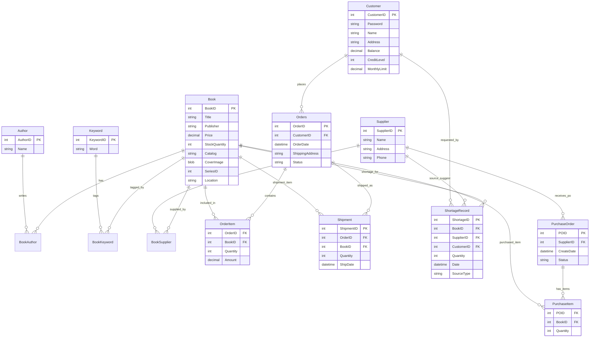

# 概念设计说明书

------

## 1 概念设计目标

概念设计通过 E-R 模型表达系统中的**实体、属性与关系**，为后续的逻辑设计（`OnlineBookStore` 数据库结构）提供蓝本。本完整版版本已经与《逻辑设计说明书完整版》对齐，补充了实现阶段新增的字段和实体（如图书上/下架、管理员账户、采购单与缺书记录的闭环等）。

本系统的数据范围包括：

- 书目与库存管理
- 客户管理与信用等级
- 订单与发货
- 缺书登记与采购闭环
- 供应商管理
- 管理员登录与权限

------

## 2 业务对象分析（Business Object Identification）

主要业务对象如下（在原版本基础上补充 `AdminUser`，并细化部分说明）：

| 业务对象                   | 是否实体       | 说明                                     |
| -------------------------- | -------------- | ---------------------------------------- |
| 书目（Book）               | 是             | 系统核心实体，支持上架/下架与封面图片   |
| 作者（Author）             | 是             | 多个作者按序排列                         |
| 关键字（Keyword）          | 是             | 一个书可有多个关键字                     |
| 供应商（Supplier）         | 是             | 多供应商供应同一本书                     |
| 客户（Customer）           | 是             | 网站用户，具有信用等级与透支额度         |
| 订单（Orders）             | 是             | 一个订单可包含多种书                     |
| 订单明细（OrderItem）      | 是（联系实体） | 表示订单与书的多对多关系                 |
| 发货记录（Shipment）       | 是             | 支持部分发货，多次发货                   |
| 缺书记录（ShortageRecord） | 是             | 缺书来源：库存预警 / 订单 / 手工登记     |
| 采购单（PurchaseOrder）    | 是             | 由缺书记录或手工生成，包含总金额         |
| 采购明细（PurchaseItem）   | 是（联系实体） | 采购单与书的多对多                       |
| 管理员（AdminUser）        | 是             | 后台登录账户，用于权限控制               |

------

## 3 实体定义与属性说明

以下每个实体均包含：

- 主键（PK）
- 外键（FK）
- 关键业务属性（包括新增的字段）
- 备注（与逻辑设计中的字段保持一一对应）

------

### 3.1 Book（书目）

**说明：核心实体；作者、关键字拆分为关联实体；增加上/下架属性。**

| 属性          | 说明                              |
| ------------- | --------------------------------- |
| BookID (PK)   | 书号                              |
| Title         | 书名                              |
| Publisher     | 出版社                            |
| Price         | 售价                              |
| Catalog       | 内容目录（可选）                  |
| CoverImage    | 封面二进制（可选）                |
| StockQuantity | 库存量                            |
| SeriesID      | 丛书编号（可选）                  |
| Location      | 库存位置                          |
| IsActive      | 是否上架（1=上架，0=下架，仅后台可见） |

------

### 3.2 Author（作者）

| 属性          | 说明     |
| ------------- | -------- |
| AuthorID (PK) | 作者编号 |
| Name          | 作者姓名 |

------

### 3.3 BookAuthor（弱实体 / 联系实体）

**说明：表达 Book 与 Author 的 M:N 关系，同时记录作者排序。**

| 属性          | 说明                               |
| ------------- | ---------------------------------- |
| BookID (FK)   | 所属书目                           |
| AuthorID (FK) | 作者                               |
| AuthorOrder   | 作者顺序（1~4），作为复合主键一部分 |

------

### 3.4 Keyword（关键字）

| 属性           | 说明       |
| -------------- | ---------- |
| KeywordID (PK) | 关键字编号 |
| Word           | 关键字文本 |

------

### 3.5 BookKeyword（联系实体）

| 属性           | 说明   |
| -------------- | ------ |
| BookID (FK)    | 书     |
| KeywordID (FK) | 关键字 |

------

### 3.6 Supplier（供应商）

| 属性            | 说明       |
| --------------- | ---------- |
| SupplierID (PK) | 供应商编号 |
| Name            | 名称       |
| Address         | 地址       |
| Phone           | 电话       |
| ContactEmail    | 联系邮箱   |

------

### 3.7 BookSupplier（多对多联系）

| 属性        | 说明          |
| ----------- | ------------- |
| BookID (FK) | 指向书目      |
| SupplierID  | 指向供应商    |
| SupplyPrice | 供应价格（进价） |

------

### 3.8 Customer（客户）

**说明：包含信用等级与透支额度，与“实验18 信用等级规则”一致。**

| 属性            | 说明                             |
| --------------- | -------------------------------- |
| CustomerID (PK) | 用户编号                         |
| Email           | 登录邮箱（唯一）                 |
| PasswordHash    | 登录密码哈希                     |
| Name            | 姓名                             |
| Address         | 地址                             |
| Balance         | 账户余额                         |
| CreditLevel     | 信用等级（1~5）                  |
| MonthlyLimit    | 透支额度（等级 3/4/5 时允许透支） |

------

### 3.9 Orders（订单）

| 属性            | 说明                                                  |
| --------------- | ----------------------------------------------------- |
| OrderID (PK)    | 订单号                                                |
| CustomerID (FK) | 客户编号                                              |
| OrderDate       | 下单日期                                              |
| ShippingAddress | 收货地址                                              |
| Status          | 订单状态（CREATED/PAID/PARTIAL/SHIPPED/CANCELLED 等） |
| TotalAmount     | 订单应付总金额（按折扣后汇总）                        |

**备注：**

- 当前实现中采用“下单即支付”模式：下单时扣款，订单状态直接进入 `PAID`。

------

### 3.10 OrderItem（订单明细）

| 属性         | 说明                      |
| ------------ | ------------------------- |
| OrderID (FK) | 所属订单                  |
| BookID (FK)  | 订购书目                  |
| Quantity     | 购买数量                  |
| UnitPrice    | 单价（下单时的售价）      |
| Amount       | 行金额（Quantity × UnitPrice），可视作派生属性 |

------

### 3.11 Shipment（发货记录）

| 属性            | 说明         |
| --------------- | ------------ |
| ShipmentID (PK) | 发货流水编号 |
| OrderID (FK)    | 对应订单     |
| BookID (FK)     | 对应书目     |
| Quantity        | 本次发货数量 |
| ShipDate        | 发货时间     |
| Carrier         | 承运商（可选） |
| TrackingNo      | 物流单号（可选） |

**备注：**

- 支持同一订单明细多次发货（部分发货），通过多条 Shipment 记录累计数量。

------

### 3.12 ShortageRecord（缺书记录）

| 属性                  | 说明                                      |
| --------------------- | ----------------------------------------- |
| ShortageID (PK)       | 缺书记录编号                              |
| BookID (FK)           | 缺书书目                                  |
| SupplierID (FK)       | 推荐供应商（可选）                        |
| CustomerID (FK, 可选) | 客户缺书来源（例如客户下单时发现缺货）    |
| Quantity              | 缺书数量                                  |
| Date                  | 登记日期                                  |
| SourceType            | 来源类型（INVENTORY/ORDER/MANUAL 等）     |
| Processed             | 是否已处理（0=未处理，1=已处理）          |

**备注：**

- 当库存预警、订单不足或管理员手工登记时，会产生一条缺书记录。
- 到货后通过采购闭环标记 `Processed=1`。

------

### 3.13 PurchaseOrder（采购单）

| 属性            | 说明                                           |
| --------------- | ---------------------------------------------- |
| POID (PK)       | 采购单号                                       |
| SupplierID (FK) | 供应商                                         |
| ShortageID (FK) | 来源缺书记录（可选，用于闭环追踪）             |
| CreateDate      | 创建日期                                       |
| Status          | 状态（CREATED/COMPLETED/CANCELLED 等）         |
| TotalAmount     | 采购总金额（按采购单明细汇总）                 |

**说明：**

- 当从缺书记录列表“一键生成采购单”时，`ShortageID` 指回来源记录。
- 到货后状态通常更新为 `COMPLETED`，并触发库存和缺书记录更新。

------

### 3.14 PurchaseItem（采购单明细）

| 属性        | 说明       |
| ----------- | ---------- |
| POID (FK)   | 所属采购单 |
| BookID (FK) | 采购书目   |
| Quantity    | 采购数量   |

------

### 3.15 AdminUser（管理员）

> 新增实体，用于后台登录与权限控制。

| 属性            | 说明           |
| --------------- | -------------- |
| AdminID (PK)    | 管理员编号     |
| Username        | 登录用户名（唯一） |
| PasswordHash    | 登录密码哈希   |
| Name            | 管理员姓名     |

**备注：**

- 与 `Customer` 分离，支持独立的管理员账户体系。

------

## 4 实体之间关系（Relationship）

以下为完整关系表（在原版基础上补充 `AdminUser` 的说明，并细化 `PurchaseOrder` 与 `ShortageRecord` 的关系）：

| 关系                         | 类型   | 基数 | 描述                                 |
| ---------------------------- | ------ | ---- | ------------------------------------ |
| Book – Author                | 多对多 | M:N  | 一本书多个作者；作者可著多书         |
| Book – Keyword               | 多对多 | M:N  | 一本书多个关键字                     |
| Book – Supplier              | 多对多 | M:N  | 一本书可由多个供应商供货             |
| Customer – Orders            | 一对多 | 1:N  | 一个客户可有多个订单                 |
| Orders – OrderItem           | 一对多 | 1:N  | 一个订单含多行明细                   |
| Book – OrderItem             | 一对多 | 1:N  | 一本书可出现在多条订单项里           |
| OrderItem – Shipment         | 一对多 | 1:N  | 一条订单项可分批多次发货             |
| Book – ShortageRecord        | 一对多 | 1:N  | 一本书可能产生多个缺书记录           |
| Supplier – ShortageRecord    | 一对多 | 1:N  | 缺书记录可建议的供应商               |
| Customer – ShortageRecord    | 一对多 | 1:N  | 客户下单时的缺货来源                 |
| PurchaseOrder – PurchaseItem | 一对多 | 1:N  | 一张采购单可以包含多种书             |
| Book – PurchaseItem          | 一对多 | 1:N  | 一本书出现在多条采购明细中           |
| ShortageRecord – PurchaseOrder | 一对多 | 1:N | 一条缺书记录可以生成多张采购单（或 0 张） |
| Supplier – PurchaseOrder     | 一对多 | 1:N  | 一个供应商可以有多张采购单           |
| AdminUser – （无直接 FK）    | N/A    | N/A  | 通过登录会话与后台操作间接关联       |

------

## 5 最终 E-R 图

下面是更新后的 E-R 图（Mermaid 伪代码），在原图基础上补充了 `AdminUser` 和 `ShortageRecord` ↔ `PurchaseOrder` 的联系，并隐含 `Book.IsActive` 等属性变更。

------

## 6 与逻辑设计的对应关系小结

- **所有实体和属性**均可在《逻辑设计说明书完整版》的相应表结构中找到一一对应字段。
- 新增或调整的关键概念：
  - 图书上/下架：`Book.IsActive`。
  - 采购单与缺书记录闭环：`PurchaseOrder.ShortageID` 与 `ShortageRecord.Processed`。
  - 采购总金额：`PurchaseOrder.TotalAmount`。
  - 管理员实体：`AdminUser`。
- 信用等级、透支额度、订单/采购单状态等业务规则，在概念层以属性与说明体现，在逻辑层以字段和枚举值实现，在应用层以 Java 代码执行。

本《概念设计说明书（完整版）》可以与《逻辑设计说明书完整版》一起作为系统最终文档提交。 

