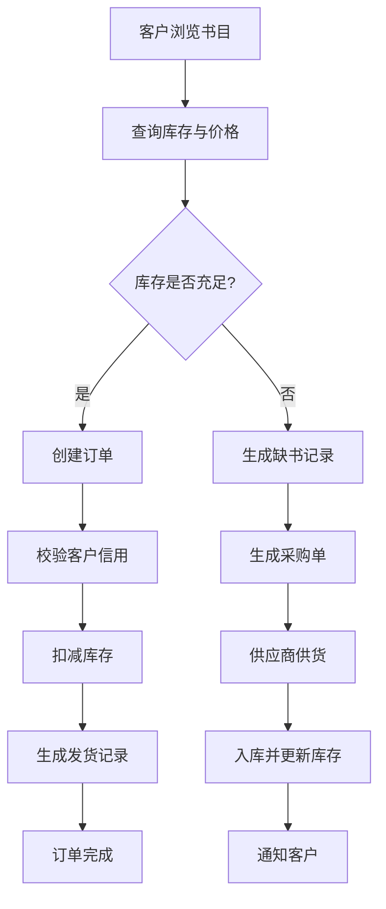
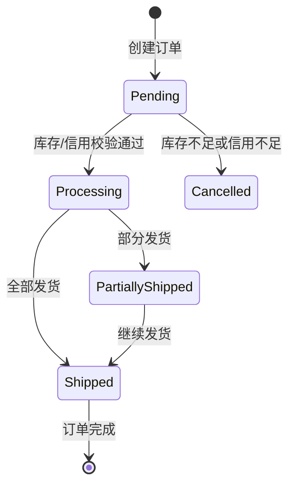

# **网上书店管理系统数据库设计说明书**

## **1. 引言**

### **1.1 编写目的**

本设计说明书旨在为《网上书店管理系统》的数据库设计与实现提供完整、系统、规范的指导文档。文档基于实验18的设计要求，并结合需求分析、概念设计与逻辑设计三个阶段的核心成果，旨在：

- **明确系统数据模型**：定义系统中所有实体、属性与关系，建立清晰的概念模型与逻辑模型。
- **指导数据库实施**：提供详细的表结构、约束、索引、视图、存储过程与触发器设计，确保数据库能正确支持业务功能。
- **保障数据质量与安全**：通过完整性约束、事务控制、权限设计与备份策略，确保数据的一致性、安全性与可恢复性。
- **为开发与维护提供依据**：作为后续数据库开发、测试、部署与维护的基准文档，便于团队协作与系统迭代。

本文档面向系统分析师、数据库设计师、开发工程师、测试人员及后期维护人员使用。

### **1.2 项目背景**

随着互联网购物的普及，传统书店业务逐渐向线上迁移，形成了线上线下融合的运营模式。为满足小型网上书店的日常业务与线上服务需求，本项目旨在构建一个支持**书目管理、库存管理、采购管理、客户管理、订单处理、发货管理、供应商管理及网上查询浏览**的综合数据库系统。

系统采用 **C/S + B/S 混合架构**：
- **后台管理端（C/S）**：供书店内部人员使用，处理日常业务，如库存维护、采购管理、信用调整等。
- **前台用户端（B/S）**：供客户通过浏览器访问，实现书目查询、在线下单、订单跟踪等功能。

数据库采用 **MySQL 8.0+**，存储引擎为 **InnoDB**，以支持事务处理、外键约束与行级锁，确保系统在高并发环境下的数据一致性与可靠性。

### **1.3 系统概述**

网上书店管理系统核心业务流如下所示：



系统主要功能模块包括：
- **书目与库存管理**：维护书目信息、作者、关键字、库存量与位置。
- **客户与信用管理**：管理客户账户、信用等级、透支额度与折扣政策。
- **订单与发货管理**：处理客户下单、库存校验、信用审核、分批发货。
- **缺书与采购管理**：实现缺书登记、采购单生成、到货入库与通知。
- **供应商管理**：维护供应商信息及其供货关系。
- **网上查询浏览**：支持客户与管理员的多维度查询。

### **1.4 设计原则与约束**

为确保数据库设计的规范性、可维护性与性能，本设计遵循以下原则：

| 原则类别       | 具体说明                                                     |
| -------------- | ------------------------------------------------------------ |
| **规范化设计** | 表结构遵循第三范式（3NF），减少数据冗余，确保更新一致性。    |
| **完整性约束** | 通过主键、外键、CHECK约束、触发器实现实体、参照与用户定义的完整性。 |
| **安全性设计** | 采用密码哈希存储、视图权限隔离、最小权限原则保护敏感数据。   |
| **性能优化**   | 为高频查询字段建立索引，使用全文索引支持模糊查询，合理设计事务与锁机制。 |
| **可扩展性**   | 表结构与字段设计预留扩展空间，支持未来业务增长与功能扩展。   |
| **可维护性**   | 提供清晰的注释、数据字典、备份与恢复策略，便于后期维护与问题排查。 |

**主要技术约束：**
- 数据库：MySQL 8.0+
- 字符集：utf8mb4
- 存储引擎：InnoDB
- 最大并发用户数：预计100人同时在线
- 数据量预估：书目1万条，订单年增量约5万条

### **1.5 术语与缩写**

| 术语/缩写    | 全称/说明                                                |
| ------------ | -------------------------------------------------------- |
| **E-R 模型** | 实体-关系模型，用于描述系统中实体、属性及其关系。        |
| **PK**       | 主键，唯一标识表中每一条记录。                           |
| **FK**       | 外键，建立表与表之间的关联关系。                         |
| **3NF**      | 第三范式，确保表中每一列都与主键直接相关，消除传递依赖。 |
| **DFD**      | 数据流图，描述系统中数据的流动、处理与存储。             |
| **C/S**      | 客户端/服务器架构。                                      |
| **B/S**      | 浏览器/服务器架构。                                      |
| **InnoDB**   | MySQL支持事务的存储引擎。                                |
| **UTF8MB4**  | 支持四字节字符的UTF-8编码，适用于存储表情符号与生僻字。  |

# **2. 需求分析综述**

## **2.1 用户角色与权限分析**

系统涉及四类主要用户角色，其职责与权限定义如下：

| 角色           | 职责描述                                                     | 关键数据权限                                                 |
| -------------- | ------------------------------------------------------------ | ------------------------------------------------------------ |
| **系统管理员** | 负责数据库整体维护、用户权限分配、系统监控与备份恢复。       | 全表访问权限（DDL、DML）、用户管理、权限配置。               |
| **书店管理员** | 管理书目信息、库存更新、客户信用调整、订单发货处理。         | 访问`Book`、`Customer`、`Orders`、`Shipment`、`ShortageRecord`等业务表。 |
| **采购管理员** | 处理缺书记录、生成采购单、管理供应商信息、执行入库操作。     | 访问`ShortageRecord`、`PurchaseOrder`、`Supplier`、`BookSupplier`等表。 |
| **网上客户**   | 注册登录、浏览查询书目、下订单、查询订单状态、登记缺书请求。 | 仅能访问自身客户信息、订单记录、发货记录及公开书目信息（通过视图）。 |

**权限控制策略：**
- 通过数据库用户角色（Role）实现权限分组。
- 敏感操作（如信用调整、库存修改）仅限后台管理员执行。
- 客户端查询通过视图（View）实现数据隔离与安全性。

## **2.2 功能需求总结**

### **2.2.1 书目与库存管理**
- **功能描述**：管理书目基本信息、作者、关键字、库存量、存放位置及供应商关系。
- **核心属性**：
  - 书号（支持丛书结构）
  - 书名、出版社、单价
  - 作者（1~4人，有序）
  - 关键字（最多10个）
  - 目录、封面（可选）
  - 库存量、库存位置
  - 供应商列表（多对多）
- **业务规则**：
  - 新书录入时自动初始化库存为0。
  - 库存量随订单发货自动扣减，随采购入库自动增加。
  - 库存量低于设定阈值时自动触发缺书记录。

### **2.2.2 客户与信用管理**
- **功能描述**：管理客户账户信息、信用等级、透支额度与折扣政策。
- **信用等级规则**（与需求文档一致）：

| 信用等级 | 折扣 | 透支额度   | 说明                     |
| -------- | ---- | ---------- | ------------------------ |
| 1        | 10%  | 不允许透支 | 基础客户                 |
| 2        | 15%  | 不允许透支 | 良好客户                 |
| 3        | 15%  | 有限额透支 | 优质客户，可先发货后付款 |
| 4        | 20%  | 有限额透支 | VIP客户，额度更高        |
| 5        | 25%  | 无限额透支 | 企业级客户               |

- **业务规则**：
  - 客户可自行修改基本信息（除余额、信用等级外）。
  - 信用等级可由管理员手动调整，或根据消费累计自动提升（可选）。
  - 下单时系统校验信用额度与账户余额。

### **2.2.3 订单与发货管理**
- **功能描述**：处理客户下单、库存校验、信用审核、发货记录生成。
- **订单状态机**：



- **业务规则**：
  - 支持一个订单包含多本书（订单明细）。
  - 库存不足时可接受订单，并自动生成缺书记录。
  - 发货前校验客户信用与账户余额。
  - 支持分批发货（部分发货状态）。

### **2.2.4 缺书与采购管理**
- **功能描述**：实现缺书登记、采购单生成、到货入库与通知流程。
- **缺书记录来源**：
  1. **人工登记**：管理员手动录入缺书信息。
  2. **自动触发**：库存低于阈值时系统自动生成。
  3. **客户触发**：客户下单时库存不足或主动登记缺书。
- **采购流程**：
  ```
  缺书记录 → 生成采购单 → 发送供应商 → 到货入库 → 更新库存 → 通知客户
  ```

### **2.2.5 供应商管理**
- **功能描述**：维护供应商基本信息及其与书目的供应关系。
- **核心属性**：供应商编号、名称、地址、联系方式、供应书目及价格。
- **业务规则**：一本书可由多个供应商供应，每个供应商可供应多本书。

### **2.2.6 网上查询浏览**
- **客户查询功能**：
  - 按书名、作者、关键字进行模糊查询。
  - 查看书目详情（含作者、关键字、库存）。
  - 查询个人订单历史与发货状态。
- **管理员查询功能**：
  - 库存统计与预警查询。
  - 缺书记录与采购进度查询。
  - 客户信用与消费统计。

## **2.3 数据流分析（DFD）**

### **2.3.1 外部实体说明**
| 实体          | 说明                                                 |
| ------------- | ---------------------------------------------------- |
| **Customer**  | 客户，执行查询、下单、登记缺书等操作。               |
| **Admin**     | 书店管理员，负责书目维护、库存管理、发货等后台操作。 |
| **Purchaser** | 采购人员，处理缺书记录、生成采购单、执行入库。       |
| **Supplier**  | 供应商，提供书目信息与供货服务。                     |

### **2.3.2 核心处理过程（P1–P5）**
| 过程编号 | 名称           | 功能描述                                                     |
| -------- | -------------- | ------------------------------------------------------------ |
| **P1**   | 书目查询与展示 | 响应客户查询，从D1读取书目信息并返回结果；支持管理员维护书目数据。 |
| **P2**   | 订单处理       | 处理客户下单，校验库存与信用，生成订单记录与缺书记录，触发出库。 |
| **P3**   | 库存管理       | 执行出库与入库操作，实时更新库存数据（D1）。                 |
| **P4**   | 缺书与采购管理 | 处理缺书记录来源，生成采购单，接收供应商发货通知，触发入库流程。 |
| **P5**   | 客户管理       | 处理客户注册、登录、信息维护、信用与余额更新。               |

### **2.3.3 数据存储（D1–D5）**
| 存储编号 | 名称           | 存储内容                                           |
| -------- | -------------- | -------------------------------------------------- |
| **D1**   | 书目与库存数据 | 书目基本信息、作者、关键字、库存量、供应商关系等。 |
| **D2**   | 客户数据       | 客户账户、联系方式、余额、信用等级、透支额度等。   |
| **D3**   | 订单与订单明细 | 订单主表、订单明细、发货状态、金额等。             |
| **D4**   | 缺书记录       | 缺书来源、数量、推荐供应商、登记日期、处理状态等。 |
| **D5**   | 采购单数据     | 采购单主表、采购明细、供应商、状态、创建日期等。   |

### **2.3.4 数据流动特点**
- **客户行为驱动多流程**：查询（P1）→ 下单（P2）→ 可能触发缺书（P4）→ 查询订单（D3）。
- **库存为核心枢纽**：订单处理（P2）与采购入库（P4）均通过库存管理（P3）更新D1。
- **采购流程闭环**：缺书记录（D4）→ 采购单（D5）→ 入库（P3）→ 更新库存（D1）→ 通知客户。
- **信用贯穿订单生命周期**：下单前校验（P2）、发货前复核、信用等级动态调整（P5）。

# **3. 概念结构设计**

## **3.1 实体识别与定义**

根据需求分析与业务对象识别，系统共定义 **11个核心实体** 与 **5个联系实体**，完整列表如下：

| 实体名称（英文）   | 实体名称（中文） | 类型     | 说明                                                         |
| ------------------ | ---------------- | -------- | ------------------------------------------------------------ |
| **Book**           | 书目             | 核心实体 | 存储书籍的基本信息，如书名、价格、库存等。                   |
| **Author**         | 作者             | 独立实体 | 存储作者信息，与书目为多对多关系。                           |
| **Keyword**        | 关键字           | 独立实体 | 存储关键字文本，与书目为多对多关系。                         |
| **Supplier**       | 供应商           | 核心实体 | 存储供应商基本信息及联系方式。                               |
| **Customer**       | 客户             | 核心实体 | 存储客户账户、信用等级、余额等信息。                         |
| **Orders**         | 订单             | 核心实体 | 记录客户下单信息，包括订单状态、收货地址等。                 |
| **OrderItem**      | 订单明细         | 联系实体 | 实现订单与书目之间的多对多关系，记录每本书的购买数量与金额。 |
| **Shipment**       | 发货记录         | 核心实体 | 记录每批发货的详细信息，支持部分发货。                       |
| **ShortageRecord** | 缺书记录         | 核心实体 | 记录缺书信息，包括来源（人工/自动/客户）、数量、推荐供应商等。 |
| **PurchaseOrder**  | 采购单           | 核心实体 | 记录采购单基本信息，如供应商、创建日期、状态等。             |
| **PurchaseItem**   | 采购明细         | 联系实体 | 实现采购单与书目之间的多对多关系，记录采购数量。             |
| **BookAuthor**     | 书目作者联系     | 联系实体 | 实现书目与作者的多对多关系，并记录作者顺序。                 |
| **BookKeyword**    | 书目关键字联系   | 联系实体 | 实现书目与关键字的多对多关系。                               |
| **BookSupplier**   | 书目供应商联系   | 联系实体 | 实现书目与供应商的多对多关系，记录供应价格。                 |

## **3.2 实体属性说明**

### **3.2.1 Book（书目）**
| 属性名        | 数据类型      | 约束     | 说明             |
| ------------- | ------------- | -------- | ---------------- |
| BookID        | INT           | PK       | 书目唯一标识     |
| Title         | VARCHAR(200)  | NOT NULL | 书名             |
| Publisher     | VARCHAR(100)  |          | 出版社           |
| Price         | DECIMAL(10,2) | NOT NULL | 售价，大于等于0  |
| StockQuantity | INT           | NOT NULL | 当前库存量       |
| Catalog       | TEXT          |          | 内容目录（可选） |
| CoverImage    | LONGBLOB      |          | 封面图片（可选） |
| SeriesID      | INT           |          | 丛书编号（可选） |
| Location      | VARCHAR(100)  |          | 库存位置描述     |
| CreatedAt     | DATETIME      |          | 创建时间         |
| UpdatedAt     | DATETIME      |          | 最后更新时间     |

### **3.2.2 Author（作者）**
| 属性名    | 数据类型     | 约束     | 说明         |
| --------- | ------------ | -------- | ------------ |
| AuthorID  | INT          | PK       | 作者唯一标识 |
| Name      | VARCHAR(100) | NOT NULL | 作者姓名     |
| CreatedAt | DATETIME     |          | 创建时间     |

### **3.2.3 BookAuthor（书目作者联系）**
| 属性名      | 数据类型 | 约束     | 说明                          |
| ----------- | -------- | -------- | ----------------------------- |
| BookID      | INT      | FK, PK   | 关联书目                      |
| AuthorID    | INT      | FK, PK   | 关联作者                      |
| AuthorOrder | TINYINT  | NOT NULL | 作者顺序（1~4），复合主键之一 |

### **3.2.4 Keyword（关键字）**
| 属性名    | 数据类型    | 约束     | 说明           |
| --------- | ----------- | -------- | -------------- |
| KeywordID | INT         | PK       | 关键字唯一标识 |
| Word      | VARCHAR(50) | NOT NULL | 关键字文本     |
| CreatedAt | DATETIME    |          | 创建时间       |

### **3.2.5 BookKeyword（书目关键字联系）**
| 属性名    | 数据类型 | 约束   | 说明       |
| --------- | -------- | ------ | ---------- |
| BookID    | INT      | FK, PK | 关联书目   |
| KeywordID | INT      | FK, PK | 关联关键字 |

### **3.2.6 Supplier（供应商）**
| 属性名       | 数据类型     | 约束     | 说明           |
| ------------ | ------------ | -------- | -------------- |
| SupplierID   | INT          | PK       | 供应商唯一标识 |
| Name         | VARCHAR(200) | NOT NULL | 供应商名称     |
| Address      | VARCHAR(300) |          | 地址           |
| Phone        | VARCHAR(50)  |          | 联系电话       |
| ContactEmail | VARCHAR(100) |          | 联系邮箱       |
| CreatedAt    | DATETIME     |          | 创建时间       |

### **3.2.7 BookSupplier（书目供应商联系）**
| 属性名      | 数据类型      | 约束   | 说明       |
| ----------- | ------------- | ------ | ---------- |
| BookID      | INT           | FK, PK | 关联书目   |
| SupplierID  | INT           | FK, PK | 关联供应商 |
| SupplyPrice | DECIMAL(10,2) |        | 供应价格   |

### **3.2.8 Customer（客户）**
| 属性名       | 数据类型      | 约束      | 说明                                  |
| ------------ | ------------- | --------- | ------------------------------------- |
| CustomerID   | INT           | PK        | 客户唯一标识                          |
| Email        | VARCHAR(150)  | UNIQUE    | 登录邮箱                              |
| PasswordHash | VARCHAR(255)  | NOT NULL  | 密码哈希值                            |
| Name         | VARCHAR(200)  |           | 客户姓名                              |
| Address      | VARCHAR(300)  |           | 收货地址                              |
| Balance      | DECIMAL(12,2) | DEFAULT 0 | 账户余额                              |
| CreditLevel  | TINYINT       | DEFAULT 1 | 信用等级（1~5）                       |
| MonthlyLimit | DECIMAL(12,2) | DEFAULT 0 | 月度透支额度（仅信用等级3、4、5有效） |
| CreatedAt    | DATETIME      |           | 注册时间                              |
| LastLogin    | DATETIME      |           | 最后登录时间                          |

### **3.2.9 Orders（订单）**
| 属性名          | 数据类型      | 约束              | 说明                                                         |
| --------------- | ------------- | ----------------- | ------------------------------------------------------------ |
| OrderID         | INT           | PK                | 订单唯一标识                                                 |
| CustomerID      | INT           | FK                | 关联客户                                                     |
| OrderDate       | DATETIME      |                   | 下单时间                                                     |
| ShippingAddress | VARCHAR(300)  |                   | 收货地址                                                     |
| TotalAmount     | DECIMAL(12,2) | DEFAULT 0         | 订单总金额                                                   |
| Status          | VARCHAR(50)   | DEFAULT 'Pending' | 订单状态：Pending/Processing/PartiallyShipped/Shipped/Cancelled |

### **3.2.10 OrderItem（订单明细）**
| 属性名    | 数据类型      | 约束      | 说明                         |
| --------- | ------------- | --------- | ---------------------------- |
| OrderID   | INT           | FK, PK    | 关联订单                     |
| BookID    | INT           | FK, PK    | 关联书目                     |
| Quantity  | INT           | NOT NULL  | 购买数量                     |
| UnitPrice | DECIMAL(10,2) | NOT NULL  | 单价（下单时价格快照）       |
| Amount    | DECIMAL(12,2) | GENERATED | 计算列：Quantity * UnitPrice |

### **3.2.11 Shipment（发货记录）**
| 属性名     | 数据类型     | 约束     | 说明             |
| ---------- | ------------ | -------- | ---------------- |
| ShipmentID | INT          | PK       | 发货记录唯一标识 |
| OrderID    | INT          | FK       | 关联订单         |
| BookID     | INT          | FK       | 关联书目         |
| Quantity   | INT          | NOT NULL | 发货数量         |
| ShipDate   | DATETIME     |          | 发货时间         |
| Carrier    | VARCHAR(100) |          | 承运商           |
| TrackingNo | VARCHAR(100) |          | 物流单号         |

### **3.2.12 ShortageRecord（缺书记录）**
| 属性名     | 数据类型    | 约束      | 说明                             |
| ---------- | ----------- | --------- | -------------------------------- |
| ShortageID | INT         | PK        | 缺书记录唯一标识                 |
| BookID     | INT         | FK        | 关联书目                         |
| SupplierID | INT         | FK        | 推荐供应商（可选）               |
| CustomerID | INT         | FK        | 关联客户（若为客户触发）         |
| Quantity   | INT         | NOT NULL  | 缺书数量                         |
| Date       | DATETIME    |           | 登记日期                         |
| SourceType | VARCHAR(50) |           | 来源：Manual/Auto/Customer       |
| Processed  | TINYINT     | DEFAULT 0 | 是否已处理（0=未处理，1=已处理） |

### **3.2.13 PurchaseOrder（采购单）**
| 属性名     | 数据类型    | 约束              | 说明                  |
| ---------- | ----------- | ----------------- | --------------------- |
| POID       | INT         | PK                | 采购单唯一标识        |
| SupplierID | INT         | FK                | 关联供应商            |
| CreateDate | DATETIME    |                   | 创建日期              |
| Status     | VARCHAR(50) | DEFAULT 'Created' | 状态：Created/Arrived |

### **3.2.14 PurchaseItem（采购明细）**
| 属性名   | 数据类型 | 约束     | 说明       |
| -------- | -------- | -------- | ---------- |
| POID     | INT      | FK, PK   | 关联采购单 |
| BookID   | INT      | FK, PK   | 关联书目   |
| Quantity | INT      | NOT NULL | 采购数量   |

## **3.3 实体间关系分析**

系统实体间关系汇总如下表所示，涵盖了所有一对多、多对多及联系实体的语义说明：

| 关系                             | 类型   | 实体A         | 实体B          | 基数 | 说明                                                         |
| -------------------------------- | ------ | ------------- | -------------- | ---- | ------------------------------------------------------------ |
| **Book – Author**                | 多对多 | Book          | Author         | M:N  | 一本书可有多个作者，一个作者可著多本书；通过BookAuthor联系实体实现。 |
| **Book – Keyword**               | 多对多 | Book          | Keyword        | M:N  | 一本书可有多个关键字，一个关键字可对应多本书；通过BookKeyword实现。 |
| **Book – Supplier**              | 多对多 | Book          | Supplier       | M:N  | 一本书可由多个供应商供应，一个供应商可供应多本书；通过BookSupplier实现。 |
| **Customer – Orders**            | 一对多 | Customer      | Orders         | 1:N  | 一个客户可拥有多个订单。                                     |
| **Orders – OrderItem**           | 一对多 | Orders        | OrderItem      | 1:N  | 一个订单可包含多个订单项（多种书）。                         |
| **Book – OrderItem**             | 一对多 | Book          | OrderItem      | 1:N  | 一本书可出现在多个订单项中。                                 |
| **OrderItem – Shipment**         | 一对多 | OrderItem     | Shipment       | 1:N  | 一个订单项可对应多批发货（支持分批发货）。                   |
| **Book – ShortageRecord**        | 一对多 | Book          | ShortageRecord | 1:N  | 一本书可产生多个缺书记录。                                   |
| **Supplier – ShortageRecord**    | 一对多 | Supplier      | ShortageRecord | 1:N  | 一个供应商可被推荐为多个缺书记录的供货方。                   |
| **Customer – ShortageRecord**    | 一对多 | Customer      | ShortageRecord | 1:N  | 一个客户可触发多个缺书记录（若来源为客户）。                 |
| **Supplier – PurchaseOrder**     | 一对多 | Supplier      | PurchaseOrder  | 1:N  | 一个供应商可对应多个采购单。                                 |
| **PurchaseOrder – PurchaseItem** | 一对多 | PurchaseOrder | PurchaseItem   | 1:N  | 一个采购单可包含多个采购明细（多种书）。                     |
| **Book – PurchaseItem**          | 一对多 | Book          | PurchaseItem   | 1:N  | 一本书可出现在多个采购明细中。                               |

## **3.4 全局E-R图**

系统全局E-R图如下所示，以可视化形式展示了所有实体、属性及其之间的关系：


**图例说明：**
- 矩形表示实体
- 菱形表示关系
- 椭圆形表示属性
- 连线上的数字表示基数（1、N、M）
- 虚线框表示弱实体或联系实体

**主要关系路径示例：**
1. **客户下单路径**：`Customer → Orders → OrderItem → Book`
2. **缺书采购路径**：`ShortageRecord → PurchaseOrder → PurchaseItem → Book`
3. **书目关联路径**：`Book ←→ Author / Keyword / Supplier`

# **4. 逻辑结构设计**

## **4.1 数据库环境说明**

| 项目           | 说明                                                         |
| -------------- | ------------------------------------------------------------ |
| **数据库系统** | MySQL 8.0+                                                   |
| **字符集**     | utf8mb4                                                      |
| **排序规则**   | utf8mb4_general_ci                                           |
| **存储引擎**   | InnoDB（支持事务、外键、行级锁）                             |
| **命名规范**   | 表名采用PascalCase，字段名采用camelCase，外键以`FK_`为前缀，索引以`IDX_`为前缀 |
| **主键策略**   | 自增整数（INT AUTO_INCREMENT），联系表采用复合主键           |

## **4.2 关系模式设计**

基于概念模型，将实体与联系转换为以下关系模式（表结构）：

| 表名（英文）     | 表名（中文）     | 说明                                     |
| ---------------- | ---------------- | ---------------------------------------- |
| `Book`           | 书目表           | 存储书目核心信息                         |
| `Author`         | 作者表           | 存储作者信息                             |
| `BookAuthor`     | 书目作者联系表   | 实现书目与作者的多对多关系，含作者顺序   |
| `Keyword`        | 关键字表         | 存储关键字文本                           |
| `BookKeyword`    | 书目关键字联系表 | 实现书目与关键字的多对多关系             |
| `Supplier`       | 供应商表         | 存储供应商信息                           |
| `BookSupplier`   | 书目供应商联系表 | 实现书目与供应商的多对多关系，含供应价格 |
| `Customer`       | 客户表           | 存储客户账户、信用、余额等信息           |
| `Orders`         | 订单表           | 存储订单主信息                           |
| `OrderItem`      | 订单明细表       | 存储订单项信息，连接订单与书目           |
| `Shipment`       | 发货记录表       | 存储发货明细，支持分批发货               |
| `ShortageRecord` | 缺书记录表       | 存储缺书登记信息                         |
| `PurchaseOrder`  | 采购单表         | 存储采购单主信息                         |
| `PurchaseItem`   | 采购明细表       | 存储采购项信息，连接采购单与书目         |

## **4.3 表结构详细设计**

### **4.3.1 Book（书目表）**

```sql
CREATE TABLE Book (
  BookID INT PRIMARY KEY AUTO_INCREMENT COMMENT '书目ID',
  Title VARCHAR(200) NOT NULL COMMENT '书名',
  Publisher VARCHAR(100) COMMENT '出版社',
  Price DECIMAL(10,2) NOT NULL CHECK (Price >= 0) COMMENT '售价',
  StockQuantity INT NOT NULL DEFAULT 0 COMMENT '库存量',
  Catalog TEXT COMMENT '内容目录',
  CoverImage LONGBLOB COMMENT '封面图片',
  SeriesID INT COMMENT '丛书编号',
  Location VARCHAR(100) COMMENT '库存位置',
  CreatedAt DATETIME DEFAULT CURRENT_TIMESTAMP COMMENT '创建时间',
  UpdatedAt DATETIME DEFAULT CURRENT_TIMESTAMP ON UPDATE CURRENT_TIMESTAMP COMMENT '最后更新时间',
  FULLTEXT INDEX fx_book_title (Title) COMMENT '全文索引-书名'
) ENGINE=InnoDB COMMENT='书目信息表';
```

### **4.3.2 Author（作者表）**

```sql
CREATE TABLE Author (
  AuthorID INT PRIMARY KEY AUTO_INCREMENT COMMENT '作者ID',
  Name VARCHAR(100) NOT NULL COMMENT '作者姓名',
  CreatedAt DATETIME DEFAULT CURRENT_TIMESTAMP COMMENT '创建时间'
) ENGINE=InnoDB COMMENT='作者信息表';
```

### **4.3.3 BookAuthor（书目作者联系表）**

```sql
CREATE TABLE BookAuthor (
  BookID INT NOT NULL COMMENT '书目ID',
  AuthorID INT NOT NULL COMMENT '作者ID',
  AuthorOrder TINYINT NOT NULL CHECK (AuthorOrder BETWEEN 1 AND 4) COMMENT '作者顺序（1-4）',
  PRIMARY KEY (BookID, AuthorID),
  FOREIGN KEY (BookID) REFERENCES Book(BookID) ON DELETE CASCADE ON UPDATE CASCADE,
  FOREIGN KEY (AuthorID) REFERENCES Author(AuthorID) ON DELETE RESTRICT ON UPDATE CASCADE,
  INDEX idx_bookauthor_bookid (BookID)
) ENGINE=InnoDB COMMENT='书目作者关联表';
```

### **4.3.4 Keyword（关键字表）**

```sql
CREATE TABLE Keyword (
  KeywordID INT PRIMARY KEY AUTO_INCREMENT COMMENT '关键字ID',
  Word VARCHAR(50) NOT NULL COMMENT '关键字文本',
  UNIQUE INDEX ux_keyword_word (Word),
  FULLTEXT INDEX fx_keyword_word (Word)
) ENGINE=InnoDB COMMENT='关键字表';
```

### **4.3.5 BookKeyword（书目关键字联系表）**

```sql
CREATE TABLE BookKeyword (
  BookID INT NOT NULL COMMENT '书目ID',
  KeywordID INT NOT NULL COMMENT '关键字ID',
  PRIMARY KEY (BookID, KeywordID),
  FOREIGN KEY (BookID) REFERENCES Book(BookID) ON DELETE CASCADE,
  FOREIGN KEY (KeywordID) REFERENCES Keyword(KeywordID) ON DELETE CASCADE
) ENGINE=InnoDB COMMENT='书目关键字关联表';
```

### **4.3.6 Supplier（供应商表）**

```sql
CREATE TABLE Supplier (
  SupplierID INT PRIMARY KEY AUTO_INCREMENT COMMENT '供应商ID',
  Name VARCHAR(200) NOT NULL COMMENT '供应商名称',
  Address VARCHAR(300) COMMENT '地址',
  Phone VARCHAR(50) COMMENT '电话',
  ContactEmail VARCHAR(100) COMMENT '联系邮箱',
  CreatedAt DATETIME DEFAULT CURRENT_TIMESTAMP COMMENT '创建时间'
) ENGINE=InnoDB COMMENT='供应商信息表';
```

### **4.3.7 BookSupplier（书目供应商联系表）**

```sql
CREATE TABLE BookSupplier (
  BookID INT NOT NULL COMMENT '书目ID',
  SupplierID INT NOT NULL COMMENT '供应商ID',
  SupplyPrice DECIMAL(10,2) COMMENT '供应价格',
  PRIMARY KEY (BookID, SupplierID),
  FOREIGN KEY (BookID) REFERENCES Book(BookID) ON DELETE CASCADE,
  FOREIGN KEY (SupplierID) REFERENCES Supplier(SupplierID) ON DELETE CASCADE
) ENGINE=InnoDB COMMENT='书目供应商关联表';
```

### **4.3.8 Customer（客户表）**

```sql
CREATE TABLE Customer (
  CustomerID INT PRIMARY KEY AUTO_INCREMENT COMMENT '客户ID',
  Email VARCHAR(150) UNIQUE NOT NULL COMMENT '登录邮箱',
  PasswordHash VARCHAR(255) NOT NULL COMMENT '密码哈希值',
  Name VARCHAR(200) COMMENT '客户姓名',
  Address VARCHAR(300) COMMENT '收货地址',
  Balance DECIMAL(12,2) DEFAULT 0 COMMENT '账户余额',
  CreditLevel TINYINT DEFAULT 1 CHECK (CreditLevel BETWEEN 1 AND 5) COMMENT '信用等级（1-5）',
  MonthlyLimit DECIMAL(12,2) DEFAULT 0 COMMENT '月度透支额度',
  CreatedAt DATETIME DEFAULT CURRENT_TIMESTAMP COMMENT '注册时间',
  LastLogin DATETIME COMMENT '最后登录时间',
  INDEX idx_customer_email (Email)
) ENGINE=InnoDB COMMENT='客户信息表';
```

### **4.3.9 Orders（订单表）**

```sql
CREATE TABLE Orders (
  OrderID INT PRIMARY KEY AUTO_INCREMENT COMMENT '订单ID',
  CustomerID INT NOT NULL COMMENT '客户ID',
  OrderDate DATETIME DEFAULT CURRENT_TIMESTAMP COMMENT '下单时间',
  ShippingAddress VARCHAR(300) COMMENT '收货地址',
  TotalAmount DECIMAL(12,2) DEFAULT 0 COMMENT '订单总金额',
  Status VARCHAR(50) DEFAULT 'Pending' 
    CHECK (Status IN ('Pending', 'Processing', 'PartiallyShipped', 'Shipped', 'Cancelled')) 
    COMMENT '订单状态',
  FOREIGN KEY (CustomerID) REFERENCES Customer(CustomerID) ON DELETE RESTRICT,
  INDEX idx_orders_customer (CustomerID)
) ENGINE=InnoDB COMMENT='订单表';
```

### **4.3.10 OrderItem（订单明细表）**

```sql
CREATE TABLE OrderItem (
  OrderID INT NOT NULL COMMENT '订单ID',
  BookID INT NOT NULL COMMENT '书目ID',
  Quantity INT NOT NULL CHECK (Quantity > 0) COMMENT '购买数量',
  UnitPrice DECIMAL(10,2) NOT NULL COMMENT '单价',
  Amount DECIMAL(12,2) AS (Quantity * UnitPrice) STORED COMMENT '金额',
  PRIMARY KEY (OrderID, BookID),
  FOREIGN KEY (OrderID) REFERENCES Orders(OrderID) ON DELETE CASCADE,
  FOREIGN KEY (BookID) REFERENCES Book(BookID) ON DELETE RESTRICT,
  INDEX idx_orderitem_bookid (BookID)
) ENGINE=InnoDB COMMENT='订单明细表';
```

### **4.3.11 Shipment（发货记录表）**

```sql
CREATE TABLE Shipment (
  ShipmentID INT PRIMARY KEY AUTO_INCREMENT COMMENT '发货记录ID',
  OrderID INT NOT NULL COMMENT '订单ID',
  BookID INT NOT NULL COMMENT '书目ID',
  Quantity INT NOT NULL COMMENT '发货数量',
  ShipDate DATETIME DEFAULT CURRENT_TIMESTAMP COMMENT '发货时间',
  Carrier VARCHAR(100) COMMENT '承运商',
  TrackingNo VARCHAR(100) COMMENT '物流单号',
  FOREIGN KEY (OrderID) REFERENCES Orders(OrderID) ON DELETE CASCADE,
  FOREIGN KEY (BookID) REFERENCES Book(BookID) ON DELETE RESTRICT,
  INDEX idx_shipment_order (OrderID)
) ENGINE=InnoDB COMMENT='发货记录表';
```

### **4.3.12 ShortageRecord（缺书记录表）**

```sql
CREATE TABLE ShortageRecord (
  ShortageID INT PRIMARY KEY AUTO_INCREMENT COMMENT '缺书记录ID',
  BookID INT NOT NULL COMMENT '书目ID',
  SupplierID INT COMMENT '推荐供应商ID',
  CustomerID INT COMMENT '客户ID（若为客户触发）',
  Quantity INT NOT NULL COMMENT '缺书数量',
  Date DATETIME DEFAULT CURRENT_TIMESTAMP COMMENT '登记日期',
  SourceType VARCHAR(50) 
    CHECK (SourceType IN ('Manual', 'Auto', 'Customer')) 
    COMMENT '来源类型',
  Processed TINYINT DEFAULT 0 COMMENT '是否已处理（0=未处理，1=已处理）',
  FOREIGN KEY (BookID) REFERENCES Book(BookID) ON DELETE CASCADE,
  FOREIGN KEY (SupplierID) REFERENCES Supplier(SupplierID) ON DELETE SET NULL,
  FOREIGN KEY (CustomerID) REFERENCES Customer(CustomerID) ON DELETE SET NULL,
  INDEX idx_shortage_book (BookID)
) ENGINE=InnoDB COMMENT='缺书记录表';
```

### **4.3.13 PurchaseOrder（采购单表）**

```sql
CREATE TABLE PurchaseOrder (
  POID INT PRIMARY KEY AUTO_INCREMENT COMMENT '采购单ID',
  SupplierID INT NOT NULL COMMENT '供应商ID',
  CreateDate DATETIME DEFAULT CURRENT_TIMESTAMP COMMENT '创建日期',
  Status VARCHAR(50) DEFAULT 'Created' 
    CHECK (Status IN ('Created', 'Arrived')) 
    COMMENT '采购单状态',
  FOREIGN KEY (SupplierID) REFERENCES Supplier(SupplierID) ON DELETE RESTRICT
) ENGINE=InnoDB COMMENT='采购单表';
```

### **4.3.14 PurchaseItem（采购明细表）**

```sql
CREATE TABLE PurchaseItem (
  POID INT NOT NULL COMMENT '采购单ID',
  BookID INT NOT NULL COMMENT '书目ID',
  Quantity INT NOT NULL COMMENT '采购数量',
  PRIMARY KEY (POID, BookID),
  FOREIGN KEY (POID) REFERENCES PurchaseOrder(POID) ON DELETE CASCADE,
  FOREIGN KEY (BookID) REFERENCES Book(BookID) ON DELETE RESTRICT
) ENGINE=InnoDB COMMENT='采购明细表';
```

## **4.4 数据字典（摘要）**

为便于查阅，以下为关键表字段的数据字典摘要：

| 表名      | 字段名      | 数据类型      | 是否为空 | 默认值         | 说明            |
| --------- | ----------- | ------------- | -------- | -------------- | --------------- |
| Book      | BookID      | INT           | NO       | AUTO_INCREMENT | 书目唯一标识    |
| Book      | Title       | VARCHAR(200)  | NO       | -              | 书名            |
| Book      | Price       | DECIMAL(10,2) | NO       | -              | 售价            |
| Customer  | CreditLevel | TINYINT       | NO       | 1              | 信用等级（1-5） |
| Orders    | Status      | VARCHAR(50)   | NO       | 'Pending'      | 订单状态        |
| OrderItem | Amount      | DECIMAL(12,2) | NO       | GENERATED      | 计算金额        |

> **完整数据字典**（含所有表的所有字段）见附录15.4。

