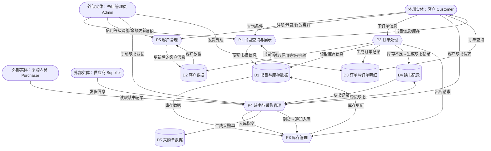

# **需求分析说明书**

## **1. 项目背景**

随着互联网的发展，网上购书成为书店业务的重要组成部分。本系统面向一个小型网上书店，支持书店内部业务（库存、采购、订单、客户管理等）与外部网上购书业务。

系统采用 **C/S + B/S 混合模式**，后端数据库为 **MySQL**。

------

## **2. 系统目标**

1. 建立一个结构合理、稳定、安全、可扩展的数据库系统。
2. 满足书目管理、库存管理、采购管理、客户管理、订单发货、供应商管理及网上浏览的业务需求。
3. 使用数据库完整性约束保证数据的一致性与正确性。
4. 提供必要的视图、存储过程和触发器以提高开发效率与数据安全性。

------

## **3. 用户角色分析**

| 角色           | 职责与权限                                          |
| -------------- | --------------------------------------------------- |
| **系统管理员** | 数据库维护、权限管理                                |
| **书店管理员** | 管理书目、库存、采购、发货、客户信用                |
| **采购管理员** | 维护缺书记录、生成采购单、入库操作                  |
| **网上客户**   | 注册/登录、浏览书目信息、下订单、查询订单、缺书登记 |

------

## **4. 功能需求分析**

### **4.1 书目信息与库存管理**

系统需管理以下信息：

- 书号（支持丛书结构）
- 书名
- 作者（最多4个，有序）
- 出版社
- 单价
- 关键字（最多10个）
- 目录（可选）
- 封面图片（可选）
- 存货量
- 库存位置（可选）
- 供应商（一本书对应多个供货商）

功能需求：

1. 新书录入
2. 书目信息修改
3. 库存量实时变化（入库/订单发货自动更新）

------

### **4.2 采购管理**

包括：

#### **缺书登记：**

来源：

1. 管理员手动登记
2. 库存低于下限自动生成
3. 客户订购超过库存自动生成

字段：

- 书号
- 供应商
- 数量
- 来源（人工/自动/客户）
- 登记日期
- 客户ID（客户发起时）

#### **采购单管理：**

- 根据缺书记录生成采购单
- 到货后入库
- 删除对应缺书记录
- 发送邮件通知（可选）

------

### **4.3 客户管理**

管理内容：

- 网上ID、密码
- 联系信息
- 帐户余额
- 信用等级（1~5 级）
- 信用政策（折扣、透支额度）

业务规则：

信用规则：

| 等级 | 折扣 | 透支         |
| ---- | ---- | ------------ |
| 1    | 10%  | 否           |
| 2    | 15%  | 否           |
| 3    | 15%  | 是（有限额） |
| 4    | 20%  | 是（有限额） |
| 5    | 25%  | 是（无限额） |

允许客户自行修改除余额、信用等级外的信息。

------

### **4.4 订单与发货管**

订单信息包括：

- 订单号、日期
- 客户ID
- 多本书的明细（1:N）
- 单价、折扣、数量、金额
- 发货地址
- 发货状态：未发货/部分发货/已发货

业务规则：

1. 库存不足时可接受订单（自动记录缺书）
2. 发货前判断账户余额或信用可用额度
3. 分批发货（可选）

------

### **4.5 供应商管理**

数据：

- 名称、地址、电话
- 提供哪些书及供应价格
- 与书目为多对多关系

------

### **4.6 网上查询浏览**

客户可查询：

- 基本信息
- 历史订单
- 发货记录
- 模糊查询书目（按书名、作者、关键字）

管理员可查询：

- 库存情况
- 缺书记录
- 采购情况
- 客户信用情况

------

## **5. 数据流分析（DFD）**

### **5.1 外部实体**

- **客户（Customer）**：执行注册、查询书目、下订单、提交缺书请求、查看订单等操作。
- **书店管理员（Admin）**：负责书目信息维护、库存管理、客户信用管理、发货等。
- **采购人员（Purchaser）**：根据缺书记录生成采购单并处理入库。
- **供应商（Supplier）**：提供书目与供货信息、处理采购单、发货。

------

### **5.2 核心处理过程**

#### **（1）P1 书目查询与展示**

接收客户查询条件，从书目信息数据库（D1）读取相关数据并展示；管理员可以通过该模块维护书目信息。

#### **（2）P2 订单处理**

处理客户提交的订单，包括校验库存与信用等级、生成订单记录（写入 D3）、必要时生成缺书记录（写入 D4），并发起出库请求。

#### **（3）P3 库存管理**

处理订单的出库与采购到货的入库操作，并更新库存数据（D1）。

#### **（4）P4 缺书与采购管理**

处理缺书来源（人工登记、库存不足自动生成、客户需求），由采购人员根据缺书记录生成采购单（写入 D5），并在供应商发货后通知库存模块入库。

#### **（5）P5 客户管理**

负责客户注册、登录、信息修改、余额与信用等级维护，所有信息写入客户数据存储（D2）。

------

### **5.3 数据存储（D1–D5）**

| 数据存储              | 作用                                         |
| --------------------- | -------------------------------------------- |
| **D1 书目与库存数据** | 存储书目信息、关键字、作者、供应商、库存量等 |
| **D2 客户数据**       | 存储客户基本资料、余额、信用等级             |
| **D3 订单与订单明细** | 存储客户订单记录、订单项与发货情况           |
| **D4 缺书记录**       | 记录缺书来源与数量，用于采购管理             |
| **D5 采购单数据**     | 存储采购单及采购明细                         |

------

### **5.4 数据流动特点**

- **客户的行为会影响多个数据流向**：书目查询 → P1；下订单 → P2；产生缺书 → P4；查询订单 → D3。
- **订单处理与库存管理紧密关联**：P2 必须读取 D1 与 D2，并与 P3 协作完成出库。
- **采购流程闭环运行**：缺书记录（D4） → 采购单（D5） → 入库（P3） → 更新库存（D1）。
- **管理员与采购员共同维护书店内部数据循环**。

整个系统通过这 5 个处理过程实现了从 **“浏览 → 下单 → 入库/出库 → 发货”** 的完整业务链条。

------

## **6. 非功能需求**

### 6.1 安全性

- 使用加密存储密码
- 合理设置外键与级联规则
- 使用视图进行权限隔离

### 6.2 性能

- 高频查询需建立索引
- 订单与发货使用事务处理

### 6.3 可维护性

- 所有业务数据均可追溯
- 表结构遵循 3NF 规范